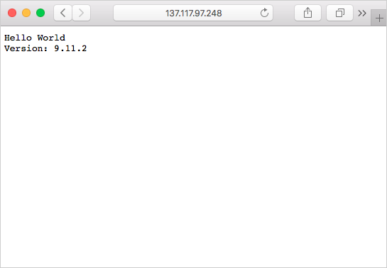

Container images can be pulled from Azure Container Registry using many container management platforms, such as Azure Container Instances, Azure Kubernetes Service, and Docker for Windows or Mac. When running container images from Azure Container Registry, authentication credentials may be needed.

It is recommended to use an Azure service principal for authentication with Container Registry. It is also recommended to secure the Azure service principal credentials in Azure Key Vault. However, for our live practice we will use the built-in admin account that can be enabled in all Azure Container Registries. The admin account works with the free sandbox resources.

<!-- Activate the sandbox -->
[!include[](../../../includes/azure-sandbox-activate.md)]

### Enable the Admin Account

Azure Container Registries come with a built-in Admin account. This isn't tied to Azure AD or role based access controls and therefore **should only be used for testing**.

1. Run the following command in the Cloud Shell to enable the Admin Account.

    ```azurecli
    az acr update -n $ACR_NAME --admin-enabled true
    ```

2. Run the following command to query for the autogenerated username and password.

    ```azurecli
       az acr credential show --name $ACR_NAME
    ```

    The output of this command will look like the following output. 
    
    ```output
    {  "passwords": [
        {
          "name": "password",
          "value": "aaaaa"
        },
        {
          "name": "password2",
          "value": "bbbbb"
        }
      ],
      "username": "ccccc"
    }
    ```
1. Take note of the username and password values that were returned from the last command. In the next step, we'll create an Azure Key Vault and store these username and password values into the vault.

### Save the username and password to a key vault

1. Run the following command to create an Azure Key Vault

    ```azurecli
    az keyvault create --resource-group <rgn>[sandbox resource group name]</rgn> --name $ACR_NAME-keyvault
    ```

2. Use the `az keyvault secret set` command to store the username for the ACR in the vault. If you were using service principals you'd use the appId for this value. Since we're using the admin account this time we'll save the username from our query above. Enter the command below, don't forget to replace `<username>`.

    ```azurecli
    az keyvault secret set --vault-name $ACR_NAME-keyvault --name $ACR_NAME-pull-usr --value <username>
    ```

3. Use the `az keyvault secret set` command to store the *password* in the vault. Replace `<password>` with the `password` from the query above.

    ```azurecli
    az keyvault secret set --vault-name $ACR_NAME-keyvault --name $ACR_NAME-pull-pwd --value <password>
    ```

You've now created an Azure key vault and stored two secrets in it:

* `$ACR_NAME-pull-usr`: the container registry **username**.
* `$ACR_NAME-pull-pwd`: the container registry **password**.

You can now reference these secrets by name when you or your applications and services pull images from the registry.

### Deploy a container with Azure CLI

Now that the service principal credentials are stored in Azure Key Vault, your applications and services can use them to access your private registry.

1. Execute the following `az container create` command to deploy a container instance. The command uses the username and password stored in Azure Key Vault to authenticate to your container registry.

    ```azurecli
    az container create \
        --resource-group <rgn>[sandbox resource group name]</rgn> \
        --name acr-tasks \
        --image $ACR_NAME.azurecr.io/helloacrtasks:v1 \
        --registry-login-server $ACR_NAME.azurecr.io \
        --ip-address Public \
        --location eastus \
        --registry-username $(az keyvault secret show --vault-name $ACR_NAME-keyvault --name $ACR_NAME-pull-usr --query value -o tsv) \
        --registry-password $(az keyvault secret show --vault-name $ACR_NAME-keyvault --name $ACR_NAME-pull-pwd --query value -o tsv)
    ```

1. Get the IP address of the Azure container instance using the following command.

    ```azurecli
    az container show --resource-group  <rgn>[sandbox resource group name]</rgn> --name acr-tasks --query ipAddress.ip --output table
    ```

1. Open a browser and navigate to the IP address of the container. If everything has been configured correctly, you should see the following results:



