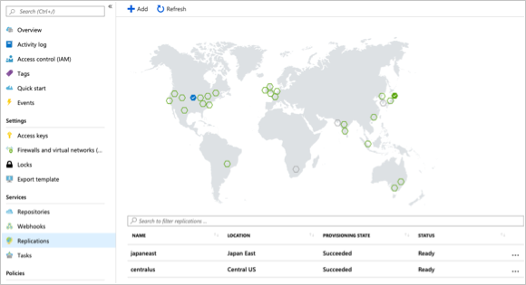

Suppose your company has compute workloads deployed to several regions to make sure you have a local presence to serve your distributed customer base. 

Your aim is to place a container registry in each region where images are run. This strategy will allow for network-close operations, enabling fast, reliable image layer transfers.

Geo-replication enables an Azure container registry to function as a single registry, serving several regions with multi-master regional registries.

A geo-replicated registry provides the following benefits:

- Single registry/image/tag names can be used across multiple regions
- Network-close registry access from regional deployments
- No additional egress fees, as images are pulled from a local, replicated registry in the same region as your container host
- Single management of a registry across multiple regions

## Create a replicated region for an Azure Container Registry

In this exercise, you'll use the `az acr replication create` Azure CLI command to replicate your registry from one region to another.

1. Run the following command to replicate your registry to another region. In this example, we're replicating to the `japaneast` region. *$ACR_NAME* is the variable you defined earlier in the module to hold your container registry name.

    ```azurecli
    az acr replication create --registry $ACR_NAME --location japaneast
    ```

    Here's an example of what the output from this command looks like:

    ```output
    {
      "id": "/subscriptions/00000000-0000-0000-0000-000000000000/resourceGroups/myresourcegroup/providers/Microsoft.ContainerRegistry/registries/myACR0007/replications/japaneast",
      "location": "japaneast",
      "name": "japaneast",
      "provisioningState": "Succeeded",
      "resourceGroup": "myresourcegroup",
      "status": {
        "displayStatus": "Syncing",
        "message": null,
        "timestamp": "2018-08-15T20:22:09.275792+00:00"
      },
      "tags": {},
      "type": "Microsoft.ContainerRegistry/registries/replications"
    }
    ```

1. As a final step,  retrieve all container image replicas created by running the following command. 

    ```azurecli
    az acr replication list --registry $ACR_NAME --output table
    ```

    The output should look similar to the following example:

    ```output
    NAME       LOCATION    PROVISIONING STATE    STATUS
    ---------  ----------  --------------------  --------
    japaneast  japaneast   Succeeded             Ready
    eastus     eastus      Succeeded             Ready
    ```

Keep in mind that you aren't limited to the Azure CLI to list your image replicas. From within the Azure portal, selecting `Replications` for an Azure Container Registry displays a map that details current replications. Container images can be replicated to additional regions by selecting the regions on the map.

[](../media/replication-map-expanded.png#lightbox)

## Summary

In this module, you learned about the Azure Container Registry. You deployed your own registry, added a custom container, and created a container image. Finally, you saw how easy it's to replicate the registry across Azure regions.

## Clean up resources

In this module, you created resources using your Azure subscription. You want to clean up these resources so that you won't continue to be charged for them.

1. In Azure, select **Resource groups** on the left.

1. Find the **learn-deploy-container-acr-rg** resource group, or whatever resource group name you used,  and select it.

1. In the **Overview** tab of the resource group, select **Delete resource group**.

1. This action opens a new dialog box. Type the name of the resource group again and select **Delete**. This option deletes all of the resources we created in this module.

## Learn More

[Azure Container Registry (ACR) documentation](https://docs.microsoft.com/azure/container-registry/)

[Docker on Azure](https://docs.microsoft.com/azure/docker/)
