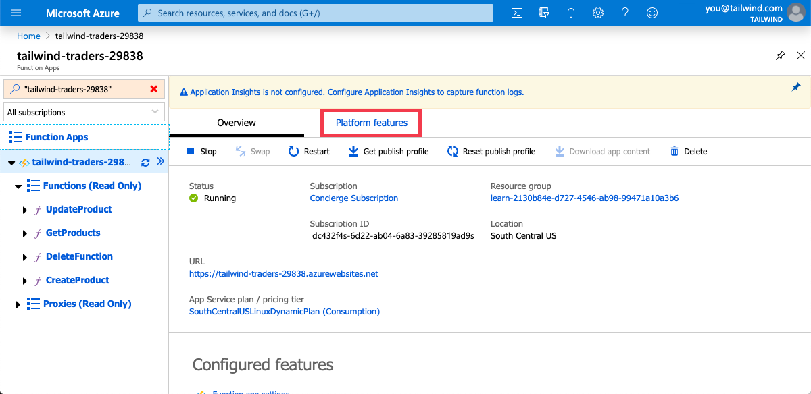
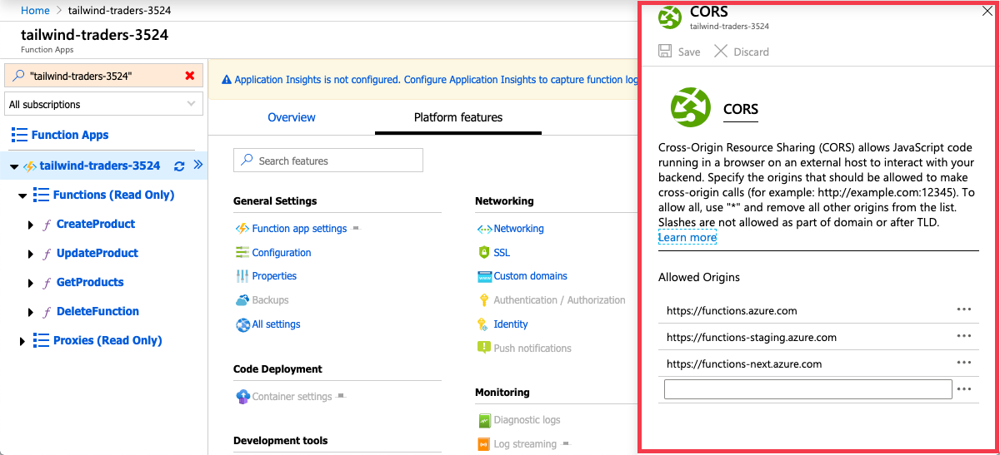

The great thing about APIs that are on the web is that you can access them from anywhere. The bad thing is that _anyone_ can access them from anywhere. There is no reason for anyone who is **not** the Products Manager application to be calling the API.

One of the ways that we have to stop other unwanted calls to the API is CORS. When the Products Manager API gets pushed to Azure, you'll need to adjust the CORS settings for production. Any application that makes a request that isn't from that allowed URL will get a swift 404 error.

## Settings CORS in production

The CORS settings that you configured for development won't be pushed to production. Otherwise, you might accidentally push "\*" to production since that's a common development setting. When you publish your application to Azure, you'll have to configure CORS via the Azure portal.

The CORS settings are located in the "Platform Features" section of your Azure Functions project.

Once there, you can define which URLs can and cannot access your Functions project in Azure.

> [!TIP]
> Using "http://localhost:PORT" is a valid entry in the CORS settings for a Function project in Azure. Just remember that everyone has a "localhost", so you'll want to make sure you don't leave that setting in after you are finished testing.

Another strategy that we use is Azure Function Authorization. Azure Functions can require that the requestor know the right "key" to access your function. The requestor will have to pass that key in order for the function to execute.

When you created the functions in the first part of the module, you selected "Function" level authorization. The authorization level is what tells Azure Functions to assign your functions a key.

## Getting your function key

You can find the keys for your Functions in the "Function Settings".

There are two keys: a "\_master" and a "default". The "default" key is the one that you want to pass to your function.

The key must be passed with every request as an HTTP header called, "x-functions-key".

The key will be visible to the user. It is not meant to be secret. In the event that a key is being used maliciously, the keys can be easily rotated from the Azure portal. The key would also be updated in the frontend application.

Between CORS and Function Authorization, your API is _more_ secure than it would be otherwise. It's important to note that it is not 100% secure. It is possible for someone to intercept the key and spoof the domain. To lock down a function completely, you would want users to log in with credentials. That's out of scope for the tremendous work you're doing here, but is covered in another Learn Module.

Alright, let's get this project to production!
