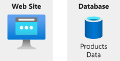

The acronym API stands for "Application Programming Interface". Sounds fancy, doesn't it?

But what is an "API"? It is an interface or protocol between different parts of an app. A shorter definition would be, "How parts of an app talk to each other".

Let's look at the *parts* of the Products Manager app.

In the Products Manager app, there are two distinct parts:

* Website
* Database

Sometimes, apps talk directly to a database. Other times, it's just not a good idea to talk directly to the database. The Products Manager app is a website that runs in a browser. Databases require secure connection information. You don't want to put secure connection information in the browser where anyone can see it.

A better idea would be to put all of the database connection code into a separate part of the app. This part connects securely to the database, but keeps your secret connection information safe and sound. Instead of talking to the database, the website talks to this new part of the app. This new part is the "API."

In this module, you're going to build the API that the Products Manager app will use to interface with the database.

The API will be URLs that you can call, which will return data or perform some action on the database. These URLs are called "HTTP endpoints." These URLs are also sometimes called "Web services."

In the next exercise, you'll set up the HTTP endpoints for your API using Azure Functions.
