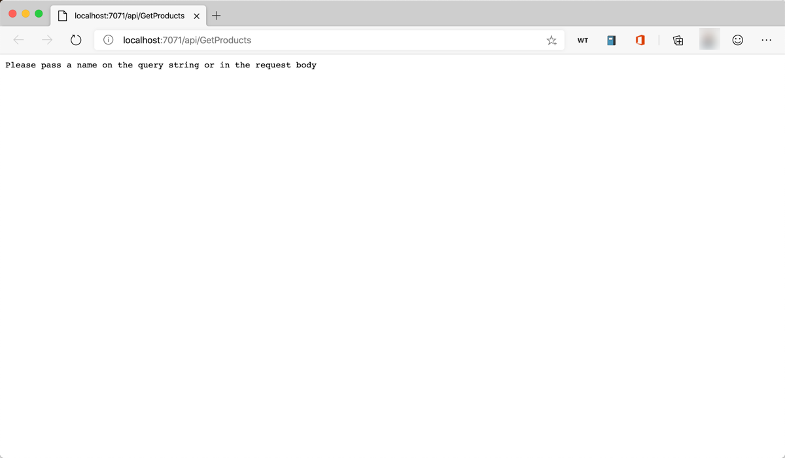

In this exercise, you'll create a new project in Azure Functions that will be the HTTP API for the Product Management application. You'll learn how to create a new HTTP Trigger function, run the function locally and set breakpoints. Finally, you'll wire the function up to the database you created in the previous exercise.

## Create a new Azure Functions project

1. From VS Code, select the "New Function Project" button in the Azure Functions extension.

   

1. Select "Browse" and create a new folder in the same parent folder as the "frontend" folder

   

1. Select "TypeScript" as the language type.

   

1. Select "HTTP trigger" as the template for the function.

   

   This is what tells Azure Functions that you want to be able to execute this function by calling a URL. When you run the function locally, the URL will be http://localhost:7071/api/{Function Name}

1. Name the function "GetProducts".

   

   With the name "GetProducts", this means that the URL for this function locally will be http://localhost:7071/api/GetProducts

1. Select "Function" authorization level.

   

   Functions have different levels of security. "Anonymous" means that the function has no security at all and can be called by anyone. "Function" means that this Function project will have a key. You will need to include this key whenever you call the function. "Admin" means that the Function is secured with a singular key that works across all functions. Note that you can use the main "Admin" key to access all functions in an Azure Functions project even if they are secured with the "Function" authorization level.

   > [!IMPORTANT]
   > If you choose "Function" or "Admin" level authorization, you will not have to pass a key when you are running locally. The key is only required once you have published your application to Azure Functions.

1. Select "Add to workspace".

   

There will now be a second folder in VS Code called "api". When you have multiple top-level folders in VS Code, this is called a "Workspace". Each top level folder is treated as a separate project. -->

## Run the project

The `index.ts` file from the "GetProducts" folder should be open. This file is what is executed by Azure Functions when the Azure Function's project is run.

Azure Functions projects can be run and debugged locally from within VS Code.

1. Switch to the "Debug View" in VS Code by clicking on the debug icon in the action bar.

   

1. Make sure that "Attach to Node Functions" is selected in the dropdown list at the top and press the green "Start Debugging" triangle button.

   

1. The Azure Functions project will launch. Notice that the terminal shows you what URL the function is running on. Press Cmd/Ctrl and click on the link to open it in a browser.

   

1. The default function template takes in a name parameter and returns a greeting. To pass in the name parameter, modify the url to pass in a query string parameter called "name"

   ```
   http://localhost:7071/api/GetProducts?name=YourName
   ```

   

## Debug the GetProducts function

1. Return to the `index.ts` file in VS Code. Click in the left-hand gutter next to line number 7.

   

This will set a breakpoint in the code. You can hit this breakpoint by executing the function from the browser.

1. Return to the browser where the greeting message was returned. Press refresh on the page. VS Code will break on line 7.

   

1. Press F5 to continue the program execution and see the greeting in the browser. Remove the breakpoint in the editor by clicking on the red dot next to line 7.

1. Click on the "disconnect" button to end the debugging session and terminate the Azure Functions process.


## Make the function RESTful

1. Open the `function.json` file in the "GetProducts" folder

1. Modify the "methods" array by removing the "post" item. This will cause the function to only respond to an HTTP GET request.

1. Add a property under "methods" for "route" and specify a new route of "products"

   ```json
   {
     "bindings": [
       {
         "authLevel": "function",
         "type": "httpTrigger",
         "direction": "in",
         "name": "req",
         "methods": ["get"],
         "route": "products"
       },
       {
         "type": "http",
         "direction": "out",
         "name": "res"
       }
     ],
     "scriptFile": "../dist/GetProducts/index.js"
   }
   ```

1. Press F5 to run the project

1. Notice that the URL for triggering the function is now different

   

In this exercise, you learned how to create a new Azure Functions project, how to run Azure Functions locally, how to pass query string parameters to an Azure Function, how to change the route of a function and how to change which HTTP verbs a function will respond to.

In the next exercise, you will wire up the "GetProducts" function to the "tailwind" database that you created in the previous exercise.
