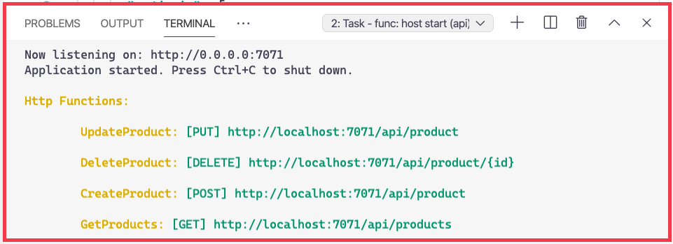

1. Open the `api/GetProducts/function.json` file.

1. Modify the "methods" property so that it only contains the value "get".

1. Below the "methods" line, add a line that specifies a new route for the GetProducts method.

   ```json
   "route": "products"
   ```

   Your `function.json` file for "GetProducts" should now look like this...

   ```json
   {
     "bindings": [
       {
         "authLevel": "function",
         "type": "httpTrigger",
         "direction": "in",
         "name": "req",
         "methods": ["get"],
         "route": "products"
       },
       {
         "type": "http",
         "direction": "out",
         "name": "res"
       }
     ],
     "scriptFile": "../dist/GetProducts/index.js"
   }
   ```

1. Save the file.

   Saving the file will cause the Azure Functions process to terminate the debugger will disconnect.

## Make the CreateProduct function RESTful

1. Open the "api/CreatProducts/function.json" file.

1. Restrict the allowed "methods" to just "post".

1. Below the "methods" line, add a line that specifies a new route for the CreateProduct method as "product".

   ```json
   "route": "product"
   ```

   Your `function.json` file for CreateProducts should now look like this...

   ```json
   {
     "bindings": [
       {
         "authLevel": "function",
         "type": "httpTrigger",
         "direction": "in",
         "name": "req",
         "methods": ["post"],
         "route": "product"
       },
       {
         "type": "http",
         "direction": "out",
         "name": "res"
       }
     ],
     "scriptFile": "../dist/CreateProduct/index.js"
   }
   ```

## Make the UpdateProduct function RESTful

1. Open the "api/UpdateProduct/function.json" file.

1. Restrict the allowed "methods" to just "put".

1. Below the "methods" line, add a line that specifies a new route for the UpdateProduct method as "product".

   ```json
   "route": "product"
   ```

   Your `function.json` file for UpdateProduct should now look like this...

   ```json
   {
     "bindings": [
       {
         "authLevel": "function",
         "type": "httpTrigger",
         "direction": "in",
         "name": "req",
         "methods": ["put"],
         "route": "product"
       },
       {
         "type": "http",
         "direction": "out",
         "name": "res"
       }
     ],
     "scriptFile": "../dist/UpdateProduct/index.js"
   }
   ```

> [!NOTE]
> Note that you specified the same route for both the CreateProduct and UpdateProduct functions (product). Only the HTTP request method is different: a post for a create and a put for an update. You can see how using HTTP request methods gives you multiple ways to use routes of the same name. This greatly simplifies the number of total endpoints that you have.

## Make the DeleteProduct function RESTful

1. Open the "api/CreatProducts/function.json" file.

1. Restrict the allowed "methods" to just "post".

1. Below the "methods" line, add a line that specifies a new route for the DeleteProduct method.

   ```
   "route": "product"
   ```

   Your `function.json` file for DeleteProduct should now look like this...

   ```json
   {
     "bindings": [
       {
         "authLevel": "function",
         "type": "httpTrigger",
         "direction": "in",
         "name": "req",
         "methods": ["delete/{id}"],
         "route": "product"
       },
       {
         "type": "http",
         "direction": "out",
         "name": "res"
       }
     ],
     "scriptFile": "../dist/DeleteProduct/index.js"
   }
   ```

> [!NOTE]
> Note that you specified the same route for the CreateProduct, UpdateProduct and DeleteProduct functions (product). Only the HTTP request method is different: a post for a create and a put for an update. You can see how using HTTP request methods gives you multiple ways to use routes of the same name. This greatly simplifies the number of total endpoints that you have.

## Start the project

1. Start the Azure Functions project by pressing <kbd>F5</kbd>.

1. Notice that the URL's for your function endpoints are now different.

   

## Test new routes

1. Press <kbd>Ctrl</kbd> or <kbd>Cmd</kbd> and click the "http://localhost:7071/api/products" link in the terminal. This will open your browser and load that endpoint.

1. Notice that the "/api/products" endpoint returns a list of all products.

   

Each function has an HTTP request method that describes what sort of database action it performs. You have also changed the routes so that they are organized by resource. Since there is only one resource - products - you really only have 2 endpoints. Your API is now a RESTful one!
