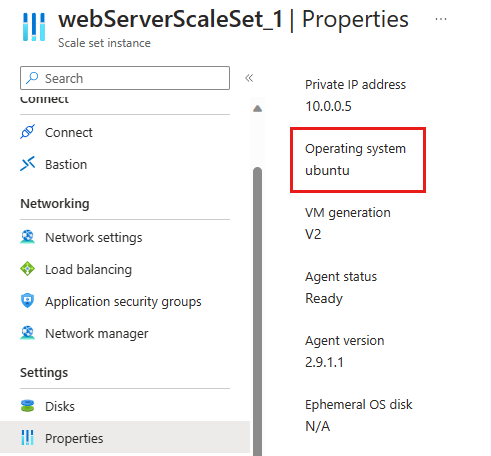

In the example scenario, you've decided to use a scale set to run the web application for the shipping company. Using a scale set, the shipping company can maintain short response times for users as the workload varies.

Your first task is to create a scale set. You'll configure it to run a web server, in this case **nginx**. When you've configured the scale set correctly, you'll deploy your web application. Then you'll set up a health probe that Azure will use to verify the availability of each VM in the scale set. Finally, you'll test the scale set by sending requests from a web browser.

> [!NOTE]
> This exercise is optional. If you don't have an Azure account, you can read through the instructions so you understand how to use the REST API to retrieve metrics.
>
> If you want to complete this exercise, but you don't have an Azure subscription or prefer not to use your own account, create a [free account](https://azure.microsoft.com/free/?azure-portal=true) before you begin.

## Deploy a Virtual Machine Scale Set

1. Sign in to the [Azure portal](https://portal.azure.com) and open Azure Cloud Shell.

1. In Cloud Shell, start the code editor and create a file named *cloud-init.yaml*.

    ```bash
    code cloud-init.yaml
    ```

1. Add the following text to the file:

    ```yaml
    #cloud-config
    package_upgrade: true
    packages:
      - nginx
    write_files:
      - owner: www-data:www-data
      - path: /var/www/html/index.html
        content: |
            Hello world from Virtual Machine Scale Set !
    runcmd:
      - service nginx restart
    ```

    This file contains configuration information to install nginx on the VMs in the scale set.

1. Press **Ctrl+S** to save the file, then press **Ctrl+Q** to close the code editor.

1. Run the following command to create a new resource group named `scalesetrg` for your scale set:

    ```azurecli
    az group create --location eastus --name myResourceGroup
    ```

1. Run the following command to create the Virtual Machine Scale Set:

    ```azurecli
    az vmss create \
      --resource-group myResourceGroup \
      --name webServerScaleSet \
      --image Ubuntu2204 \
      --upgrade-policy-mode automatic \
      --custom-data cloud-init.yaml \
      --admin-username azureuser \
      --generate-ssh-keys
    ```

    By default, the new Virtual Machine Scale Set has two instances and a load balancer.

    > [!NOTE]
    > The `custom-data` flag specifies that the VM configuration should use the settings in the *cloud-init.yaml* file after the VM has been created. You can use a cloud-init file to install additional packages, configure security, and write to files when the machine is first installed.
    >
    > For more information, see [Cloud-init support for VMs in Azure](/azure/virtual-machines/linux/using-cloud-init).

## Configure the Virtual Machine Scale Set

1. Run the following command to add a health probe to the load balancer:

    ```azurecli
    az network lb probe create \
      --lb-name webServerScaleSetLB \
      --resource-group myResourceGroup \
      --name webServerHealth \
      --port 80 \
      --protocol Http \
      --path /
    ```

    The health probe pings the root of the website through port 80. If the website doesn't respond, the server is considered unavailable. The load balancer won't route traffic to the server.

1. Run the following command to configure the load balancer to route HTTP traffic to the instances in the scale set:

    ```azurecli
    az network lb rule create \
      --resource-group myResourceGroup \
      --name webServerLoadBalancerRuleWeb \
      --lb-name webServerScaleSetLB \
      --probe-name webServerHealth \
      --backend-pool-name webServerScaleSetLBBEPool \
      --backend-port 80 \
      --frontend-ip-name loadBalancerFrontEnd \
      --frontend-port 80 \
      --protocol tcp
    ```

## Test the Virtual Machine Scale Set

1. In the Azure portal, on the left, select **Resource groups** > **scalesetrg**.

1. Select the **webServerScaleSet** Virtual Machine Scale Set.

1. On the **Overview** page, note the public IP address of the Virtual Machine Scale Set.

    

1. Under **Settings**, select **Instances**. Verify that the scale set contains two running VMs.

    

1. Select an instance and navigate to the **Properties** tab. Verify that the VMs are running Ubuntu Linux.

    


1. In your web browser, go to the public IP address of the scale set. Verify that the message ```Hello World from Virtual Machine Scale Set !``` appears.

    :::image type="content" source="../media/3-web-app.png" alt-text="Screenshot of the web app running in a web browser with the desired message." loc-scope="other":::
