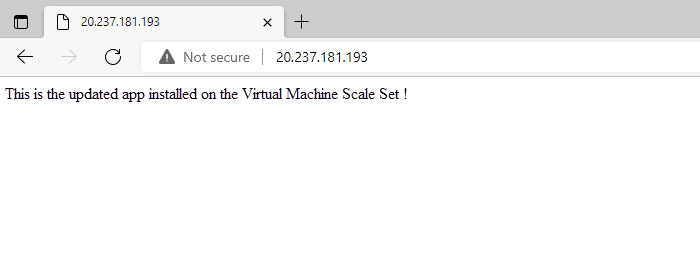

In the shipping company scenario, you installed a web application by creating the virtual machine scale set. You now need to update the web app and install a new version across all VMs in the scale set. 

You must ensure that the system will remain available during the roll-out. A good way to ensure availability is to use a custom script extension to do the update. Apply this script across the virtual machine scale set. The scale set will apply the update to one VM at a time, leaving the other VMs up and running.

In this exercise, you'll use a custom script extension to roll out a new version of the web app. You'll edit the message that's provided by the nginx server. You can use the same approach for bigger updates.

> [!NOTE]
> This exercise is optional. If you don't have an Azure account, you can read through the instructions to understand how to use the REST API to retrieve metrics.
>
> If you want to complete this exercise but you don't have an Azure subscription or prefer not to use your own account, create a [free account](https://azure.microsoft.com/free/?azure-portal=true) before you begin.

## Deploy the update by using a custom script extension

1. In the [Azure portal](https://portal.azure.com), run the following command to view the current upgrade policy for the scale set:

    ```bash
        az vmss show \
            --name webServerScaleSet \
            --resource-group scalesetrg \
            --query upgradePolicy.mode
    ```

    Verify that the upgrade policy is set to `Automatic`. You specified this policy when you created the scale set in the first lab. If the policy were `Manual`, you would apply any VM changes by hand. Because the policy is `Automatic`, you can use the custom script extension and allow the scale set to do the update.

1. Run the following command to apply the update script:

    ```bash
        az vmss extension set \
            --publisher Microsoft.Azure.Extensions \
            --version 2.0 \
            --name CustomScript \
            --vmss-name webServerScaleSet \
            --resource-group scalesetrg \
            --settings "{\"commandToExecute\": \"echo This is the updated app installed on the Virtual Machine Scale Set ! > /var/www/html/index.html\"}"
    ```

## Test the updated web application

1. Run the following command to retrieve the IP address of the load balancer for the scale set:

    ```bash
        az network public-ip show \
            --name webServerScaleSetLBPublicIP \
            --resource-group scalesetrg \
            --output tsv \
            --query ipAddress
    ```

1. In your web browser, go to the public address of the scale set load balancer. Verify that you see the message **This is the updated app installed on the Virtual Machine Scale Set**.

    
