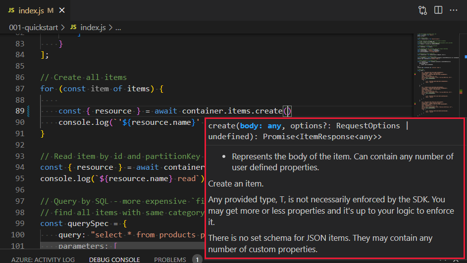
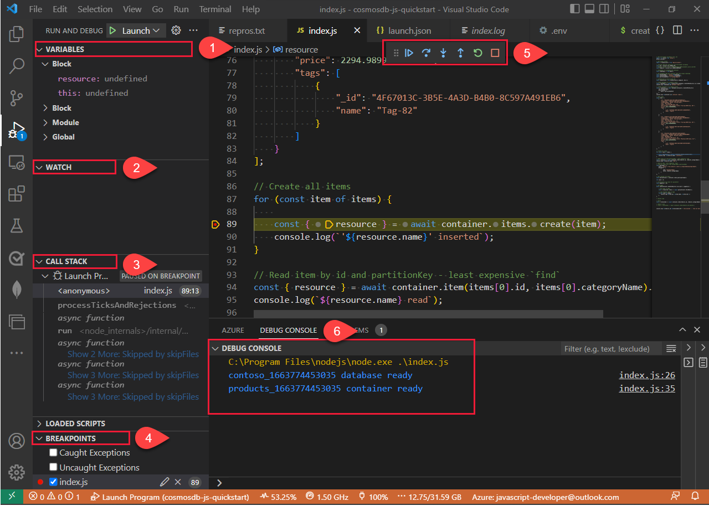

VS Code makes it easy to write JavaScript code and run it using Node.js. The VS Code editor has built-in support for JavaScript and JSON. You utilize the IntelliSense features of the editor to help you check syntax. IntelliSense also offers code-completion, helping to minimize any syntactic and semantic errors in your applications. You can use the integrated debugging tools to help test and verify your code.

In this unit, you'll learn how to create a JavaScript application using VS Code. You'll see how to run the application using Node.js from within VS Code. Finally, you'll learn how to use the debugger to step through your code and examine variables as your code runs.

## Create a JavaScript application for Node.js

You can create a new JavaScript application for Node.js from within VS Code using a terminal window. Create a new folder, and run the following command to initialize the Node application.

```bash
npm init -y
```

The `npm init` command creates a new file, named **package.json** in the application folder. This file contains metadata that you use to describe your application to the Node.js runtime.

Edit the **package.json** file and add a description to the **description** property. Also replace the text **main.js** in the **main** property with the name of the JavaScript file that will hold your application code.

Create a new file for your application code. Save the file with the same name as the one you specified in the **package.json** file. Make sure you give the file a **.js** extension (for JavaScript)

You're now ready to start writing your JavaScript code.

## Use IntelliSense to help write your code

When you import a module into a JavaScript file, the types for that module become available in that file, and IntelliSense can provide code completion and type checking.

Add your JavaScript code to the application code file. As you type, IntelliSense will use a combination of type checking and type inference to show suggestions appropriate to the current context. Type inference enables IntelliSense to present valid code completion suggestions as you write your code:


Type checking enables IntelliSense to show the parameters that a function call can take, and will type-check the expressions you provide for each function:



Other IntelliSense features available in VS Code include:

- Detecting unreachable code and unused variables. Statements that can never be run, and variables that are never used, are shown faded out in the editor.
- Organizing imports. IntelliSense can quickly sort the imports that occur in a code file, and remove imports that aren't used.
- Peeking definitions and references. The peek facility enables you to quickly view the definition of an object or function, even if it's in another file. Right-click a variable or function, and select **Peek Definition** or **Peek References**. The definition or references appear in a pop-up window.
- Go to a variable, function, or type definition. This feature enables you to move directly to the definition of a variable, function, or type in your code. This is useful if you need to change the definition of an item, or modify a function. Right-click the code that references your variable or type, or that calls your function. Select **Go To Definition**, or **Go To Type Definition**.
- Suggesting possible refactoring of your code. An ellipsis (...) under an item indicates areas where IntelliSense has one or more suggestions. Click the ellipsis to view the suggestions. Select **Quick Fix** to implement the suggestion.
  
## Run and debug a Node.js application

The simplest way to run a Node.js application from VS Code is to use the `node` command from a terminal window. For example, to run the code in a file named **myapp.js**, use the following command:

```bash
node myapp
```

You can use the native Node.js debugger (for example, `node inspect myapp`) from a terminal window, but VS Code provides an enhanced environment for stepping through and debugging Node.js applications.

Before you use the VS Code debugger, you should configure it. For example, the VS Code debugger displays output in its own **Output** window in the IDE. However, this window can't handle terminal input. If your app expects to receive keyboard input, you must configure the debugger to use an external terminal.

To edit the debugger configuration settings, on the **Debug** menu, click **Open Configurations**. The configuration file contains a JSON object named **configurations**. To debug the application using an external terminal, add the **console** property and set it to **externalTerminal**.

```json
{
    // Use IntelliSense to learn about possible attributes.
    // Hover to view descriptions of existing attributes.
    // For more information, visit: https://go.microsoft.com/fwlink/?linkid=830387
    "version": "0.2.0",
    "configurations": [
        {
            "type": "node",
            "request": "launch",
            "name": "Launch Program",
            "program": "${workspaceFolder}/myapp.js",
            "console": "externalTerminal"
        }
    ]
}
```

To begin a debug session, first set one or more breakpoints in your application code. To do this, click in the left margin by the statement at which you want to pause execution. A red dot will appear.

Next, select **Start Debugging** on the **Debug** menu. If you're using an external terminal, a new terminal window will appear. If your application expects any input, enter it into this window. Any messages output by your application will appear in this window:


If you aren't using an external terminal, debugger output will appear in the **Output** window in VS Code.

When the debugger reaches a breakpoint in your application, execution will pause, and the breakpoint statement is highlighted. On the left, you'll see windows where you can examine and set the values of local and global variables, and the call stack. You can also add **Watch** expressions, which are evaluated and displayed as execution proceeds:



The **Debug** toolbar appears above the editor window. This toolbar contains commands that enable you to single step through your code. If a statement contains a function call, you can step into that function, or step over it. The step out command continues execution until the function finishes. You can also continue running the application, either until the debugger reaches another breakpoint, or the application finishes. The other two commands enable you to restart the application from the beginning, or terminate the application:


Most JavaScript engines (including Node.js) implement just-in-time compilation. You can make changes to the application code while the debugger is running. These changes become effective immediately. You don't need to stop and restart the debugger.
