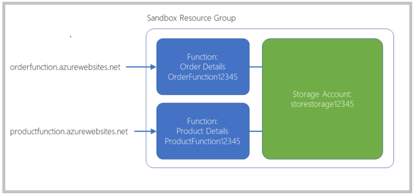
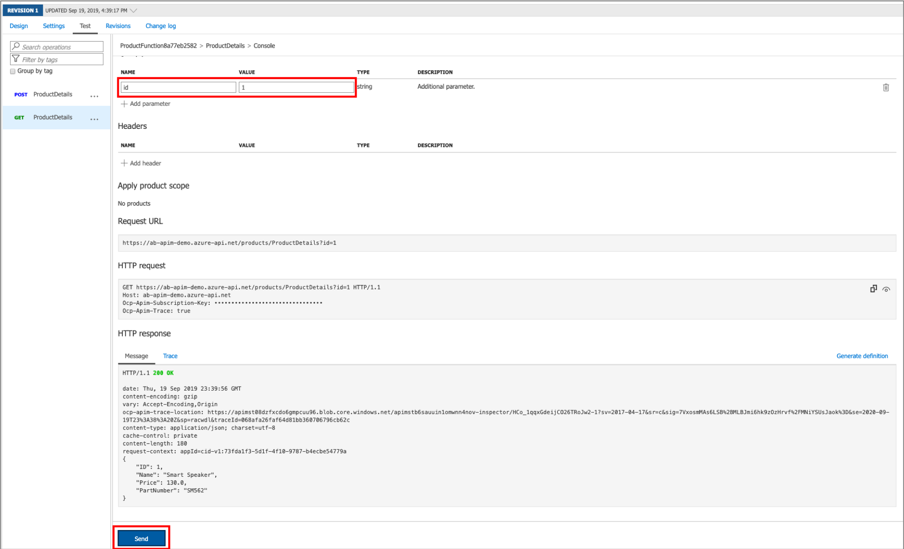

You can add Functions to Azure API Management, to present them to users as parts of a single API.

In your online store company, your developers have created multiple Azure Functions as microservices. Each function implements a small part of the store's functionality. You want to assemble these functions into single API.

Here, you will create a new API Management instance and then add a Product Details function to it.

[!include[](../../../includes/azure-sandbox-activate.md)]

## Create functions

In this exercise, you will add an Azure Function to Azure API Management. Later you will add a second function to the same resource in order to create a single serverless API from multiple functions. Let's start by using a script to create the functions:

1. To clone the functions project, in the Cloud Shell on the right, execute this command:

    <!-- TODO: the URL in this git clone command must be updated when the correct location is known -->
    <!-- TODO: For testing purposes, I expose the code in a repo on my account. We need to update when the real repo is available -->

    ```bash
    git clone https://github.com/AndrewJByrne/bbab38fa-6d69-461a-99be-1b60d8d4b676.git OnlineStoreFuncs
    ```

1. To run the script that sets up the necessary Azure resources, execute these commands:

    ```bash
    cd OnlineStoreFuncs
    bash setup.sh
    ```

    The `setup.sh` script creates the two functions that you use in this module and deploys the code that responds to requests. It also sets up a storage account that the functions need. The functions both have URLs in the **azurewebsites.net** domain. The function names include random numbers for uniqueness. The script may take a few minutes to complete.

    


    <!-- TODO: You need to explain what the script is doing and let the learners view it in a browser. You also need to set expectations about how long the script runs for. On my test, it takes "a few minutes to run" (6+). Ideally we'd show a picture of the function apps and functions within them, to give the learner a feeling for what is happening.  -->

    <!-- AJM: Done -->

## Test the product details function

<!-- TODO: Explain why we are testing the function -->
<!-- AJM: Done -->
Now, let's test the Product Details function, to see how it behaves before we add it to API Management:

1. Sign into the [Azure portal](https://portal.azure.com/learn.docs.microsoft.com?azure-portal=true) using the same account you activated the sandbox with.
<!-- TODO: I prefer select over click for Accessibility reasons -->
<!-- AJM: fixed, here and in unit 5 -->
1. Select **All Resources**.
1. Select the app service with a name beginning with **ProductFunction**. The random number was appended by the setup script to ensure uniqueness. <!-- TODO: Break this up into two instructions. The second instruction should be more explicit and tell the learner to select the App Service with the name beginning with ProductFunction. Should also explain the naming convention used.  -->
<!-- AJM: Done -->
1. Under **Functions**, select **ProductDetails**, and then select **Test**, as highlighted in the following screenshot: 

    
<!-- TODO ... as highlighted in the following screenshot -->
<!-- AJM: Done. -->
1. In the **HTTP method** drop-down list, select **GET**, and then select **Add parameter**.
1. In the **name** textbox, type **id** and in the **value** textbox, type **3**.
1. Select **Run** and then examine the results in the **Output** box.

    

    The output pane displays the details of a product in JSON format. You can also test the function with IDs 1 and 2 for different products.

1. At the top of the page, select **</> Get function URL**. Notice that the URL is the name of the function within the **azurewebsites.net** domain. Make a note of this URL for later comparison. <!-- TODO: Given that we've asked them to save off the function URL, consider mentioning or showing  them how to test with it in their favorite browser -->

> [!NOTE]
> You can use this URL to test the function in your browser. Append the query string `&id=1` to request a product.

## Create a new API Management instance

Now that we have a working Function, let's create the API Management resource:

1. In the [Azure portal](https://portal.azure.com/learn.docs.microsoft.com?azure-portal=true), select **Create a resource > Integration > API management**, and then select **Create**.
1. In the API Management service window, enter these settings and then select **Create**:

    | Setting | Value |
    | --- | --- |
    | Name | Use a unique name within the **azure-api.net** domain |
    | Subscription | Concierge |
    | Resource group | <rgn>[sandbox resource group name]</rgn> |
    | Location | Choose either **West Europe** or **Southeast Asia**. These locations are the only two that are supported by both the sandbox and the consumption tier | <!-- NOTE: these locations are the only two that are supported by both the sandbox and the consumption tier --> <!-- TODO: You have to tell the learner that fact.  --> <!-- AJM: Done -->
    | Organization name | OnlineStore |
    | Administrator email | Use the default value |
    | Pricing tier | Consumption |
    | | | 

    

<!-- NOTE: this is currently resulting in a sandbox policy error. Engineering must review the policies -->

<!-- AJM: This deployment worked fine for me, 08/23/2019 -->

<!-- TODO: I know it might feel obvious to us, but we need to tell learners that this step takes some time and to wait for it to complete successfully before continuing. FYI - validating this took a long time to complete for me. -->

<!-- AJM: Done -->

1. Wait for the deployment to complete. It may take several minutes.

## Import an Azure Function App as a new API 

<!-- TODO: You introduce the concept of creating a product for the function. What does that mean? Is it an APIM concept? Explain to the learner -->

<!-- AJM: Fixed. It was a mistake actually. We don't create a APIM product, so I've just removed it. -->

Now, we can add the **Product Details** function to the API Management instance:

1. In the [Azure portal](https://portal.azure.com/learn.docs.microsoft.com?azure-portal=true), select **All resources** and then select your **Azure API Management** service instance.
1. Under **API Management**, select **APIs** and then, under **Add a new API**, select **Function App**.

    

1. To select your function, select **Browse** and then select the **Function App** section.

    

1. In the list of Function Apps, select the **ProductFunction** and then select **Select**.
1. Ensure that **ProductDetails** is checked, and then select **Select**.
1. In the **API URL suffix** textbox, type **products**, and then select **Create**. 

    

## Test the OnlineStore product

You now have a functional product details API in the API Management instance that you created. Let's test that API, by using the API Management tools in the Azure portal:

1. In the [Azure portal](https://portal.azure.com/learn.docs.microsoft.com?azure-portal=true), select **All resources** and then select your **Azure API Management** service instance.
1. Under **API Management**, select **APIs** and then select the **ProductFunction** API.
1. In the list of operations, select **GET ProductDetails** and then select the **Test** tab.

    

1. Under **Query parameters**, select **Add parameter**.
1. In the **name** textbox, type **id**.
1. In the **value** textbox, type **1**, and then select **Send**.

    

1. In the **HTTP response**, notice that the details of a product have been returned in JSON format. Also notice the **HTTP request** was sent to a destination within the **azure-api.net** domain. This location is different to the **azurewebsites.net** domain where the original function app is hosted.
