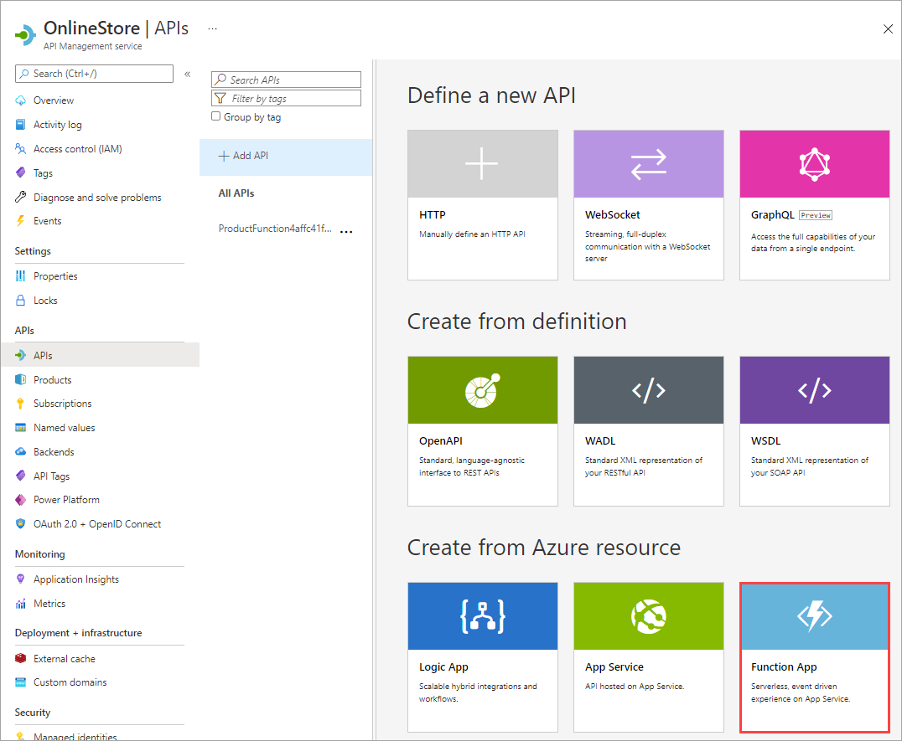
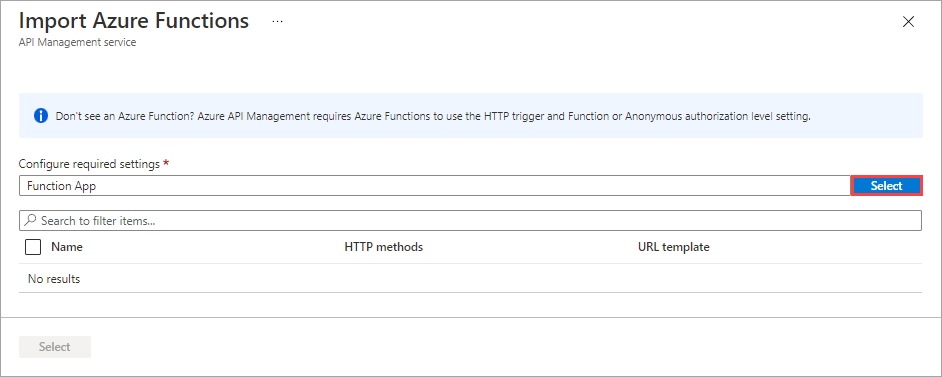

Recall that you want to integrate all of the separate microservices, which are Azure Functions, into a single API. You have already added the Products function app to a new instance of API Management. Now you want to add another function app to that API.

In this exercise, you'll add the Orders function app to the API and use the `curl` tool to test the integrated system.

## Test the OrderDetails function

Before we add the Orders function app to the API, let's test the function it hosts - OrderDetails.

1. On Azure resource menu, or from the **Home** page, select **All resources**. The **All resources** pane appears.

1. Sort the resources by Type, and then select the Function App whose name begins with **OrderFunction**. The Overview pane for the OrderFunction Function App appears.

1. In the OrderFunction menu, under **Functions**, select **Functions**. The **Functions** pane appears, listing the functions for the OrderFunction Function App.

1. From the list, select **OrderDetails**. The **OrderDetails** Function Overview pane appears.

1. In the Order Details menu, under **Developer**, select **Code + Test**. The **Code + Test** pane for the OrderDetails function appears.

    :::image type="content" source="../media/5-test-order-details.png" alt-text="OrderDetails JSON code, with Code + Test in menu and Test/Run in command bar highlighted.":::

1. On the command bar, select **Test/Run**.  The JSON code for your function displays and the Input pane for Code + Test appears.

1. On the **Input** tab, in the **HTTP method** field dropdown list, select **GET**, and then under **Query**, select **Add parameter**. The name and value fields for a new query parameter appear.

1. In the **Name** field, enter *name*, and in the **Value** field, enter *Chiba* (value is case-sensitive), and then select **Run**.

1. The **Output** tab displays the HTTP response.

    :::image type="content" source="../media/5-order-test-results.png" alt-text="Add a new function option page appears.":::

    The output tab displays the details of an HTTP response in JSON format. Optionally, you can also test the function by inputting names "Henri" and "Barriclough" for different orders.
    
1. Select **Close** to close the Input Output tabs for Code + Test.

1. On the commans bar of the  OrderDetails Code + Test pane, select **Get function URL**. Notice that the URL is the name of the function within the **azurewebsites.net** domain. Copy and save this URL for later in this exercise.

## Add another function to an existing API

In this step, we'll add the Order function to the API Management resource that we created in the preceding exercise. In that exercise, we used the API Management interface from within the function app interface. Here, we'll navigate to our API Management instance through the Azure portal resource menu, just to demonstrate that both approaches are available.

1. From the Azure resource menu or **Home** page, select **All resources**. The **All resources** pane appears.

1. Sort the resources by type, and then select the Function App whose name begins with **OrderFunction**. The **OrderFunction** Function App Overview pane appears.

1. In the Function App menu, scroll down to **API**, and then select **API Management**. The OrderFunction **API Management** pane appears.

1. Under the **API Management** field, select **Create new**. The **API Management service** pane appears.

1. Enter the following API Management values for each setting.

    | Setting | Value |
    | --- | --- |
    | Name | The default value OrderFunctionnnnnnnnnnn-apim should be OK. Use a name that is unique within the **azure-api.net** domain |
    | Subscription | Concierge Subscription |
    | Resource group | <rgn>[sandbox resource group name]</rgn> |
    | Location | Choose one of the following locations that supports the Consumption Plan: **West US**, **North Central US**, **West Europe**, **North Europe**, **Southeast Asia**, **Australia East**  |
    | Organization name | OnlineStore |
    | Administrator email | Accept the default value |
    | Pricing tier | Consumption |

1. Select **Export** to provision a linked API Management instance. This may take several minutes.

1. On the command bar, select **Go to API Management**. The **API Management service** Overview pane appears.

1. In the resource menu, under **APIs**, select **APIs**. The APIs pane shows options for adding a new API.
 
1. In the **APIs** pane, under **Create from Azure resource**, select **Function App**.

    

    The **Create from Function App** dialog box appears.

1. To select your function app, select **Browse**. The **Import Azure Functions** pane appears.

1. On the **Configure required settings** field, select **Select**.

    [  ](../media/5-import-azure-function-app-03-expanded.png#lightbox)

    The **Select Azure Function App** pane appears.

1. In the list of Function Apps, select the **OrderFunction**, and then select **Select**. The **Import Azure Functions** pane reappears with your functionapp configured.

1. Ensure that **OrderDetails** is checked, and then select **Select**. The **Create from Function App** dialog box appears.

1. Replace the value in the **API URL suffix** field with *orders*, and then select **Create**.

    

    The Orderfunction API Management service **APIs** pane  displays the OrderFunctionnnnn api with the Deisgn tab selected.

## Test the OnlineStore orders endpoint in the portal

Now that we've added OrderDetails to our API, let's test it by using the API Management tools in the Azure portal.

1. In the list of operations for OrderFunctionnnnnnnnnnnn-apim APIs, select **GET OrderDetails**, and then select the **Test** tab.

1. Under **OrderDetails**, in the **Query parameters** section, select **Add parameter**.

1. In the **NAME** field, enter *name*, and in the **VALUE** field, enter *Chiba*, and then select **Send**.

1. In the **HTTP response** section, the message tab shows the HTTP request/response succeeded (HTTP/1.1/ 200 OK), and the details of the order appears was returned in JSON format at the end of the message.
 
1.  Scroll up to the **HTTP request** section; notice that the request was sent to a subdomain and subdirectory within the **azure-api.net** domain. This location differs from the **azurewebsites.net** host domain.

## Test the combined API

We can use the `curl` command-line tool to submit requests to our API. It's ideal because we can use it to include the correct subscription key with our requests. To submit requests, we also need the location of the API, which is hosted in Azure API Management and consists of the Products and Orders functions.

1. In the Azure resource menu or from home, select **All resources**.
 
1. Sort resources by Type, and then select the Function App that begins with **OrderFunction**. The **OrderFunction** Function App Overview pane appears.

1. In the **Essentials** section of the **Overview** pane, hover over the **URL** and select the **Copy to clipboard** icon.

1. In The Azure Cloud Shell to the right, run the following command, pasting the **URL** value that you just copied in place of the token, and then press <kbd>Enter</kbd>.

    ```bash
    GATEWAY_URL=<paste the URL here>
    ```

1. In the Azure portal, On the OrderFunction API Management service mneu, scroll down to **API**, and select **API Management**. The **API Management** pane appears for your **OrderFunction** function app.

1. In the command bar, select **Go to API Management**. The **API Management service** pane appears.

1. In the API Management service menu, under **APIs**, select **Subscriptions**. The **Subscriptions** pane appears for your API Management service instance.

1. To the far right of **Built-in all-access subscription**, select the ellipsis **...**, and then select **Show/hide keys**.

1. To the right of **Primary key** field, select the *Copy to clipboard* icon.

1. In Cloud Shell, run the following command, paste the **PRIMARY KEY** value that you copied in place of the token, and then press <kbd>Enter</kbd>.

    ```bash
    SUB_KEY=<paste the key here>
    ```

1. To request the details of an order, run the following command in Cloud Shell.

   ```bash
    curl -X GET "$GATEWAY_URL/orders/OrderDetails?name=Henri" -H "Ocp-Apim-Subscription-Key: $SUB_KEY"
    ```

    The command returns the details of an order. You can also try the command with the names "Chiba" and "Barriclough" for different results.
    
1. To request the details of a product, run the following command, and then press <kbd>Enter</kbd>.
2.     
    ```bash
    curl -X GET "$GATEWAY_URL/products/ProductDetails?id=2" -H "Ocp-Apim-Subscription-Key: $SUB_KEY"
    ```

    The command returns the details of a product. You can also try the command with IDs 1 and 3 for different results.

Notice that both the functions can now be called through endpoints within the **azure-api.net** domain, which is the domain used by Azure API Management. We can also access them both by using the same subscription key, because that key grants access to the API Management gateway. In other Learn modules, you can learn how to apply policies, security settings, external caches, and other features to all the functions in an API Management Gateway. The gateway provides you with a central control point, where you can manage multiple microservices without altering their code.
