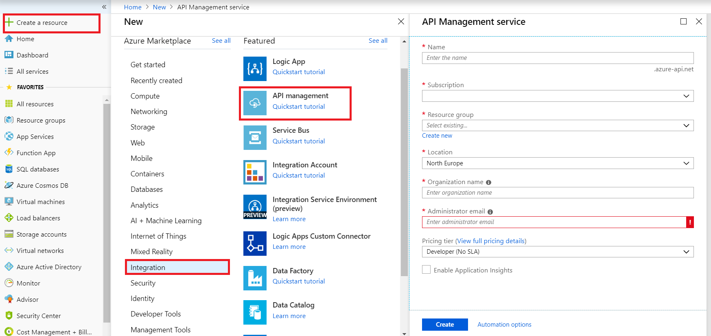
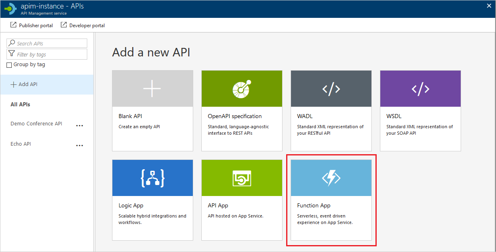
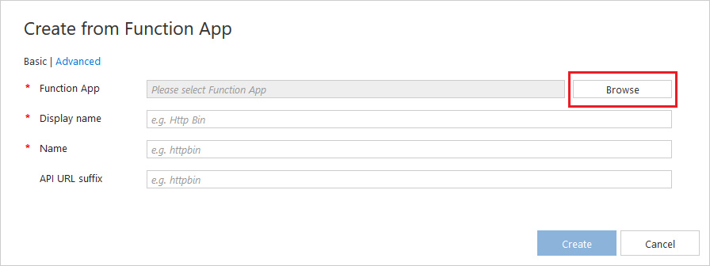
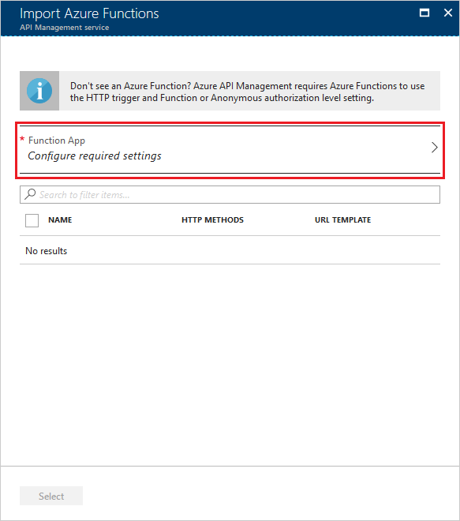
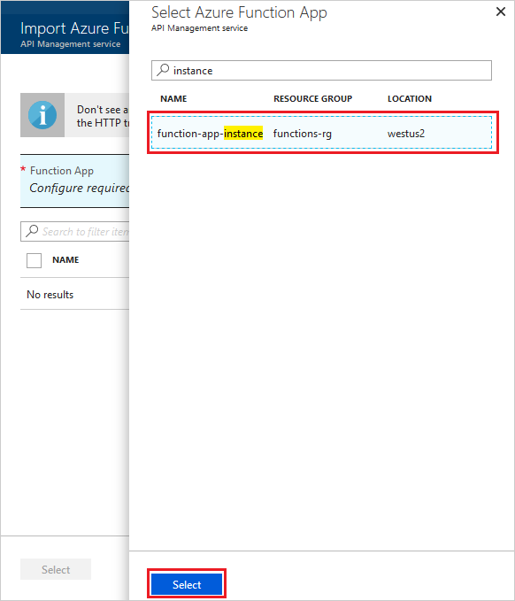
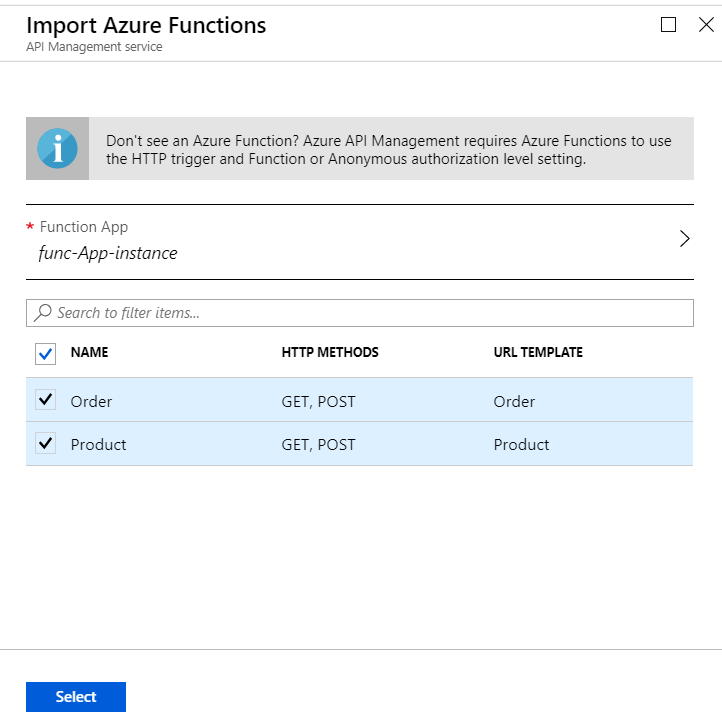

You must have a function app to host the execution of your functions. The function app provides an environment for serverless execution of your function code. It lets you group functions as a logic unit for easier management, deployment, and sharing of resources. Create a function app by using the az functionapp create command.

For this exercise you will create 2 Function Aps with HTTP trigger Functions. You can use the script below to setup a Function App (currently named as "func-App-instance1). Create a second name by changing the name to something similar such as (func-App-stance2) and running the serverless function app script below

```azurecli
#!/bin/bash

# Function app and storage account names must be unique.
storageName=mystorageaccount$RANDOM
functionAppName=func-App-instance1$RANDOM

# Create a resource group.
az group create --name myResourceGroup --location westeurope

# Create an Azure storage account in the resource group.
az storage account create \
  --name $storageName \
  --location westeurope \
  --resource-group myResourceGroup \
  --sku Standard_LRS

# Create a serverless function app in the resource group.
az functionapp create \
  --name $functionAppName \
  --storage-account $storageName \
  --consumption-plan-location westeurope \
  --resource-group myResourceGroup
```

Run the following to create HTTP trigger function or alternatively use the Azure Portal to create two Azure Functions

```bash
func new --name Product --template "HttpTrigger"
func new --name Order --template "HttpTrigger"
```

## Create a new API Management instance

1. In the Azure portal, select **Create a resource** > **Integration** > **API management**
    Alternatively, choose New, type API management in the search box, and press Enter. Click Create

1. In the API Management service window, enter settings

    

> [!TIP]
> It usually takes between 20 and 30 minutes to create an API Management service. You can pin the newly created service to the dashboard by selecting Pin

### Import an Azure Function App as a new API

Follow the steps below to create a new API from an Azure Function App

1. In your **Azure API Management** service instance, select **APIs** from the menu on the left

1. In the **Add a new API** list, select **Function App**

    

1. Click **Browse** to select Functions for import

    

1. Click on the **Function App** section to choose from the list of available Function Apps.

    

1. Find the **Function App** you want to import Functions from, click on it and press **Select**

    

1. Select the Functions you would like to import and click **Select**

    

1. Switch to the **Full** view and assign **Product** to your new API. If needed, edit other pre-populated fields
1. Click **Create**
