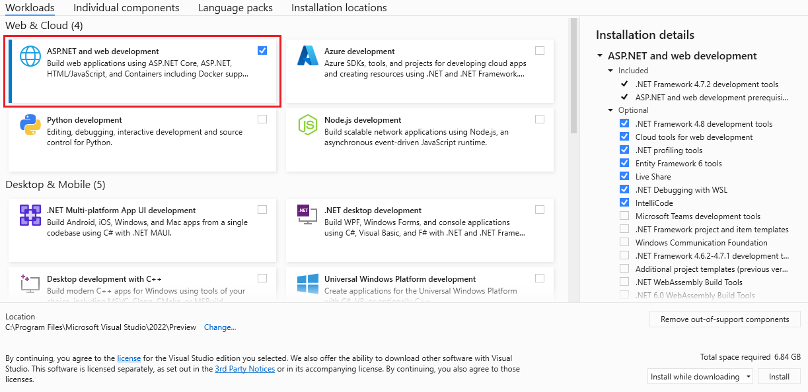
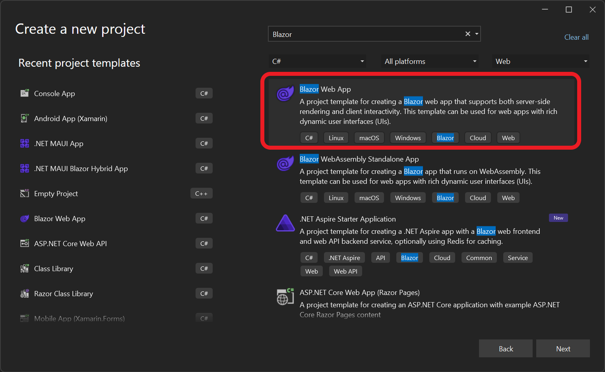
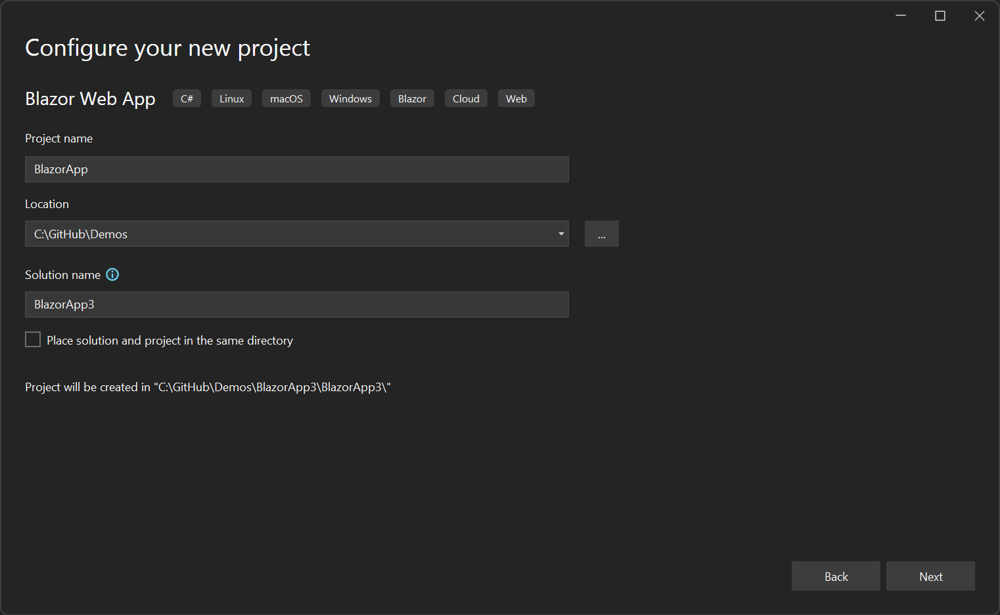
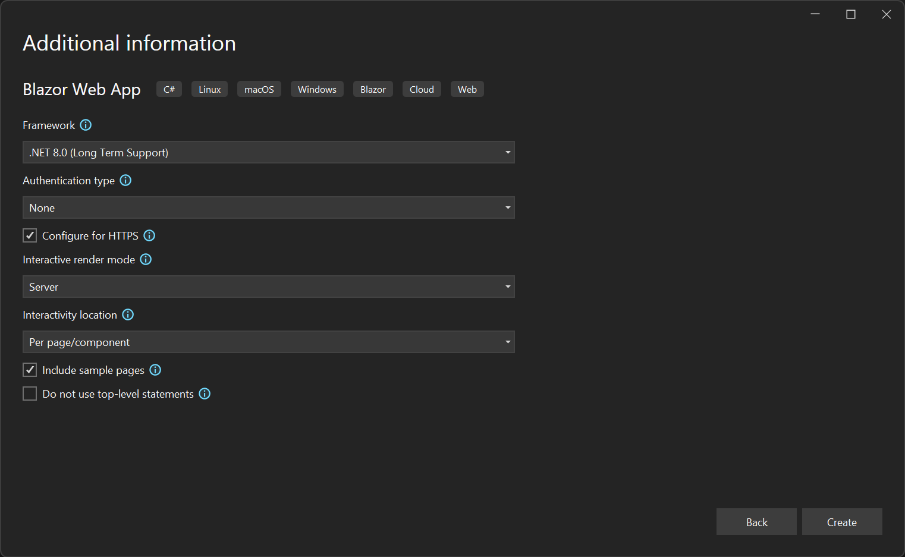

Let's set up our .NET development environment and create our first Blazor web app.

This module gives you the option to use the [.NET CLI](/dotnet/core/tools/), [Visual Studio Code](https://code.visualstudio.com), or [Visual Studio 2022](https://visualstudio.com) for local development. If you're developing with Visual Studio Code, be sure to install the [C# Dev Kit](https://code.visualstudio.com/docs/csharp/get-started#_install) extension, which we use in this module.

::: zone pivot="vscode"

[!include[](../../../includes/dotnet8-sdk-version.md)]

## Create a new Blazor web app with the C# Dev Kit

To create a new Blazor web app project in Visual Studio Code with the C# Dev Kit:

1. Bring up the Command Palette using Ctrl+Shift+P and then type ".NET".

1. Find and select the **.NET: New Project** command.

1. Select **Blazor Web App** in the dropdown list.

1. Select the folder where you want to create the new project.

1. Name the project **BlazorApp** and press **Enter** to confirm.

1. In Visual Studio Code with the C# Dev Kit, the **Solution Explorer** loads with a project view of the new Blazor app.

## Optional: Create a new Blazor app with the .NET CLI

To create a Blazor web app project using the .NET SDK from the command-line, use the following command:

```dotnetcli
dotnet new blazor
```

Whether you created the Blazor app with Visual Studio Code or the .NET CLI, the generated project contains the following files and pages:

- *Program.cs* is the entry point for the app that starts the server and where you configure the app services and middleware.
- *App.razor* is the root component for the app.
- *Routes.razor* configures the Blazor router.
- The *Components/Pages* directory contains some example web pages for the app.
- *BlazorApp.csproj* defines the app project and its dependencies and can be viewed by double-clicking the project node in the Solution Explorer.
- The *launchSettings.json* file inside the Properties directory defines different profile settings for the local development environment. A port number is automatically assigned at project creation and saved on this file.

## Run the app with the integrated debugger

1. In Visual Studio Code, select **Run** from the menu.

1. Select  **Start Debugging**.

1. Select **C#** from the **Select debugger** drop down.

1. Select **C#: BlazorApp [Default Configuration]**

    This builds and starts the app with debugging enabled. The app should automatically open in your default browser. Your browser might warn you that the site isn't secure; it's safe to proceed.

    

## Optional: Run the app with the .NET CLI

1. In the terminal window, copy and paste the following command to run the app and watch for file changes:

    ```dotnetcli
    dotnet watch
    ```

    This command builds and starts the app, and then applies any code changes to the running app. The app should automatically open in your default browser. Your browser might warn you that the site doesn't yet have a valid certificate; it's safe to proceed.

::: zone-end

::: zone pivot="vstudio"

## Create a new Blazor app

Visual Studio is a fully featured IDE for .NET development that makes creating Blazor apps easy.

To use Visual Studio create and work with Blazor web apps, be sure to install the "ASP.NET and web development" workload using the Visual Studio installer.



To create a new Blazor web app using Visual Studio:

1. Start Visual Studio and select **Create a new project**.

1. In **Create a new project** window, type **Blazor** in the search box and hit Enter.

1. Select the **Blazor Web App** template and select **Next**.

    

1. In the **Configure your new project** window, enter **BlazorApp** as the project name and select **Next**:

    

1. In the **Additional information** window, select **.NET 8.0 (Long Term Support)** in the **Framework** drop-down if not already selected and click the **Create** button.

    When creating a Blazor Web App you can select from various options, like whether to enable authentication, what interactive render modes to enable, and how much of the app you want to be interactive. For this app, make sure the defaults are selected as follows:

    - Authentication type: None
    - Interactive render mode: Server
    - Interactivity location: Per page/component

   

1. Select **Create** to create a basic Blazor project with all required files and pages.

Your project is created and loaded in Visual Studio. Take a look at the contents of your project using **Solution Explorer**.


Several files were created to give you a simple Blazor app that is ready to run:

- *Program.cs* is the entry point for the app that starts the server and where you configure the app services and middleware.
- *App.razor* is the root component for the app.
- *Routes.razor* configures the Blazor router.
- The *Components/Pages* directory contains some example web pages for the app.
- *BlazorApp.csproj* defines the app project and its dependencies and can be viewed by double-clicking the project node in the Solution Explorer.
- The *launchSettings.json* file inside the Properties directory defines different profile settings for the local development environment. A port number is automatically assigned at project creation and saved on this file.

## Run the app

Click on the **Start Debugging** button (green arrow) in the Debug Toolbar in Visual Studio to run your app.


Once the app is running, you can apply code changes to the running app by clicking the **Hot Reload** button.


You can stop the app at any time by clicking on the **Stop** button in the top toolbar.


The first time you run a web app in Visual Studio, it will set up a development certificate for hosting the app over HTTPS and then prompt you to trust the certificate. We recommend agreeing to trust the certificate. The certificate is only used for local development, and without it most browsers complain about the security of the website.

Wait for the app to launch in the browser. Once you get to the following page, you've successfully run your first Blazor app!


::: zone-end

Use this Blazor app in the following exercises.
