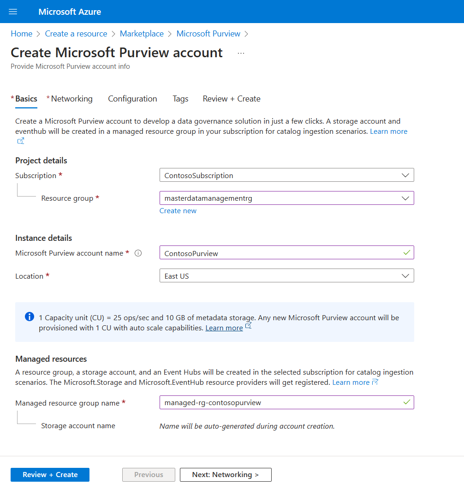
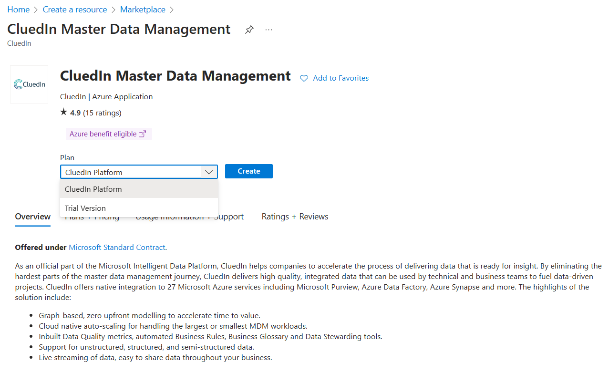
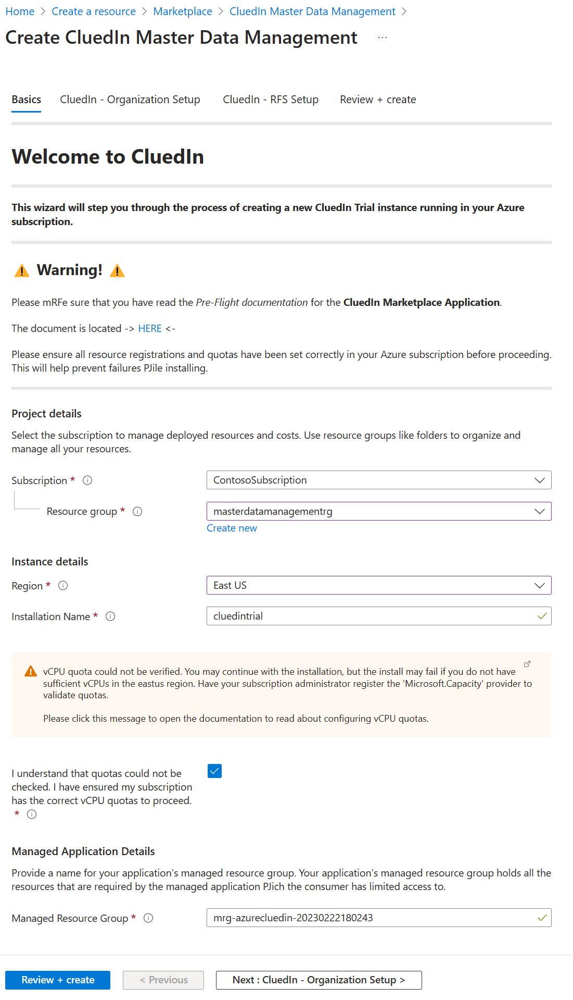
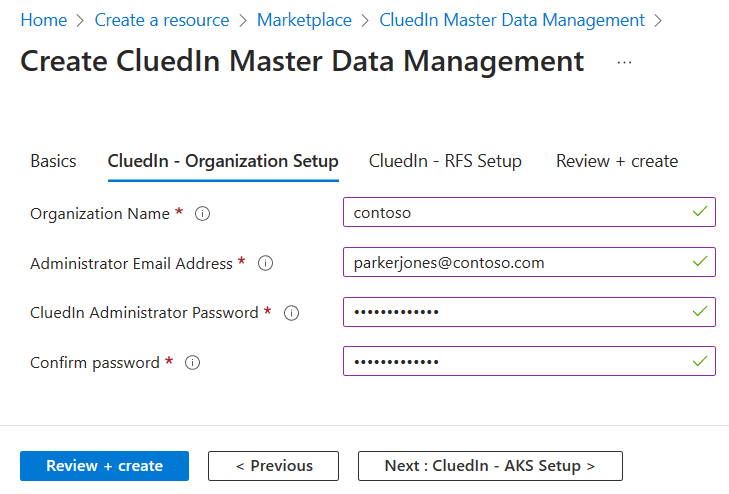
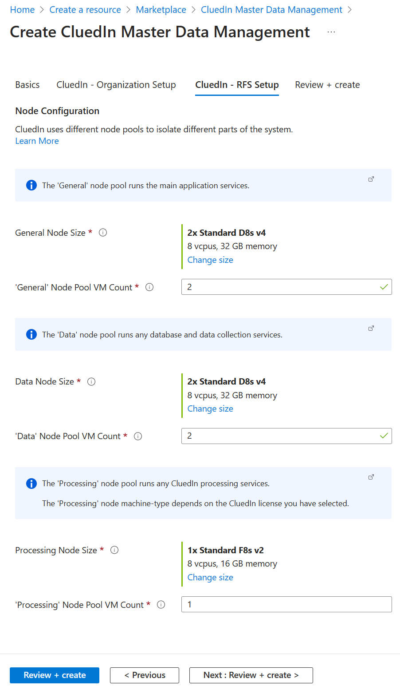

To provide an end to end data technology stack we'll be creating many resources and integrating them together. In this exercise you'll deploy some foundational services that you can use in the future exercises. This exercise includes setting up Azure Data Factory, Microsoft Purview, CluedIn, a Service Principal, and an Azure Storage account. If you have these components already, you can move on to the next section. 

>[!TIP]
>Even if you already have a security principal, confirm you have the correct permissions in the [set up authentication using a service principal](#set-up-authentication-using-service-principal) section.

## Create an Azure Data Factory

We will be using Azure Data Factory as our mechanism to pull data from source systems into the Storage Accounts, but will also be using it as the mechanism for CluedIn to pull data registered in Microsoft Purview through into CluedIn to be processed.

You will need to create an instance of Azure Data Factory (or bring an existing instance) and you can use the following guide to setup an Azure Data Factory instance: https://learn.microsoft.com/en-us/azure/data-factory/quickstart-create-data-factory

## Create a Microsoft Purview instance

You will need to bring your own Microsoft Purview instance to the learning module, which can be installed using the following guide: https://learn.microsoft.com/en-us/azure/purview/create-microsoft-purview-portal

## Create a service principal

You will also need to setup a Service Principal in order to generate the right credentials for all the different components to talk with each other.
To create a new service principal:

1. Sign in to the [Azure portal](https://portal.azure.com).
1. From the portal, search for and select **Azure Active Directory**.
1. From the **Azure Active Directory** page, select **App registrations** from the left pane.
1. Select **New registration**.
1. On the **Register an application** page:
    1. Enter a **Name** for the application (the service principal name).
    1. Select **Accounts in this organizational directory only (_&lt;your tenant's name&gt;_ only - Single tenant)**.
    1. For **Redirect URI (optional)**, select **Web** and enter a value. This value doesn't need to be a valid endpoint. `https://exampleURI.com` will do.
    1. Select **Register**.

    :::image type="content" source="../media/application-registration.png" alt-text="Screenshot of the application registration page, with the above options filled out.":::

1. On the new service principal page, copy the values of the **Display name** and the **Application (client) ID** to save for later.

   The application ID is the `client_id` value in the sample code.

   :::image type="content" source="../media/tutorial-using-rest-apis/application-id.png" alt-text="Screenshot of the application page in the portal with the Application (client) ID highlighted.":::

To use the service principal (application), you need to know the service principal's password that can be found by:

1. From the Azure portal, search for and select **Azure Active Directory**, and then select **App registrations** from the left pane.
1. Select your service principal (application) from the list.
1. Select **Certificates & secrets** from the left pane.
1. Select **New client secret**.
1. On the **Add a client secret** page, enter a **Description**, select an expiration time under **Expires**, and then select **Add**.

   On the **Client secrets** page, the string in the **Value** column of your new secret is your password. Save this value.

   :::image type="content" source="../media/tutorial-using-rest-apis/client-secret.png" alt-text="Screenshot showing a client secret.":::

### Set up authentication using service principal

Once the new service principal is created, you need to assign the data plane roles of your purview account to the service principal created above. Follow the steps below to assign the correct role to establish trust between the service principal and the Purview account:

1. Navigate to your [Microsoft Purview governance portal](https://web.purview.azure.com/resource/).
1. Select the Data Map in the left menu.
1. Select Collections.
1. Select the root collection in the collections menu. This will be the top collection in the list, and will have the same name as your Microsoft Purview account.

    >[!NOTE] 
    >You can also assign your service principal permission to any sub-collections, instead of the root collection. However, all APIs will be scoped to that collection (and sub-collections that inherit permissions), and users trying to call the API for another collection will get errors.

1. Select the **Role assignments** tab.

1. Assign the following roles to the service principal created previously to access various data planes in Microsoft Purview.

    * Data Curator role to access Catalog Data plane.
    * Data Source Administrator role to access Scanning Data plane.
    * Collection Admin role to access Account Data Plane and Metadata policy Data Plane.

    > [!Note]
    > Only members of the Collection Admin role can assign data plane roles in Microsoft Purview. For more information about Microsoft Purview roles, see [Access Control in Microsoft Purview](./catalog-permissions.md).

## Create a CluedIn instance

You can also install CluedIn directly through the Azure Marketplace or Azure Portal. You will need to make sure that you check and validate that you have all the prerequisites for installing the trial, available here: https://documentation.cluedin.net/deployment/azure-marketplace/preflight 

To install CluedIn, head to the Azure Portal and follow the steps below:

1. Type "CluedIn" in your Azure Portal and select the application under the Marketplace section. 

    

1. This will take you to a form where you will be asked to choose the type of plan. CluedIn provides a 7-day trial that is cost-free from CluedIn, but will charge for the underlying Azure infrastructure used to install within your environment. You can also choose the "CluedIn Platform" plan which is the hourly based pricing. 

    

1. Choose the plan that works for you and fill in the form details. In this modeul, we will walk you through using the CluedIn 7-day trial. 

1. Choose "Trial Version" from the dropdown and select "Create".

1. Fill in the Subscription and Resource Group you would like to use. You can also create a new Resource Group here if that is preffered. For the region, make sure you choose a region in which you are able to create infrastructure and that you have enough of a quota to spin up the required infrastructure. If you are in doubt, there is a handy PowerShell script that you can run here: https://documentation.cluedin.net/deployment/azure-marketplace/preflight that will tell you if you have enough quota and all required prerequisites before running the installation. 

    >[!NOTE]
    >The Managed Resource Group name is autogenerated for you, there is no need to rename this. Call your Installation Name something that will be easy for you to remember throughout your learning Module. 

    

1. Select "Next : CluedIn - Organization Setup >" in which you will then be taken to set the Organization Name, Administrator Email Address, CluedIn Administrator Password, Confirm Password. 

    

    >[!NOTE]
    >If you are required to use Single Sign On for your Learning Module then you will need to use the "CluedIn Platform" plan. The Trial does not support SSO setup and uses simple OAuth 2 / JWT authentication.

    The Organization Name will not only act as the Account Name for your new instance of CluedIn, but will also be the subdomain that will be used to access your CluedIn Studio in the browser. 

1. Provide an email address that is valid and that you have access to, and provide a strong Password in the CluedIn Administration Password and Confirm password fields. 

1. Select "Next : CluedIn - AKS Setup >" and leave all of the values as the default. 

    

1. Select "Next : Review + create >". On this next page you will need to check the checkbox to agree to the terms and conditions.

In approximately 15 to 20 minutes, you will have a created instance of CluedIn and will receive an email with all of the access details, including the Url, to access your newly created CluedIn environment.

# Create an Azure Storage Account

To act as the ADLS Gen2 in the scenario for this Microsoft Learn module, we will be creating a Storage Account (Container Storage) as to host all of the data used for the module. You can follow a guide here: https://learn.microsoft.com/en-us/azure/storage/common/storage-account-create?tabs=azure-portal

