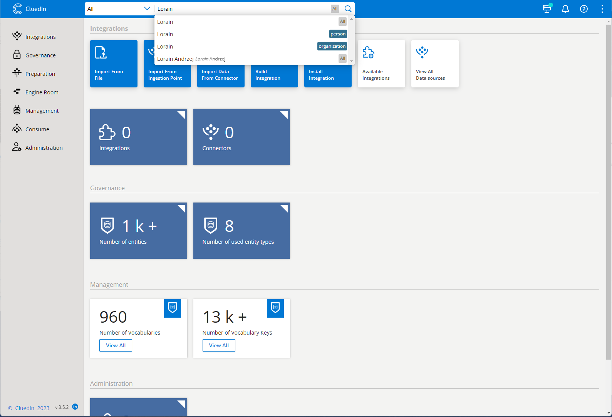

With your data now mapped into the CluedIn platform, let's go explore the data in the CluedIn Studio. 

1. In the search bar up the top of the Studio, search for "Lorain". You will notice that CluedIn will provide some autosuggested search results, but you can just select the search button or press enter to see the results. 

    

    If you mapped the data like in the previous exercise then you should see one result for Lorain. If you see more than this, please revisit the last part of the exercise as you may be missing an identifier mapped. 

    Most importantly, we don't see 3 Lorain records from across the 3 input files, but rather one single record of Lorain. Select the result to be taken through the the "Single View" of Lorain. 

    On this page you will see the inbuilt data quality metrics of CluedIn. Don't be alarmed if some of the quality metrics don't have a value yet, they will either come over time or you may need to setup other parts of the platform for them to be enabled. You should, however see that we are starting to get scores for Data Accuracy, Data Completeness and more. 

1. Navigate to the **All Properties** tab and you will see all of the data for Lorain, including the fact that we do not have columns for first, fname and first_name, but rather we have one normalised key, but we have the values from each of the respective input columns as values. 

1. For any of the properties such as employee.Email, select the 3 horizontal dots, to reveal a submenu where you will have an option to "View History".

    Here you will notice that you have the 3 different emails of Lorain, more proof that we could not have used this to stitch together the 3 records. 

1. Now select the "**Relations**" tab in which you will see one single record for Lorain, however she will have a relationship that has been built to a company.

    >[!NOTE]
    > What is interesting here is that at no point in the mapping process did you tell CluedIn HOW to integrate the data, but rather you simply made a reference that the person_id column should refer to an Employee. Which file that Employee came from was not something that we specified. 

1. Select the **History** tab to reveal that we have 4 entries. Unsuprisingly, we have the entries from the 3 files from Xero, Salesforce and Experian. However there is another entry in here that didn't come from a file, but rather seems to have been generated by the CluedIn system. 

    This entry is what CluedIn calls a Shadow Entity. If you recall back to the mapping process, you uploaded the file called "Companies.csv" first in which there was a refernce to a Person/Employee with the column of person_id. When you processed this data into CluedIn, the system created a "placeholder" for a Person/Employee that may or may never actually enter the system at all. Think of this 4th entry as that Shadow Entity or "placeholder".

1. Finally, select the **Topology** tab in which you will see a visual view of what logic CluedIn used to stitch Lorain's record together from the 3 files. Unsuprisingly, it never used the email address to do this, but it did triangulate the Id and the PersonId from the 3 files to form one record. 