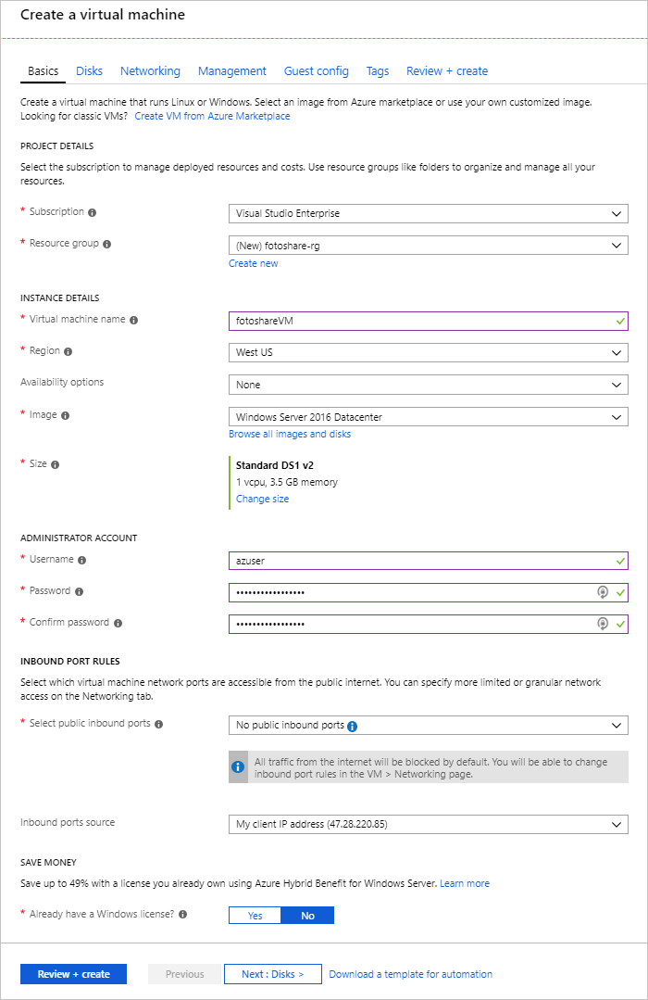

Suppose you run a photo sharing site, with data stored on Azure virtual machines (VMs) running SQL Server and custom applications. You want to make the following adjustments:

- You need to change the disk cache settings on a VM.
- You want to add a new data disk to the VM with caching enabled.

You've decided to make these changes through the Azure portal.

In this exercise, we'll walk through making the changes to a VM that we described above. First, let's sign in to the portal and create a VM.

[!include]

## Create a virtual machine

In this step, we're going to create a VM with the following properties:

| Property        | Value   |
|-----------------|---------|
| Image           | **Windows Server 2016 Datacenter** |
| Name            | **fotoshareVM** |
| Resource group  |   **<rgn>[sandbox resource group name]</rgn>** |
| Location        | See below. |

1. Sign into the [Azure portal](https://portal.azure.com/learn.docs.microsoft.com?azure-portal=true) using the same account you activated the sandbox with.

1. Select **Create a resource** in the sidebar menu on the left.

1. _Windows Server 2016 VM_ should be in the list of **Popular** Marketplace elements. If not, try searching for "Windows Server 2016 DataCenter" using the search box on the top.

1. Select the Windows VM and click **Create** to start the VM creation process.

1. In the **Basics** panel, verify the selected **Subscription** is _Concierge Subscription_.

1. Under **Resource Group**, select **Use Existing** and choose _<rgn>[sandbox resource group name]</rgn>_.

1. In the **Virtual machine name** box, enter _fotoshareVM_.

1. In the **Location** drop-down list, select the closest region to you from the following list.

    [!include]

1. For the VM **Size**, the default is **DS1 v2** which gives you a single CPU and 3.5 GB of memory. That's fine for this example.

1. In **ADMINISTRATOR ACCOUNT** section, enter a **Username** and **Password**/**Confirm password** for an administrator account on the new VM.

1. The following image is an example of what the **Basics** configuration looks like when filled out. Leave the defaults for the remaining tabs and fields and click **Review + create**.

    

1. After reviewing your new VM settings, click **Create** to start the deploying your new VM.

VM creation can take a few minutes as it creates all the various resources (storage, network interface, etc.) to support the virtual machine. Wait until the VM has deployed before continuing with the exercise.

## View OS disk cache status in the portal

Once our VM is deployed, we can confirm the caching status of the OS disk using the following steps:

1. Select the **fotoshareVM** resource to open the VM details in the portal. Alternatively, you can click **All resources** in the left sidebar, and then select your VM, **fotoshareVM**.

1. Under **Settings**, select **Disks**.

1. On the **Disks** pane, the VM has one disk, the OS disk. Its cache type is currently set to the default value of **Read/write**.

## Change the cache settings of the OS disk in the portal

1. On the **Disks** pane, select **Edit** in the upper left of the screen.

1. Change the **HOST CACHING** value for the OS disk to **Read-only** using the drop-down list, and then select **Save** in the upper left of the screen.

1. This update can take some time. The reason is that changing the cache setting of an Azure disk detaches and reattaches the target disk. If it's the operating system disk, the VM is also restarted. When the operation completes, you'll get a notification saying the VM disks have been updated.

1. Once complete, the OS disk cache type is set to **Read-only**.

Let's move on to data disk cache configuration. To configure a disk, we'll need first to create one.

## Add a data disk to the VM and set caching type

1. Back on the **Disks** view of our VM in the portal, go ahead and click **Add data disk**. An error immediately appears in the **Name** field, telling us that the field can't be empty. We don't have a data disk yet, so let's create one.

1. Click in the **Name** list, and then click **Create disk**.

1. In the **Create managed disk** pane, in the **Name** box, type **fotosharesVM-data**.

1. Under **Resource Group**, select **Use existing**, and select _<rgn>[sandbox resource group name]</rgn>_.

1. Note the defaults for the remaining fields:
    - Premium SSD
    - 1023 GB in size
    - In the same location as the VM (not changeable).
    - IOPS limit - 5000
    - Throughput limit (MB/s) - 200

1. Click **Create** at the bottom of the screen.

    Wait until the disk has been created before continuing.

1. Change the **HOST CACHING** value for our new data disk to **Read-only** using the drop-down list (it might be set already), and then click **Save** in the upper left of the screen.

    Wait for the VM to finish updating the new data disk. Once complete, you will have a new data disk on your virtual machine.

In this exercise, we used the Azure portal to configure caching on a new VM, change cache settings on an existing disk, and configure caching on a new data disk. The following screenshot shows the final configuration:

