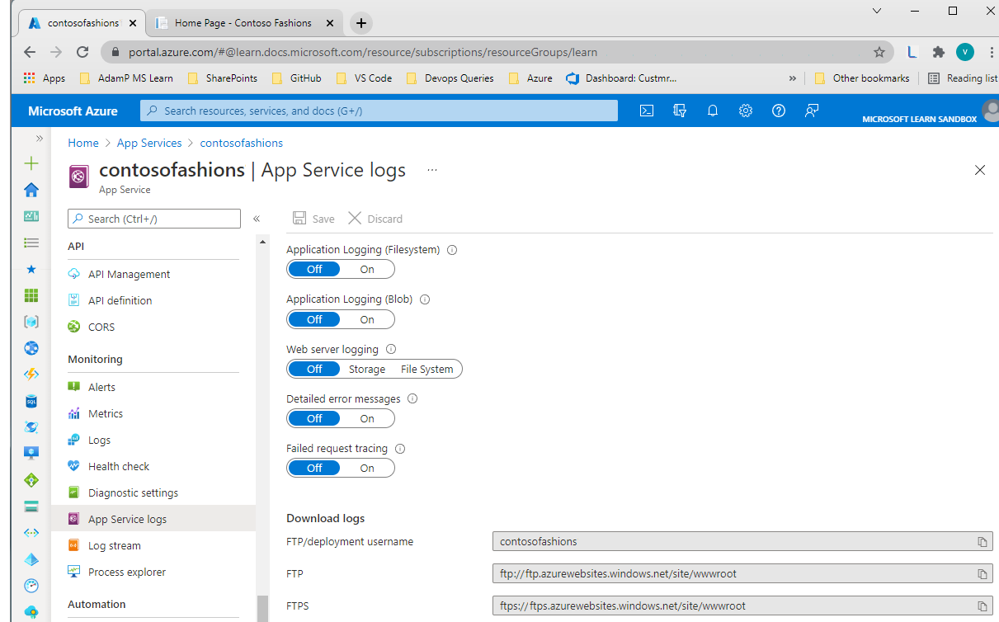
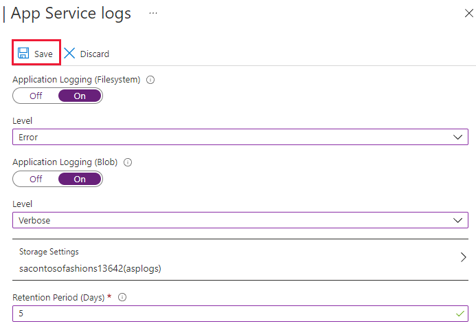

In this unit, you'll look at how app logging can help with your Web apps, and how to enable these logs.

## What are app logs?

App logs are the output of runtime trace statements in app code. For example, you might want to check some logic in your code by adding a trace to show when a particular function is being processed, or you might only want to see a logged message when a particular level of error has occurred. App logging is primarily for apps in pre-production and for troublesome issues, because excessive logs can carry a performance hit and quickly consume storage; for this reason, logging to the file system is automatically disabled after 12 hours.

App logging has scale limitations, primarily because ***files*** are being used to save the logged output. If you have multiple instances of an app, and the same storage used is shared across all instances, messages from different instances may be interleaved, making troubleshooting difficult. If each instance has its own log file, there will be multiple logs, again making it difficult to troubleshoot instance-specific issues.

The types of logging available through the Azure App Service depends on the code framework of the app, and on whether the app is running on a Windows or Linux app host.

### ASP.NET

ASP.NET apps only run on Windows app services. To log information to the app diagnostics log, use the `System.Diagnostics.Trace` class. There are four trace levels you can use, and these correlate with `error`, `warning`, `information`, and `verbose` logging levels shown in the Azure portal.

- Trace.TraceError("Message"); *// Writes an error message*
- Trace.TraceWarning("Message"); *// Writes a warning message*
- Trace.TraceInformation("Message"); *// Writes an information message*
- Trace.WriteLine("Message"); *// Writes a verbose message*

### ASP.NET Core apps

ASP.NET Core apps can run on either Windows or Linux. To log information to Azure app logs, use the **logger factory** class, and then use one of six-log levels:

- logger.LogCritical("Message"); *// Writes a critical message  at log level 5*
- logger.LogError("Message"); *// Writes an error message  at log level 4*
- logger.LogWarning("Message"); *// Writes a warning message  at log level 3*
- logger.LogInformation("Message"); *// Writes an information message  at log level 2*
- logger.LogDebug("Message"); *// Writes a debug message at log level 1*
- logger.LogTrace("Message"); *// Writes a detailed trace message  at log level 0*

For ASP.NET Core apps on Windows, these messages relate to the filters in the Azure portal in this way:

- Levels 4 and 5 are "error" messages.
- Level 3 is a "warning" message.
- Level 2 is an "information" message.
- Levels 0 and 1 are "verbose" messages.

For ASP.NET Core apps on Linux, only "error" messages (levels 4 and 5) are logged.

### Node.js apps
For script-based Web apps, such as Node.js apps on Windows or Linux, app logging is enabled using the **console()** method:

- console.error("Message") - writes a message to STDERR
- console.log("Message") - writes a message to STDOUT

Both types of message are written to the Azure app service error-level logs.

### Logging differences between Windows and Linux hosts

To route messages to log files, Azure Web apps use the Web server (IIS process). Because Windows-based Web apps are a well-established Azure service, and messaging for ASP.NET apps is tightly integrated with the underlying IIS service, Windows apps benefit from a rich logging infrastructure. For other apps, logging options may be limited by the development platform, even when running on a Windows app service.

The logging functionality available to Linux-based scripted apps, such as Node, is determined by the Docker image used for the app's container. Basic logging, using redirections to STDERR or STDOUT, uses the Docker logs. Richer logging functionality is dependent on the underlying image, such as whether this is running PHP, Perl, Ruby, and so on. To download equivalent Web application logging as provided by IIS for Windows apps, may require connecting to your container using SSH.

The following table summarizes the logging support for common app environments and hosts.

| App environment | Host    | Log levels                                             | Save location             |
| --------------- | ------- | ------------------------------------------------------ | ------------------------- |
| ASP.NET         | Windows | Error, Warning, Information, Verbose                   | File system, Blob storage |
| ASP.NET Core    | Windows | Error, Warning, Information, Verbose                   | File system, Blob storage |
| ASP.NET Core    | Linux   | Error                                                  | File system               |
| Node.js         | Windows | Error (STDERR), Information (STDOUT), Warning, Verbose | File system, Blob storage |
| Node.js         | Linux   | Error                                                  | File system               |
| Java            | Linux   | Error                                                  | File system               |

### Alternatives to app diagnostics

Azure Application Insights is a site extension that provides additional performance monitoring features, such as detailed usage and performance data, and is designed for production app deployments as well as being a potentially useful development tool. Application Insights works with a range of app development environments, providing the same set of rich telemetry and performance data whether the app is ASP.NET or Node. However, to make use of Application Insights, you have to include specific code within your app, using the App Insights SDK. Application Insights is also a billable service, so depending on the scale of your app deployments and data collected, you may need to plan for regular costs.

You can also view **Metrics** for your app, which can help you profile how your app is operating, and these counters are useful in production, as well as, development. You can view CPU, memory, network, and file system usage, and set up alerts when a counter hits a particular threshold. Billing for metrics is covered by the app service plan tier.

## Enable logging using the Azure portal

In the portal, app logging is managed from the Diagnostics logs pane of the web app.



To enable app logging to the Web app's file system, set **Application logging (Filesystem)** to **On**, and then set the **Level** to Error, Warning, Information, or Verbose. Logging to the file system will be automatically reset to Off after 12 hours.

To enable app logging to a blob storage container, set **Application logging (Blob)** to **On**, and then select a storage account and container; the storage account and Web app must be created in the same Azure region. You then set the **Level** to Error, Warning, Information, or Verbose.

> [!NOTE]
> Saving to blob storage is not available for Linux app logs.

When logging to blob storage, you must also set a **Retention Period**. Unlike the file system logs, blob logs are never deleted by default; the retention period option means that any logs older than the specified number of days will be deleted.



After configuring the logs, select **Save**.

## Enable logging using the Azure CLI

The current version of Azure CLI does not enable you to manage app logging to blob storage. To enable app logging to the file system, run this command.

```azurecli
az webapp log config --application-logging true --level verbose --name <app-name> --resource-group <resource-group-name>
```

For example, to enable logging to the file system for an app called **contosofashions123**, capturing all messages, run this command.

```azurecli
az webapp log config --application-logging true --level verbose --name contosofashions123 --resource-group contosofashionsRG
```

There is currently no way to disable application logging by using Azure CLI commands; however, the following command resets file system logging to error-level only.

```azurecli
az webapp log config --application-logging false --name <app-name> --resource-group <resource-group-name>
```

To view the current logging status for an app, use this command.
```azurecli
az webapp log show --name <app-name> --resource-group <resource-group-name>
```
