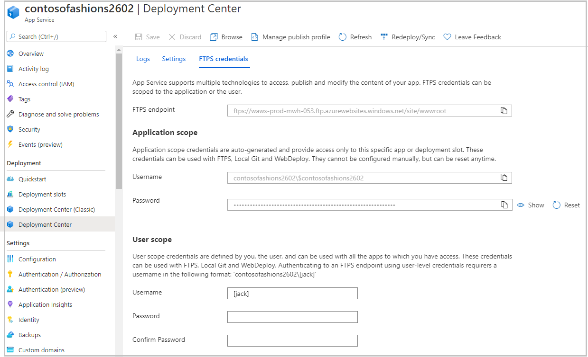

In this unit, you'll look at how to view a live app log stream, and how live log streams can help during Web app development. 

## What is live log streaming

Live log streaming is an easy and efficient way to view live logs for troubleshooting purposes. Live log streaming is designed to provide a quick view of all messages that are being sent to the app logs in the file system, without having to go through the process of locating and opening these logs. To use live logging, you connect to the live log service from the command line, and can then see text being written to the app's logs in real time.

### What logs can be streamed

The log streaming service adds a redirect from the file system logs, so you'll see the same information as is saved to those log files. So, if you enable verbose logging for ASP.NET Windows apps, for example, the live log stream will show all your logged messages.


### Typical scenarios for using live logging

Live logging is a good tool for initial debugging; log messages show in real time to give you quick feedback on code or server issues. You can then make a change, redeploy your app, and instantly see the results.

The live log stream connects to only one app instance, so is not useful if you have a multi-instance app. Live logging is also of limited use as you scale up your apps; in these scenarios, it is better to ensure that messages are saved to log files that can be opened and studied offline.

## How to use live log streaming

To enable live log streaming from the command line, run **Azure CLI** or **curl** commands.

### Azure CLI

To open the log stream, run the following command.

```
az webapp log tail --name <app name> --resource-group <resource group name>
```

To stop viewing live logs, press <kbd>Ctrl+C</kbd>.

### Curl

To use Curl, you need *FTPS credentials*. There are two types of FTPS credentials:

- **Application scope**. Azure automatically creates a username/password pair when you deploy a Web app, and each of your apps has their own separate set of credentials.

- **User scope**. You can create your own credentials for use with any Web app; you can manage these credentials in the Azure portal, *as long as you already have at least one Web app*, or by using Azure CLI commands.

To view and copy these details, under the **Deployment** section in the left nav bar, select **Deployment Center**, and then select the **FTPS credentials** tab in the Azure portal.



To create a new set of user-level credentials, run the following command.

```
az webapp deployment user set --user-name <name-of-user-to create> --password <new-password>
```

> [!NOTE]
> Usernames must be globally unique across all of Azure, not just within your own subscription or directory.

After you have created a set of credentials, to open the log stream, run the following command. You'll be prompted for the password.

```azcli
curl -u {username} https://{sitename}.scm.azurewebsites.net/api/logstream
```

To close the log stream session, press <kbd>Ctrl+C</kbd>.
