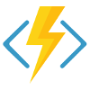

You don't have much time to get business processes properly integrated between your existing bike rental system and the system in use in the second campus. You'd like to make the most of your existing Azure expertise and you've read that Azure includes several different technologies that you can use to solve problems like this.

In this unit, we'll explore the Azure technology options that are available to you.

## Common Business Problems

In business, one way to guarantee a high-quality service to users and high-quality products is to design and implement strict business processes. Such processes may involve multiple steps, multiple people, and multiple software packages. Each process may run in a simple line of activities that workers perform one after the other or they may branch or loop. Each process may also run quickly or take days or weeks to complete.

Frequently, a business runs into issues when it merges with a second business or integrates with a partner organization. How can administrators integrate the separate processes used in the two organizations, which may have been implemented using different software?

Business processes modeled in software are often called **workflows**. Azure includes four different technologies that you can use to build and implement workflows that integrate multiple systems:

- Logic Apps
- Microsoft Flow
- WebJobs
- Azure Functions

These four technologies have some similarities. For example:

- They can all accept **inputs**. An input is a piece of data or a file that is supplied to the workflow.
- They can all run **actions**. An action is a simple operation that the workflow executes and may often modify data or cause another action to be performed.
- They can all include **conditions**. A condition is a test, often run against an input, that may decide which action to execute next.
- They can all produce **outputs**. An output is a piece of data or a file that is created by the workflow.

In addition, workflows created with these technologies can either start based on a schedule or they can be triggered by some external event.

## Design-first technologies

When business analysts discuss and plan a business process, they may draw a flow diagram on paper. With Logic Apps and Microsoft Flow, you can take a similar approach to designing a workflow. They both include user interfaces in which you can draw out the workflow. We call this approach a *design-first* approach.

### Logic Apps

Logic Apps is a service within Azure that you can use to automate, orchestrate, and integrate disparate components of a distributed application. By using the design-first approach in Logic Apps, you can draw out complex workflows that model complex business processes. The following screenshot shows the Logic Apps Designer and design canvas that you use to define your workflow.

Alternatively, if you prefer to work in code, you can create or edit a workflow in JSON notation by using the code view, as illustrated in the following screenshot.

One reason why Logic Apps is so good at integration is that over 200 connectors are included. A *connector* is a Logic Apps component that provides an interface to an external service. For example, the Twitter connector allows you to send and retrieve tweets, while the Office 365 Outlook connector lets you manage your email, calendar, and contacts. Logic Apps provides hundreds of pre-built connectors that you can use to create your apps. If you have an unusual or unique system that you want to call from a Logic Apps, you can create your own connector if your system exposes a REST API.

### Microsoft Flow

Microsoft Flow is a service that you can use to create workflows even when you have no development or IT Pro experience. You can create workflows that integrate and orchestrate many different components by using the website or the Microsoft Flow mobile app.

There are four different types of flow that you can create:

- **Automated**: A flow that is started by a trigger from some event. For example, the event could be the arrival of a new tweet or a new file being uploaded.
- **Button**: Use a button flow to run a repetitive task with a single click from your mobile device.
- **Scheduled**: A flow that executes on a regular basis such as once a week, on a specific date, or after 10 hours.
- **Business process**: A flow that models a business process such as the stock ordering process or the complaints procedure.

Microsoft Flow provides an easy-to-use design surface that anyone can use to create flows of the above types. As the following screenshot illustrates, the designer makes it easy to design and layout your process.

Under the hood, Microsoft Flow is built on Logic Apps. This fact means that Flow supports the same range of connectors and actions. You can also use custom connectors in Microsoft Flow.

### Design-first technologies compared

As you can see from the following table, Microsoft Flow is more appropriate for use by non-technical staff. If your workflow designers are IT professionals, developers, or DevOps practitioners, Logic Apps are usually a better fit:

| | Microsoft Flow| Logic Apps |
-- | -- | -- |
**Intended users** | Office workers and business analysts | Developers and IT pros |
**Intended scenarios** | Self-service workflow creation | Advanced integration projects |
**Design tools** | GUI only. Browser and mobile app | Browser and Visual Studio designer. Code editing is possible |
**Application Lifecycle Management** | Flow includes testing and production environments | Logic Apps source code can be included in Azure DevOps and source code management systems |

## Code-first technologies

The developers on your team will likely prefer to write code when they want to orchestrate and integrate different business applications into a single workflow. This is the case when you need more control over the performance of your workflow or need to write custom code as part of the business process. For such people, Azure includes WebJobs and Functions.

### WebJobs and the WebJobs SDK

The Azure App Service is a cloud-based hosting service for web applications, mobile back-ends, and RESTful APIs. These applications often need to perform some kind of background task. For example, in your bike rental system, when a user uploads a photo of a bike, you may need to generate a smaller thumbnail photograph.

WebJobs are a part of the Azure App Service that you can use to run a program or script automatically. There are two kinds of WebJob:

- **Continuous.** These WebJobs run in a continuous loop. For example, you could use a continuous WebJob to check a shared folder for a new photo.
- **Triggered.** These WebJobs run when you manually start them or on a schedule.

To determine what actions your WebJobs takes, you can write code in several different languages. For example, you can script the WebJob by writing code in a Shell Script (Windows, PowerShell, Bash). Alternatively, you can write a program in PHP, Python, Node.js, or Java.

You can also program a WebJob by using the .NET Framework or the .NET Core Framework and a .NET language such as C# or VB.NET. In this case, you can also use the WebJobs SDK to make the task easier. The SDK includes a range of classes, such as `JobHostConfiguration` and `HostBuilder`, which reduce the amount of code required to interact with the Azure App Service.

The WebJobs SDK only supports C# and the NuGet package manager.

### Azure Functions

An Azure Function is a simple way for you to run small pieces of code in the cloud, without having to worry about the infrastructure required to host that code. You can write the Function in C#, F# Node.js, Java, or PHP and you only pay for the time when the code runs. Azure automatically scales your function in response to the demand from users.

When you create an Azure Function, you can start by writing the code for it in the portal. Alternatively, if you need source code management, you can use GitHub or Azure DevOps Services.

To create an Azure Function, choose from the range of templates. The following list is an example of some of the templates available to you.

- **HTTPTrigger**. Use this template when you want the code to execute in response to a request sent through the HTTP protocol.
- **TimerTrigger**. Use this template when you want the code to execute according to a schedule.
- **BlobTrigger**. Use this template when you want the code to execute when a new blob is added to an Azure Storage account.
- **CosmosDBTrigger**. Use this template when you want the code to execute in response to new or updated documents in a NoSQL database.

Azure Functions can integrate with many different services both within Azure and from third parties. These services can trigger your function, or send data input to your function, or receive data output from your function.

### Code-first technologies compared

In most cases, the simple administration and more flexible coding model provided by Azure Functions may lead you to choose them in preference to WebJobs. However, you may choose WebJobs for the following reasons:

- You want the code to be a part of an existing App Service application and to be managed as part of that application, for example in the same Azure DevOps environment.
- You need close control over the object that listens for events that trigger the code. This object in question is the `JobHost` class, and you have more flexibility to modify its behavior in WebJobs.

| | Azure WebJobs | Azure Functions |
-- | -- | -- |
Supported languages | C# if you are using the WebJobs SDK | C#, F#, JavaScript, Java |
Automatic scaling | No | Yes |
Development and testing in a browser | No | Yes |
Pay-per-use pricing | No | Yes |
Integration with Logic Apps | No | Yes |
Package managers | NuGet if you are using the WebJobs SDK | Nuget and NPM |
Can be part of an App Service application | Yes | No |
Provides close control of `JobHost` | Yes | No |

Now you know what design-first and code-first technologies are available to you, how do you narrow you choice down for a given scenario? We'll look at this question in the next unit. 