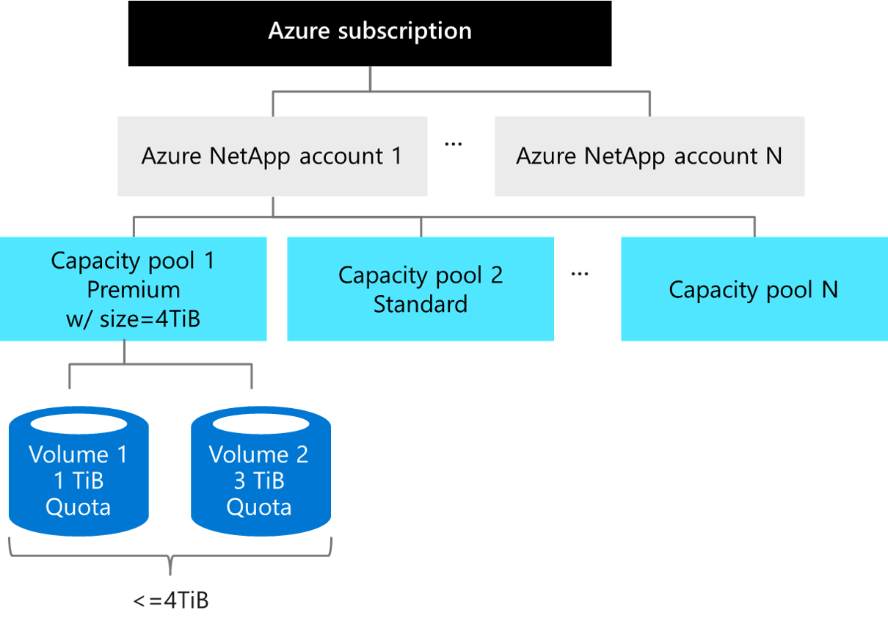

<!-- 1. Topic sentence(s) --------------------------------------------------------------------------------

    Goal: briefly summarize the key skill this unit will teach

    Heading: do not add an H1 or H2 title here, an auto-generated H1 will appear above this content

    Example: "Organizations often have multiple storage accounts to let them implement different sets of requirements."

    [Learning-unit introduction guidance](https://review.docs.microsoft.com/learn-docs/docs/id-guidance-introductions?branch=master#rule-use-the-standard-learning-unit-introduction-format)

-->

# Goal

You will examine the key factors that determine Azure NetApp Files performance. You will also learn how to calculate the required bandwidth of your applications.

<!-- 2. Scenario sub-task --------------------------------------------------------------------------------

    Goal: Describe the part of the scenario that will be solved by the content in this unit

    Heading: none, combine this with the topic sentence into a single paragraph

    Example: "In the shoe-company scenario, we will use a Twitter trigger to launch our app when tweets containing our product name are available."
-->

## Storage Hierarchy

Below chart shows the relationships of the Azure subscription, Azure NetApp accounts, Capacity Pools, and Volumes.

### Azure NetApp account

Azure NetApp Files account is primarily an administrative concept and is in regional scope.

### Capacity Pool

A single Azure NetApp account can have up to 25 Capacity Pools. The provisioned size of each Pool can then be assigned to Volumes within it. 

In above example, we provisioned 4 TiB to Capacity Pool 1. This Pool is also assigned a "Premium" service level, which we'll discuss in next section. 

Please note that Azure NetApp Files is charged based on the provisioned size of Capacity Pools. Size of Pools can vary from 4 TiB to 500 TiB each.

### Volume

Volumes are the actual constructs that will be mounted from your VM(s) and being consumed. Volume quota can be assigned in range from 100 GB to 100 TB. And the total Volume capacity cannot exceed the size of the Capacity Pool.

In above example, there are two Volumes within Capacity Pool 1 and the total quota limit cannot exceed 4 TiB. All Volumes in a Pool will have the same service level, Premium in this example.

## Service Levels

The first important concept in determining performance with Azure NetApp Files is the Service Level. The service levels define the maximum throughput allowed on a normalized basis relative to volume quota. For example on Premium service level, you can achieve up to 64 MB/s of throughput for every TB of quota in the volume.  

Azure NetApp Files offers three service levels suited to different workload types: Standard, Premium, and Ultra.

<!-- 3. Prose table-of-contents --------------------------------------------------------------------

    Goal: State concisely what's covered in this unit

    Heading: none, combine this with the topic sentence into a single paragraph

    Example: "Here, you will learn the policy factors that are controlled by a storage account so you can decide how many accounts you need."
TODO: write your prose table-of-contents
-->

<!-- 4. Image (highly recommended) ----------------------------------------------------------------

    Goal: Add a visual like an image, table, list, etc. that supports the topic sentence. Ideally, you'll provide an image that illustrates the customer problem the unit will solve; it can use the scenario to do this or stay generic (i.e. not address the scenario).
TODO: add a visual dddd

-->

<!-- 5. Chunked content-------------------------------------------------------------------------------------

    Goal: Provide all the information the learner needs to perform this sub-task.

    Structure: Break the content into 'chunks' where each chunk has three things:
        1. An H2 or H3 heading describing the goal of the chunk
        2. 1-3 paragraphs of text
        3. A visual like an image, table, or list

    [Learning-unit structural guidance](https://review.docs.microsoft.com/learn-docs/docs/id-guidance-structure-learning-content?branch=master)
-->

## Performance Sizing

Performance for Azure NetApp Files is simple to design and easy to configure. There are 2 key factors involved: the service level, which we just introduced, establishes the baseline level of performance.

The second is the Volume quota.

The gross performance limit of the Volume is the product of these two factors.

Let's walk through an example:

- If I choose the Premium Tier, I get 64 MB per second for every 1TB of quota within the Volume.

- If I provision a Volume with a 2-TB quota, then that Volume can deliver up to 128MB per second of throughput.  

Note that:

1. The limit of maximum throughput of an Azure NetApp Files Volume is 4,500 MiB/s.

2. The gross throughput is set by the quota of the Volume, not the actual capacity consumed in the Volume.

3. You can resize the Volume quota in anytime, even it is mounted. And changes to QoS will take effect in near real time. You do not need to reboot your VM nor to remount the Volume.

And keep in mind that in real-world, storage performance is impacted by a wide range of factors, including the Read/Write mix, block size mix, and access patterns like random or sequential access.

## Calculate Required Bandwidth

How do you know the needed bandwidth of throughput? If you know both the IOPS and the transfer size of your workload, you can calculate the bandwidth required by multiplying them together.

For example, if your workloads need 100,000 IOPS and have an averaged transfer size of 16KB, then the bandwidth required is 1.53 GB per second.

- 100,000 IOPS * 16 KB = 1,600,000 KB/s = 1.53 GB/s

<!-- - - - - - - - - - - - - - - - - - - - - - - - - - - - - - - - - - - - - - - - -->

<!-- Do not add a unit summary or references/links -->