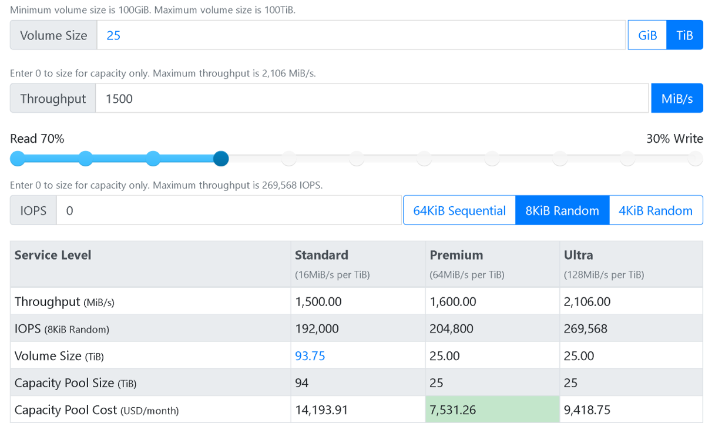

Recall that in the EDA simulation scenario, after we identify the throughput or IOPS requirements of the application, we can then decide the most optimal and cost-effective Azure NetApp Files service level. In this unit, we use the Azure NetApp Files Performance Calculator to achieve this goal.

## Performance considerations

As you learned in the previous unit, a combination of the service level and the volume quota determines the throughput limit for a volume.

Recall that the limit of maximum throughput of an Azure NetApp Files volume is 4,500 MiB per second. At the Premium service level, a volume quota of 70.31-TiB provisions a throughput limit that's high enough to achieve this level of performance:

- 64MiB/s * 70.31 = 4,500 MiB/s

If we assign more than 70.31 TiB, the extra quota is only assigned for storing more data and doesn't result in a further increase in actual throughput.

Most importantly, we also need to consider the cost structure of different service levels.

### Azure NetApp Files Performance Calculator

Use the [Azure NetApp Files Performance Calculator](https://cloud.netapp.com/azure-netapp-files/tco?hs_preview=tIKQbfoF-41214739590) to specify your throughput or IOPS requirements to help you choose the most cost-effective service level.

## Throughput requirement example

An HPC application needs at least a 25-TiB size of volume storage and needs to ensure 1,500 MiB per second in throughput on 8 KiB random with 70/30 read/write.

The output of the Performance Calculator should look like this example:

In this example, the Premium service level is the best choice because it achieves throughput requirements with the lowest capacity pool cost.

## IOPS requirement example

Another HPC application needs at least a 50-TiB size of volume storage and requires at least 140,000 IOPS on 8 KiB random with 70/30 read/write.

The output of the Performance Calculator should look like this example:

In this case, the Standard service level is the best choice because it achieves the specific IOPS requirement and it's also the most cost effective.
