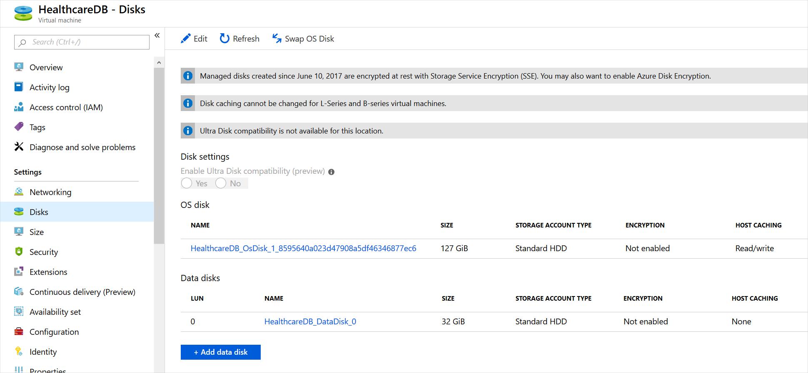
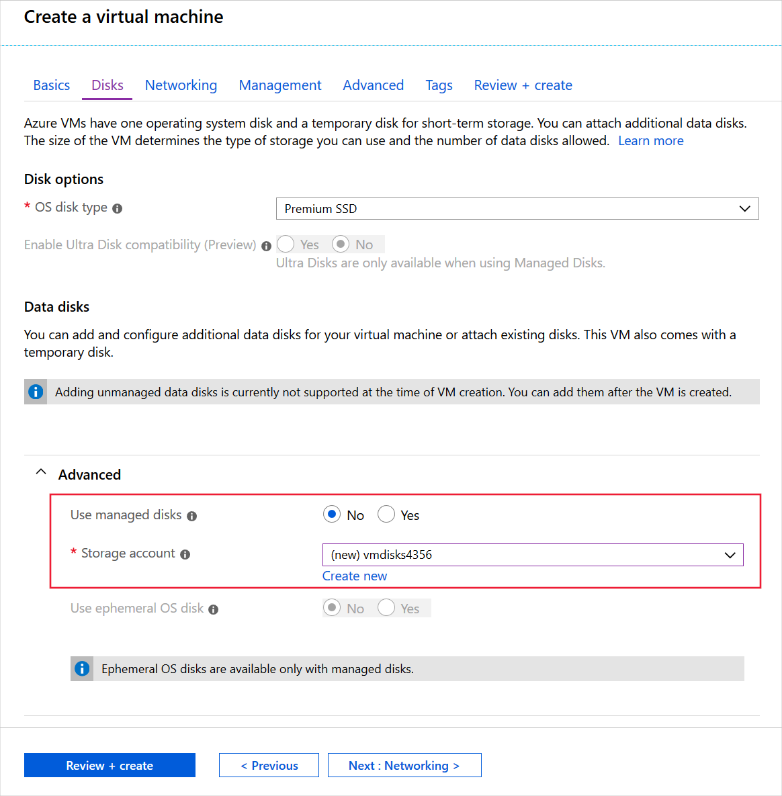

You can choose whether to let Azure manage the storage infrastructure for your virtual hard disks or manage that infrastructure yourself.

Suppose you have a variety of virtual machines running healthcare workloads in your on-premises network that you want to migrate to Azure. You want to maximize performance while minimizing administrative effort.

In this unit, you'll learn about disk roles and ephemeral disks. You'll also learn about the differences between managed and unmanaged disks.

## Disk roles

Each disk can take one of three roles in a virtual machine:

- **OS disk**. One disk in each virtual machine contains the operating system files. When you create a virtual machine, you select a virtual machine image and that fixes the operating system and the OS disk that's attached to the new machine. The OS disk has a maximum capacity of 4 TB.
- **Data disk**. You can add one or more data virtual disks to each virtual machine to store data. For example, you should store database files, website static content, or custom application code on data disks. The number of data disks you can add depends on the virtual machine size. Each data disk has a maximum capacity of 32,767 GB.
- **Temporary disk**. Each virtual machine contains a single temporary disk, which is used for short-term storage applications such as page files and swap files. The contents of temporary disks are lost during maintenance events, so don't use these disks for critical data. These disks are local to the server and aren't stored in a storage account.

You can administer OS disks and data disks on the virtual machine's **Disks** page in the Azure portal.



## Ephemeral OS disks

An ephemeral OS disk is a virtual disk that saves data on the local virtual machine storage. An ephemeral disk has faster read-and-write latency than a managed disk. It's also faster to reset the image to the original boot state if you're using an ephemeral disk. However, an individual virtual machine failure might destroy all the data on an ephemeral disk and leave the virtual machine unable to boot. Because ephemeral disks reside locally to the host, they're free and incur no storage costs.

Ephemeral disks work well when you want to host a stateless workload, such as the business logic for a multitier website or a microservice. Such applications are tolerant of individual virtual machine failures, because requests can be rerouted to other virtual machines in the system. You can reset the failed virtual machine to its original boot state rapidly and get it back up and running faster than if it used managed disks.

## Managed disks

Most disks that you'll use with virtual machines in Azure are managed disks. A managed disk is a virtual hard disk for which Azure manages all the required physical infrastructure. Because Azure takes care of the underlying complexity, managed disks are easy to use. You can just provision them and attach them to virtual machines.

Virtual hard disks in Azure are stored as page blobs in an Azure Storage account, but you don't have to create storage accounts, blob containers, and page blobs yourself or maintain this infrastructure later. The benefits of managed disks include:

- **Simple scalability.** You can create up to 50,000 managed disks of each type in each region in your subscription. 
- **High availability.** Managed disks support 99.999% availability by storing data three times. If there's a failure in one replica, the other two can maintain full read-write functionality.
- **Integration with availability sets and zones.** If you place your virtual machines into an availability set, Azure automatically distributes the managed disks for those machines into different fault domains so that your machines are resilient to localized failures. You can also use availability zones, which distribute data across multiple datacenters, for even greater availability.
- **Support for Azure Backup.** Azure Backup natively supports managed disks, which includes encrypted disks.
- **Granular access control.** You can use Azure role-based access control (RBAC) to grant access to specific user accounts for specific operations on a managed disk. For example, you could ensure that only an administrator can delete a disk.
- **Support for encryption.** To protect sensitive data on a managed disk from unauthorized access, you can encrypt it by using Azure Storage Service Encryption (SSE), which is provided with Azure Storage accounts. Alternatively, you can use Azure Disk Encryption (ADE), which uses BitLocker for Windows virtual machines and DM-Crypt for Linux virtual machines.

Because of all these features, you should use managed disks by default.

## Unmanaged disks

An unmanaged disk, like a managed disk, is stored as a page blob in an Azure Storage account. The difference is that with unmanaged disks, you create and maintain this storage account manually. This requirement means that you have to keep track of IOPS limits within a storage account and ensure that you don't overprovision throughput of your storage account. You must also manage the security and RBAC access at the storage-account level, instead of at each individual disk like with managed disks.

Because unmanaged disks don't support all of the scalability and management features that you've seen for managed disks, they're no longer widely used. Consider using them only if you want to manually set up and manage the data for your virtual machine in the storage account.

To use unmanaged disks in the Azure portal, expand the **Advanced** section on the **Disks** page of the **Create a virtual machine** wizard.



Originally, all virtual hard disks in Azure were unmanaged. If you're running an old virtual machine, it might have unmanaged disks. You can convert those unmanaged disks to managed disks by using the `ConvertTo-AzureRmVmManagedDisk` PowerShell cmdlet:

```PowerShell
ConvertTo-AzureRmVMManagedDisk -ResourceGroupName MyResourceGroup -VMName WebVm
```
