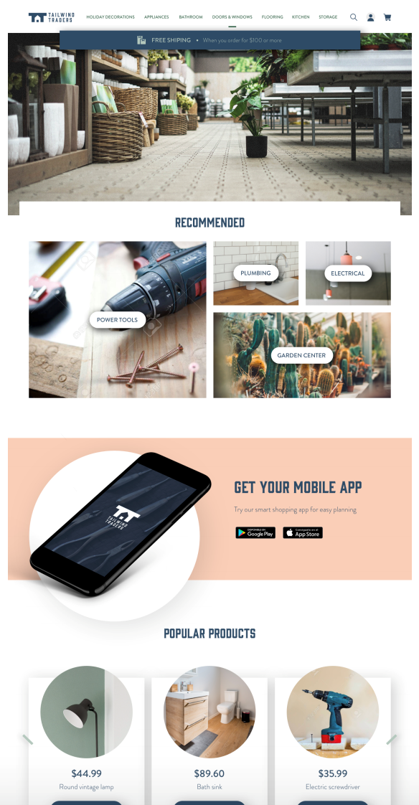
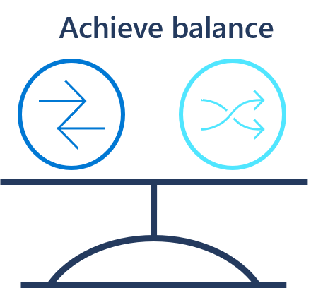
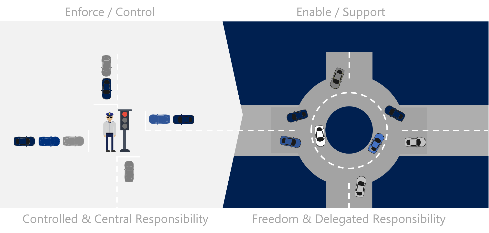

_Figure 1: The Tailwind Traders logo._

Tailwind Traders (Tailwind) is a modern commerce company. For over 30 years, Tailwind has been a popular retail destination growing to over 50 physical stores. Several years ago, their Chief Executive Officer (CEO) anticipated changes in retail and bought a competing e-commerce startup that was growing aggressively in niche markets. Today, the company is seen as an innovative leader with customer-focused local storefronts.

## Retail innovation

The Tailwind Traders retail innovation team uses technology to continually redefine Tailwind's position as a leader in modern commerce.

_Figure 2: The website and app that started retain innovation efforts._

The retail innovation team reports to the company's Chief Technology Officer (CTO), who was the CEO of the acquired e-commerce startup. Those technology solutions are the primary hub for interactions with customers. Those solutions affect 60 percent of global revenue and produce 30 percent of annual gross sales. A few examples of those innovations include:

- **Boundless commerce:** Originally a simple e-commerce solution, this custom-built platform now provides online and offline experiences for customers. Purchases can be made from the platform. The mobile app gathers information from the customer's viewing history to customize the retail experience with in-store ads, shopping lists, and other interactions.
- **Analytics, AI, and robotics innovation:** The team is experimenting with drone delivery, autonomous warehousing, and other AI lead approaches to reduce costs, scale through automation, and improve customer experiences. These experiments are built on big data, analytics, and AI solutions.

## Information technology

Beyond new innovations, Tailwind's central IT teams support all of the back-office and store technologies.

_Figure 3: A balance of speed and control._

The retail innovation team is a division of Tailwind Traders' IT team. That team is led by Tailwind Trader's CIO. When you think of Tailwind Traders, you probably first think of e-commerce and innovation. This is just the beginning of Tailwind's technical capability and a small portion of the overall IT spend. Tailwind supports 3,500 employees less than 100 are dedicated to IT. The innovation team consists of only 20 employees who are mostly developers. Beyond core innovation, the IT team supports the following types of technologies:

- **Smart storefronts:** Environmental controls, doors, lighting, interactive shelves, in-store displays and advertisements, and over 500 point of sales systems.
- **Corporate headquarters:** More than 900 employees are hosted in corporate headquarters with technology systems covering best of breed solutions to support processes across real estate, logistics, supply chain, pricing, human resources, employee schedules/tracking, payroll, etc.
- **End-user workstations:** Mostly desktop-based with a growing percentage of employees opting for mobile, BYOD (bring you own device), in-store kiosks, and virtual desktop solutions.
- **Central operations:** The IT team provides ongoing technical operations for all IT and retail innovations assets.

## CIO transition (new strategy)

The CIO of Tailwind Traders has recently retired. The new CIO is focused on improving technical operations in a number of areas to fuel greater innovation throughout the company while limiting disruptions to core business operations. The cloud will play an important role in this transition.

_Figure 4: The shift in IT operations._

A cornerstone of this strategy will be a shift in the operating model, moving from a centralized command and control operating model to a model that focuses on delegated responsibilities led by a cloud center of excellence team. This transition is expected to take several years. The CIO will be looking for small incremental steps to transition in each of the coming projects.

## IT portfolio overview

Tailwind currently have three datacenters. One is located within the same office building in which their employees work; the company owns this building and datacenter. The two other datacenters are in separate locations and are leased from datacenter providers. Their datacenters are a mix of physical and virtual servers. The virtualization platforms that they use are a mix between Hyper-V and VMware, as they've had different people with different strategy ideas leading their IT department over the years.

Their servers primarily run Windows Server, with a mix of Windows Server 2008 R2, 2012, and Windows Server 2016. They have only a few Windows Server 2019 instances. Upgrading the operating systems to the latest version or following a consistent strategy has never been a priority for the organization, despite various IT team members trying to push that goal.

There are a few Linux and other open-source servers. The IT operations team isn't familiar with the servers, as the development team has introduced them without collaboration between the teams.

The leases for the two datacenters are due to run out in 18 months and 2 years. The IT manager and finance director have been talking, and they don't want to renew the leases instead looking at doing a project that will upgrade, consolidate, and use the cloud as a replacement datacenter. The new CIO is using this project as an opportunity to rethink IT operations.

## Team

- **CIO:** This is the first transformation effort to start since she accepted the new role. As such, she'll keep a close eye on the project and will be examining how IT operates in the cloud.
- **CTO:** The smaller of the two datacenters hosts a number of IT assets, including the experiments being development by the retail innovations team. That datacenter also hosts a number of mainstreamed innovations that are now considered production IT assets. The CTO wants to ensure they will be able to continue to innovate and that the existing innovations will be properly supported.
- **Project manager(s):** Part of the IT department and they help to keep projects on time and on budget. They ensure that all the right stakeholders are involved.
- **Central operations/infrastructure team:** The ops team are currently in charge of the datacenters, looking after the hardware maintenance, operating systems, patch management, networking, out-of-hours support, etc. Most of the team are familiar with the current infrastructure, have little coding experience, and the majority hold Microsoft qualifications relating to Windows Server.
- **Developer:** The in-house development team makes the website for the online store that Tailwind Traders host from their own datacenters.
- **IT manager:** In charge of the ops, developer, and project management teams. Is looking to make the IT department run better, replace old servers, and look to the future to help make Tailwind Traders more competitive and make things better for his operations team, who has to juggle many different systems.
- **Finance director:** Is looking to reduce costs where he can from the budget. The finance director is familiar with the capital expenditure he has to deal with pertaining to the IT department and equipment.
