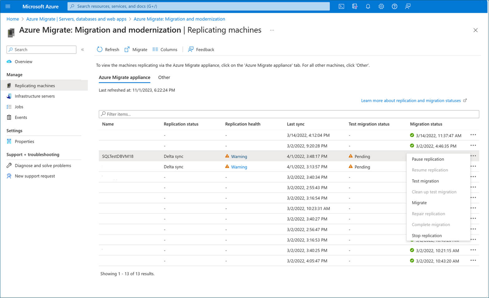

In this unit, you'll review Azure Migrate and how to use it to migrate specific workloads to Azure.

## Virtual machine replication
Add Azure Migrate: Server Migration to your Azure Migrate dashboard, which carries over machines and insights from the assessment completed during the CAF Plan module. You can begin your replication by clicking Replicate in the tool window. Azure Migrate replicates up to 100 VMs simultaneously. If you need to do more, it’s recommended to create multiple batches. Times for replication will vary based on number and size of virtual machines along with connection speeds between your data center and Azure.

> [!div class="mx-imgBorder"]
> 

## Test migrated virtual machines

Once all your targeted virtual machines are replicated and into Azure, before you migrate them into production, you can test your virtual machines to ensure everything works. 
The process runs a prerequisite check, prepares for the test, creates a new test virtual machine, and starts it. This process will take a few minutes.

## Migrating the virtual machines into production

Once you’re ready for the production migration, select **Migrate** from the replicating machines window. That process will prompt you to shut down the virtual machine to avoid any data loss and perform a final replication. It is recommended to do this during off peak business hours, because the virtual machine will be down for a few minutes.

> [!div class="mx-imgBorder"]
> 

Now it will run through the production migration process and you can check the status as it validates the pre-requisites, prepares for migration, creates the Azure VM and starts the Azure VM.

## Release steps
After the migration has taken place, you can release production traffic to the VM by re-rerouting network traffic to the machine. Before re-routing traffic, you should evaluate the workloads to ensure each has a completed business change plan, technical validation, and business validation.

**Business change plan** Ensure that the following aspects of the business change plan are properly communicated to avoid business disruption:

- End-user training is completed (or at least planned).
- Any outage windows have been communicated and approved.
- Production data has been synchronized and validated by end users.
- Validate promotion and adoption timing; ensure timelines and changes have been communicated to end users.

**Technical validation** In additional to the business chance plan, you'll want to consider validation of the technical readiness for your workloads. The following are a few suggested tests to complete:

- **Network isolation testing.** Test and monitor network traffic to ensure proper isolation and no unexpected network vulnerabilities. Also validate that any network routing to be severed during cutover is not experiencing unexpected traffic.
- **Dependency testing.** Ensure that all workload application dependencies have been migrated and are accessible from the migrated assets.
- **Business continuity and disaster recovery (BCDR) testing.** Validate that any backup and recovery SLAs are established. If possible, perform a full recovery of the assets from the BCDR solution. At minimum, you will want to add  a backup schedule using Azure Backup. For more advanced SLAs, you may also want to consider replication to a second region using Azure Site Recovery.
- **End-user route testing.** Validate traffic patterns and routing for end-user traffic. Ensure that network performance aligns with expectations.
- **Final performance check.** Ensure that performance testing has been completed and approved by end users. Execute any automated performance testing.
- **Additional technical readiness** Restrict network access for unused services by using network security groups. Deploy Azure Disk Encryption to secure the disks from data theft and unauthorized access.

**Final business validation** After the business change plan and technical readiness have been validated, the following final steps can complete the business validation:

- **Cost validation (plan versus actual).** Testing is likely to produce changes in sizing and architecture. Ensure that actual deployment pricing still aligns with the original plan.
- **Communicate and execute cutover plan.** Prior to cutover, communicate the cutover and execute accordingly.

Complete clean-up tasks for the remaining on-premises servers. Such tasks may include removing the servers from local backups and removing their raw disk files from storage-area network (SAN) storage to free up space. Update documentation related to the migrated servers to reflect their new IP addresses and locations in Azure.

Once the final step in the list above is completed, the VM and supported workload are considered released, completing the final phase or discipline of migration for that workload.