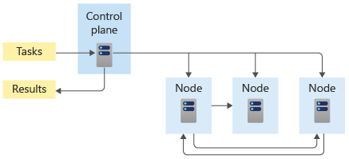

Containers are a virtualization technology. In many ways, they’re similar to virtual machines, but unlike virtual machines, containers don't have their own internal operating system. They’ll actually share part of the operating system with their hosts. As such, a single virtual machine can run many containers. However, each container is still self-contained, with its own code, data, and dependencies.

You can build and run containers in Docker. Docker is software for containers - providing an open, widely used standard for packaging and distributing containerized applications. Using Docker, you can also store and share container images.

## Using containers in the cloud

**Azure Container Registry** provides storage for Docker container images in the cloud, based on the open-source Docker Registry 2.0. Container Registry provides security benefits, such as:

* Authentication for who can see and use your images
* You can sign images to increase trust and reduce the chances of an image becoming accidentally—or intentionally—corrupted or otherwise infected
* All images stored in a container registry are encrypted at rest

Container Registry also lets you automate tasks such as container image builds, and redeploying an app when an image is rebuilt.

### Using Azure Container Registry

In our example scenario, the team needs to host a docker image in Kubernetes that will connect messages from smart fridges to a management webapp. To do this, we’ll create a container registry to store the image, and later ACR will connect to an AKS cluster for image deployment.

One of the main benefits of using containers for Cloud Native Applications is reliability. This is because **containers are immutable**: a container image tested in a QA environment is the exact same container image, with the exact same environment, that is deployed to production.

## Manage containers in the cloud

Kubernetes orchestrates containers by managing virtual machines for you and scheduling containers to run in those virtual machines based on your resource requirements. If the need arises, you can scale to multiple, identical containers, automatically.

### AKS does the heavy lifting

AKS handles Kubernetes for you, by deploying, managing, and scaling Kubernetes clusters. If you have to replace or replicate a container, AKS will automatically route and balance traffic in the cluster. AKS makes it simple to deploy, manage, and connect containerized applications, providing massive savings in development time, application deployment, and security obligations.

## Creating the smart fridge solution

In our scenario, we’ll use AKS to host containers in the cloud. The smart fridges will send REST messages to the cloud, where it will be received by AKS. AKS will route the messages to a container.

The container will run a Node.js program that will then route messages to a management webapp. With the flexibility of AKS and a cloud-native approach, it will be easy to adjust and connect the Node.js container to a database.
