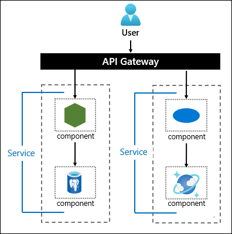

Transitioning from the traditional software programming model to cloud-native applications is typically driven by the need to improve agility, availability, and resiliency of your workloads. As part of that transition, you divide the functionality that such workloads provide into separate components and delegate their implementation to distinct subsystems. This, in turn, allows you to deploy and scale these subsystems independently of each other. You also benefit from the resiliency associated with the scaling capabilities and distributed architecture. One of the core concepts that you rely on to decide how to design and implement these changes is a service.

## What is a service?

The term **service** represents a collection of components that collectively deliver specific, workload-oriented functionality to your cloud-native application. Each service is a part of a larger system that forms the application. For instance, for the smart refrigerator application you are developing, you might have an inventory service, an ordering service, a payment service, and a management interface, each with its own, independent set of technology choices. This gives you flexibility to choose any implementation method that you consider to be optimal based on your requirements or preferences. 

## How can services leverage Azure capabilities?

In the context of cloud native applications, you can optimize the use of services by leveraging Azure capabilities. For example, it is common to implement services as containers, which automatically ensures their isolation by including all service dependencies within the container image. Deploying containers to Azure Kubernetes Service (AKS) allows you not only increase the scalability and resiliency that are fundamental parts of container orchestration, but also offers minimized maintenance overhead, inherent to the managed service. Offerings such as Azure SQL Database, Azure Cosmos DB, and Azure Database for PostgreSQL offer equivalent benefits in regard to data persistence. With Azure API Management, you can control access to services' APIs.

## What is Azure Database for PostgreSQL?

Azure Database for PostgreSQL is a Microsoft-managed implementation of the PostgreSQL Community Edition database engine, which offers a wide-range of capabilities that either eliminate or minimize common database management tasks. These capabilities include automatic backups, elastic scaling, enhanced monitoring and automation, as well as built-in high availability provisions.

Introduced in 1996, PostgreSQL has garnered over the years a large following, so its availability as a managed service on Azure considerably facilitates adoption of principles of cloud-native applications for existing workloads. For example, you can continue using popular, open-source object-role modeling libraries, such as Sequelize or Prisma as you refactor or rearchitect your Node.js-based applications as part of their migration to Azure.

Azure Database for PostgreSQL is available in three deployment modes:

- Single Server. This mode is optimized for cloud native applications that do not require granular control over custom PostgreSQL configuration settings but benefit from the minimized management overhead. It supports the community version of PostgreSQL 9.5, 9.6, 10, and 11
<!-- Missing period after "11". -->
- Flexible Server. This mode offers more granular control of database management tasks and configuration settings. The flexible server architecture delivers support for availability zones and cost optimization controls. The controls allow you to stop the server during idle periods and include the choice of the burstable compute tier, which automatically adjusts the compute resources based on demand. The flexible server supports community version of PostgreSQL 11 and 12.
- Hyperscale. This mode implements sharding to horizontally scale data queries across multiple database instances in order to minimize response time for large datasets. It is intended for applications that require greater scale and performance, with data sets in the range 100 GB.
