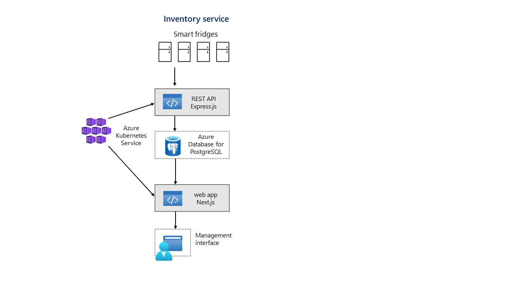

Since cloud native applications do not impose the selection of a specific technology to be used for their individual components, you can base their implementation details on your preferences. In addition, many cloud offerings, such as Azure Database for PostgreSQL, not only allow you to use the same open-source versions of technologies that you're familiar with, but additionally leverage the underlying platform to minimize administrative overhead associated with their usage.

To begin, you decided to configure your Express.js-based application to implement REST API routes providing access to a PostreSQL database. 

## What are the benefits of modular design?

The modularization principle of the services model provides a high degree of separation between individual services. You can independently upgrade, deploy, scale and restart each service, without affecting availability or performance of other services. This, in turn, promotes applying DevOps practices to the lifecycle of your applications, expediting releases of new features by facilitating small, frequent, and incremental changes.

The loose coupling of services allows you to even change the underlying technology without forcing significant code rewrites of the entire application. For example, the Express.js backend service could be containerized and deployed to a Kubernetes cluster, allowing it to scale dynamically based on demand. Alternatively, you could deploy it as a container- or code-based Azure App Service web app, which also supports autoscaling. 

Similarly, you could modify the backend service to connect to a different database of choice, potentially relying on the same set of libraries. Most common object-relational mapper (OMR) libraries available with Node.js, such as Prisma or Sequelize, support a range of relational database products, including PostgreSQL, MariaDB, and Microsoft SQL Server.

Another benefit of the modular design is its extensibility. You have the option of adding another component, such as a management service accessible via a Next.js web app and containerize it if needed, without significant changes to the existing application.

## How to implement a basic service?

The two architectural patterns that serve commonly as the basis for building and optimizing services are Domain-Driven Design (DDD) and command-query responsibility segregation (CQRS). These patterns also influence the way cloud-native applications are modeled.

Domain Driven Design (DDD) is a software development approach that focuses on the functionality of the application in order to define boundaries between services. Command and Query Responsibility Segregation (CQRS) is commonly combined with DDD. Its objective is to replace the traditional CRUD (Create, Read, Update, Delete)-based approach, which relies on a single interface for all data management tasks. Instead, CQRS separates read and update operations for a data store, providing an additional layer of isolation that aligns with the premise behind DDD.

Your objective is to modify the existing Express.js-based web service to provide access to a PostgreSQL database. Express.js is an open-source, back-end web application framework for Node.js. It simplifies building web applications and APIs. Node.js is a JavaScript runtime engine for building client and server applications. It has a module-based architecture that simplifies implementation of a wide range of tasks, including traditional web development and accessing databases, including MongoDB and PostgreSQL. 

There are different ways to access a PostgreSQL database from Express.js applications, but the most popular ones involve the use of OMR libraries, which map programmatic constructs into corresponding database schema. This approach facilitates portability, providing an abstraction layer between the actual database objects and their service-based representation.

The methods implemented by the Express.js application are exposed via routes, which define how the application's endpoints respond to client requests. When implementing them, you should consider applying the principles of CQRS, although this might not be applicable to basic services due to increased complexity.
