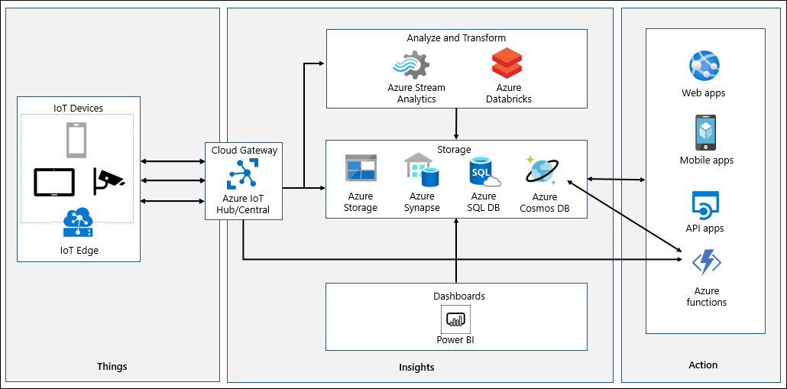

Now that you have verified that Azure Cosmos DB can provide significant benefits in IoT scenarios, you need to determine how you can integrate it with Azure IoT services. Your plan to explore its usage of both the hot and cold path options in order to account for smart appliance inventory and device telemetry scenarios that are part of your cloud-native application design. You also want to identify other data stores that you might be able to leverage in your design.

## What are Azure Cosmos DB-specific design considerations?

When designing Azure Cosmos DB database and container hierarchy, the proper choice of the partition key is essential for ensuring optimal performance and efficiency. This is particularly relevant in IoT scenarios that typically involve large volumes of streaming data.

The choice of the most suitable partition key should take into consideration the usage patterns and the 20 GB limit on the size of an individual logical partition. In general, the best practices dictate to create a partition key with hundreds or thousands of distinct values. The leads to the balanced usage of storage and compute resources across the items associated with these partition key values. At the same time, the combined size of items sharing the same partition key value must not exceed 20 GB. 

For example, when collecting IoT data, you might choose to use the **/date** property for telemetry streaming and **/deviceId** for device inventory, assuming that these represent the targets of the most common data queries. Alternatively, you can construct a synthetic partition key, such as a concatenation of the values of **/deviceId** and **/date**. Another possible approach to ensuring balanced distribution of the workload across multiple partitions is to append a random number within a designated range at the end of the partition key value. This way, as you load the items into the target collection, you can perform parallel writes across multiple partitions.

## What are data pipelines in IoT scenarios?

It is common in IoT scenarios to implement multiple concurrent data paths, either by partitioning the ingested data stream, or by forwarding data records to multiple pipelines. The corresponding architectural pattern is referred to as Lambda architecture and consists of two distinct types of pipelines:

- A fast (hot) processing pipeline performing real-time processing that analyzes data, displays its content, generates short term, time-sensitive information, triggers corresponding actions, such as alerts, and, subsequently, archives the data.
- A slow (cold) processing pipeline executing more complex analysis, potentially combining data from multiple sources and over an extended period of time, and generating such artifacts as reports or machine learning models.

## What is the role of Azure services in implementing IoT pipelines?

IoT systems ingest telemetry generated by a wide range of devices, process and analyze streaming data to derive near real-time insights, and archive data to cold storage for batch analytics. The data path starts with telemetry generated by IoT devices being sent for initial processing to Azure IoT Hub or Azure IoT Central. Both Azure IoT Hub and Azure IoT Central store collected data for a configurable amount of time. 

Azure IoT Hub supports partitioning and message routing, which allow you to designate specific messages for processing, alerting, and remediation tasks by Azure Logic Apps and Azure Functions. The equivalent functionality is available in Azure IoT Central, based on its custom-configured rules that trigger actions via webhooks, which can point to Azure Functions, Azure Logic Apps, Microsoft Flow, or your own custom apps. Azure IoT Hub routes also allow you to forward telemetry to an Azure function for initial processing and subsequently forward it to Azure Cosmos DB. Examples of such processing include format conversion or constructing a synthetic partition key. Another potential use of Azure IoT Hub routes involves copying incoming data into Azure Blob Storage or Azure Data Lake. This provides a low-cost archiving option, with convenient access for batch processing, including Azure Machine Learning data science tasks.

Azure IoT Central offers continuous data export to Azure Event Hub, Azure Service Bus, and custom webhooks. It is also possible to configure interval-based data export to Azure Blob storage. Azure Functions support bindings for Azure Event Hub and Azure Service Bus, which you can leverage to integrate them with Azure Cosmos DB. 

With Azure IoT Central, you have the ability to provide near-real time insights with its built-in analytics capabilities. For more advanced analytics needs or when using Azure IoT Hub, you can funnel data into Azure Stream Analytics. Azure Stream Analytics supports Azure Cosmos DB SQL API as its output, writing stream processing results as JSON-formatted items into Azure Cosmos DB containers. This implements data archiving and allows for low-latency, ad-hoc queries on unstructured JSON data. The change feed functionality automatically detects new data and changes to existing data. You have the option to process this data by connecting Azure Cosmos DB to Azure Synapse Analytics and, once the processing completes, load it back to Azure Cosmos DB for more in-depth reporting. Alternatively, it is possible to use Azure Databricks with Apache Spark streaming to load data from Azure IoT Hub, to process it to deliver real time analytics, and to archive it for long term retention and additional reporting to such Azure services as Azure Cosmos DB, Azure Blob storage, or Azure Data Lake. 

