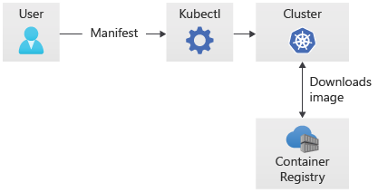
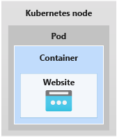
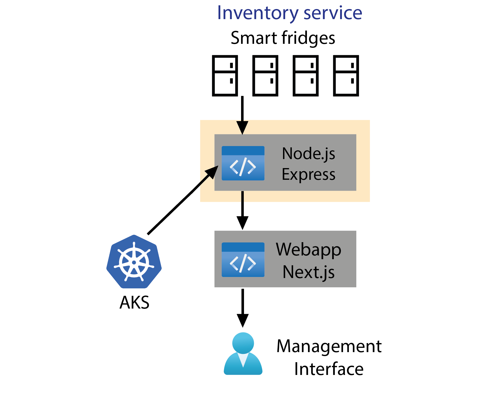

In the exercise, we created a Container Registry and a Kubernetes cluster in AKS. To deploy a container image to the cluster, we can connect to the cluster from the Cloud Shell.

AKS can use either **kubectl**, the standard Kubernetes command-line tool, or the Azure CLI to manage your deployments. As Kubernetes is open-source, Kubectl is the same for AKS as it is for the standard Kubernetes. If you learn to use kubectl in one, you can use it for the other.

## Open-source benefits

With kubectl and AKS, you can also leverage other open-source tools. A popular example is Argo CD - a continuous delivery tool for Kubernetes that provides incredible visualizations for what's happening with your Kubernetes infrastructure. Argo CD can increase your confidence and trust in systems, as you can show a deployment rollout or scaling operation happening in real time.

If something goes wrong, Argo CD also helps troubleshoot by making it clear when and where the problem has occurred.

## Deploying to a cluster

We can use kubectl to deploy a container from our container registry to the Kubernetes cluster. Although Azure Container Registry is a private registry for container images, we already integrated our registry to AKS when we created the cluster. Next, to deploy an image we need to create a manifest file that contains instructions for the deployment.

### Creating a deployment manifest

Manifest files contain all the information that's needed to deploy your container image. A Kubernetes manifest file allows you to describe your deployment in a YAML format, which simplifies Kubernetes management.

## Storing an image in Kubernetes

When we send a container image to a cluster, it's hosted in a pod. Containers are grouped into pods and those pods scale to your desired state. Pods run an instance of your container and are the smallest deployable units of computing that you can create and manage in Kubernetes.

These pods have no intelligence. Each one has an IP address, network rules, and exposed ports, which are all managed for you by the Kubernetes API server.

## Kubernetes health checks

One of the key benefits of Kubernetes is the ability to restore applications to the exact instance that had been tested and saved, otherwise known as **self-healing**. As containers can be saved and replicated, Kubernetes can check on the health of a container and replace it with an original copy if necessary. This is important at scale, when you may require multiple instances of containers, possibly spread across multiple regions.

## What our container will do

The Kubernetes API server will route REST messages from smart fridges to our Node container. The smart fridges will send REST messages to the cloud, where they will be received by AKS. AKS will route the messages to an instance of our Node.js container.

The container will run a program that processes messages, and then route them to the management webapp. Later, it will be easy to connect the Node.js container to a database instead of directly to a webapp.

