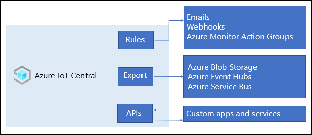

You have successfully completed the initial testing of the core functionality of Azur IoT Central. With an Azure IoT Central application in place and telemetry collected from simulated IoT devices displayed on its dashboards, you are ready to proceed to the next phase of your evaluation. Your plan is to test integration of Azure IoT Central with other Azure services and custom web apps that will be part of your cloud-native application. To accomplish this, you want to implement rules-based alerting and configure telemetry export to an Azure-based data store for long-term retention.

## Manage telemetry processing with Azure IoT Central

Azure IoT Central offers built-in telemetry processing functionality, including:

- The analytics service, which allows you to visualize historical trends, correlate distinct telemetries, and detect anomalies in collected data based on built-in and custom reports. This capability leverages Azure Time Series Insights for telemetry processing.

* IoT Central accepts any syntactically valid JSON-formatted telemetry and displays it as raw data. However, telemetry characteristics, including the metrics names, must match their definition in the device model included in the device template in order for them to appear in the default and custom dashboards.

- Rules, which allow you to monitor devices in near real time and automatically trigger actions, such as sending an email or submitting a POST request to an HTTP endpoint that you configured as a webhook. Rules evaluate conditions based on data coming from a device in order to determine when to trigger an action. Azure IoT Central uses a stream processor to determine when the rule conditions are met. For example, you can define a rule that identifies when reported temperature exceeds a defined threshold and triggers an action that sends an email with the relevant notification to a support team. Optionally, you can also configure time aggregation, such as average or sum. Depending on the device capabilities, it might be possible to use the webhook functionality to initiate a remediation task, such as increasing the speed of an IoT device-controlled fan.

## Integrate Azure IoT Central with cloud-native applications

As a developer, you can leverage the Azure IoT Central functionality to integrate IoT telemetry collection and processing into cloud-native applications. This might involve, for example:

- Exporting IoT data to cloud destinations by using data export. Azure IoT Central applications support continuous data export to Azure Event Hub, Azure Service Bus, and custom webhooks. It is also possible to configure interval-based data export to Azure Blob storage. In both cases, the export can include device telemetry, changes to devices including property updates, and device template information. You have the option to filter out data that you are not interested in based on custom conditions. Conversely, you can also add to data streams custom values and properties of monitored devices. 
- Transforming Azure IoT Central data at ingress or egress. Before you ingest telemetry data into your application, you may need to first perform conversion of data format (for example, from JSON to CSV) and data metrics (for example, from Fahrenheit to Celsius), or enrich data by referencing other data sources. For transformations at ingress, your options include IoT Edge modules and IoT Central device bridge. For egress, you can use the IoT Central device bridge or Azure Function apps.
- Implementing workflows that integrate an Azure IoT Central application with other cloud services. Azure IoT Central supports a connector for Power Automate and Azure Logic Apps, which allows you to configure more advanced rule processing behavior. When a connector-based rule fires, it triggers a workflow in Power Automate or Azure Logic Apps, with actions which scope could extend beyond Azure, including, for example, Microsoft 365 and third-party cloud services. Similarly, an event in these cloud services could trigger a workflow in Power Automate or Azure Logic Apps, which, in turn, would have the ability to interact with an IoT Central application.
- Extending Azure IoT Central with custom rules that rely on Azure Stream Analytics and Azure Functions. To address advanced stream processing requirements that exceed the capabilities of Time Series Insights built into the Azure IoT Central platform, you might need to resort to Azure Stream Analytics, with an Azure Function app performing rule action processing.
- Extending Azure IoT Central with custom analytics using Azure Databricks. To address advanced analytics requirements that exceed the capabilities of the Azure IoT Central built-in analytics, you have the option of streaming telemetry to an Azure Databricks workspace and using it to generate more complex visualizations. 
- Visualizing and analyzing telemetry data in Power BI. Another option for addressing more advanced analytics requirements involves the use of Power BI. In this case, you could set up a pipeline reading telemetry data exported to Azure Blob storage, processing and transforming it by using Azure Functions, Azure Data Factory, and Azure SQL Database, with Power BI providing data visualization functionality.
- Relying on IoT Central REST API to incorporate device administration and telemetry analytics directly into your cloud-native applications apps. The IoT Central REST API lets you manage Azure IoT Central applications programmatically, including the ability to add device templates, create devices, set device properties, send commands to devices, and manage data exports.

