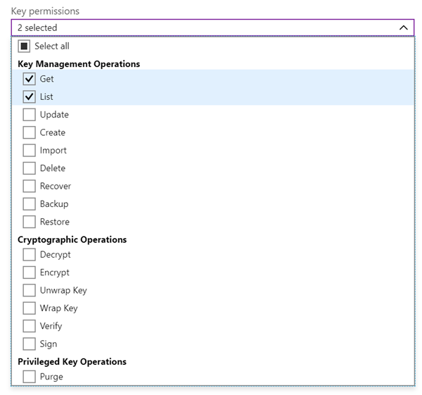
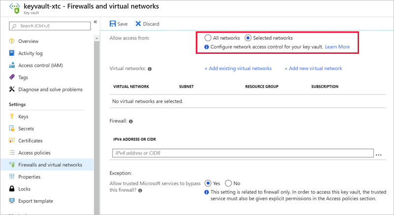

Access to a key vault is controlled through two interfaces: the management plane, and the data plane.

The **management plane** provides operations to manage the service such as:

- Creating and deleting key vaults
- Retrieving key vault properties
- Updating access policies

The **data plane** provides access to the data. This plane is where you add, update, and delete the keys, secrets, and certificates contained in the vault.

To access a key vault, all users or applications must have proper _authentication_ to identify the caller, and _authorization_ to determine the operations the caller can perform.

## Key Vault authentication

Authentication () is performed by associated the Azure AD tenant of the subscription that the Key Vault is part of. 

1. **User + application access**. The application accesses a Key Vault on behalf of a signed-in user known to AAD. This is most often used with interactive apps such as web apps or desktop-based apps.

1. **Application-only access**. The application runs as a standalone service and has a managed identity known to AAD.

For both types of access, the application authenticates with Azure AD and acquires a token to grant access to a resource through the REST API.

## Key vault authorization

For authorization, the management plane uses role-based access control (RBAC) and includes a built-in role **Key Vault Contributor** that provides access to management features of key vaults, but doesn't allow access to the key vault data. This is the recommended role to use - there's also a **Contributor** role which includes full administration rights - including the ability to grant access to the data plane.

The data plane uses a Key Vault access policy. A Key Vault access policy is a permission set assigned to a user or managed identity to read, write, and/or delete secrets and keys. You can create an access policy using the CLI, REST API, or Azure portal as shown below.

The system has a list of predefined management options which define the permissions allowed for this policy - here we have **Key, Secret, & Certificate Management** selected which is appropriate to manage secrets in the Key Vault. You can then customize the permissions as desired by changing the **Key permissions** entries. For example, we could adjust the permissions to only allow _read_ operations:

## Restricting network access

Another point to consider with Azure Key Vault is what services in your network can access the vault. In most cases the network endpoints don't need to be open to the Internet. You should determine the minimum network access required - for example you can restrict Key Vault endpoints to specific Azure Virtual Network subnets, specific IP addresses, or "trusted Microsoft services" which would include things like Azure SQL, Azure App Service, and various data and storage services which use encryption keys.

