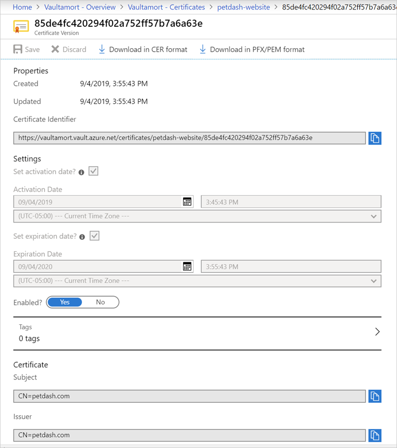
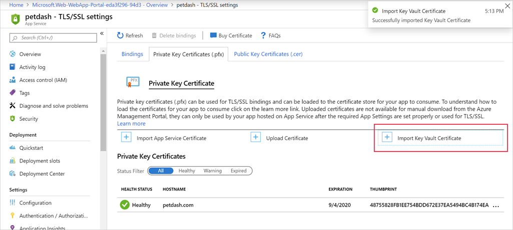

Securely managing certificates is a challenge for every organization. You must ensure that the private key is kept safe, and, as Steve from PetDash found out, certificates have an expiration date and have to be renewed periodically to ensure your website traffic is secure.

## Adding certificates to a Key Vault

Azure Key Vault manages X.509 based certificates that can come from several sources.

First, you can create self-signed certificates directly in the Azure portal. This process creates a public/private key pair and signs the certificate with it's own key. These certificates can be used for testing and development.

Second, you can create an X.509 certificate signing request (CSR). This creates a public/private key pair in Key Vault along with a CSR you can pass over to your certification authority (CA). The signed X.509 certificate can then be merged with the held key pair to finalize the certificate in Key Vault as shown in the following diagram.


1. In the diagram above, your application is creating a certificate which internally begins by creating a key in your Azure Key Vault.
1. Key Vault returns to your application a Certificate Signing Request (CSR).
1. Your application passes the CSR to your chosen CA.
1. Your chosen CA responds with an X.509 Certificate.
1. Your application completes the new certificate creation with a merger of the X.509 Certificate from your CA.

This approach works with any certificate issuer and provides better security than handling the CSR directly because the private key is created and secured in Azure Key Vault and never revealed.

Third, you can connect your Key Vault with a trusted certificate issuer (referred to as an _integrated_ CA) and create the certificate directly in Azure Key Vault. This approach requires a one-time setup to connect the certificate authority. You can then request to create a certificate and the Key Vault will interact directly with the CA to fulfill the request in a similar process to the manual CSR creation process shown above. The full details of this process are presented in the following diagram.


1. In the diagram above, your application is creating a certificate which internally begins by creating a key in your key vault.
1. Key Vault sends and SSL Certificate Request to the CA.
1. Your application polls, in a loop and wait process, for your Key Vault for certificate completion. The certificate creation is complete when Key Vault receives the CA’s response with x509 certificate.
1. The CA responds to Key Vault's SSL Certificate Request with an X509 SSL Certificate.
1. Your new certificate creation completes with the merger of the X509 Certificate for the CA.

This approach has several distinct advantages. Because the Key Vault is connected to the issuing CA, it can manage and monitor the lifecycle of the certificate. That means it can automatically renew the certificate, notify you about expiration, and monitor events such as whether the certificate has been revoked.

Finally, you can import existing certificates - this allows you to add certificates to Key Vault that you are already using. The imported certificate can be in either PFX or PEM format and must contain the private key. For example, here's a PowerShell script to upload a certificate:

```powershell
$pfxFilePath = "C:\WebsitePrivateCertificate.pfx"
$pwd = "password-goes-here"
$flag = [System.Security.Cryptography.X509Certificates.X509KeyStorageFlags]::Exportable
$pkcs12ContentType = [System.Security.Cryptography.X509Certificates.X509ContentType]::Pkcs12

$collection = New-Object System.Security.Cryptography.X509Certificates.X509Certificate2Collection  
$collection.Import($pfxFilePath, $pwd, $flag)

$clearBytes = $collection.Export($pkcs12ContentType)
$fileContentEncoded = [System.Convert]::ToBase64String($clearBytes)
$secret = ConvertTo-SecureString -String $fileContentEncoded -AsPlainText –Force
$secretContentType = 'application/x-pkcs12'

# Replace the <vault-name> and <key-name> below.
Set-AzureKeyVaultSecret -VaultName <vault-name> -Name <key-name> -SecretValue $secret -ContentType $secretContentType
```

## Retrieving certificates from a Key Vault

Once a certificate is stored in your Azure Key Vault, you can use the Azure portal to explore the certificate properties as well as enable or disable a certificate to make it unavailable to clients.



### Azure App Service integration

Once you have a public/private key pair certificate in your Azure Key Vault, you can easily associate it to your web app through the Azure portal.

1. Select **TLS/SSL settings** under **Settings**.
1. Select the **Private Key Certificate (.pfx)** tab.
1. Select **+ Import Key Vault Certificate** as shown in the following screenshot.

    

1. You can then select the vault, which must be in the same subscription, and the secret containing the certificate.
    - The certificate must be an X.509 cert with a content type of `application/x-pkcs12` and cannot have a password. 

Finally, once the certificate is in place, you'll want to setup a _custom domain_. There's already a built-in certificate for `*.azurewebsites.net`. You can then associate your custom domain the certificate you've assigned so the server uses your certificate to secure the connection to the browser.

>
