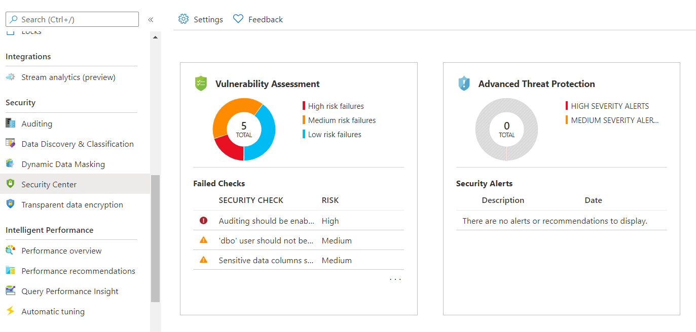
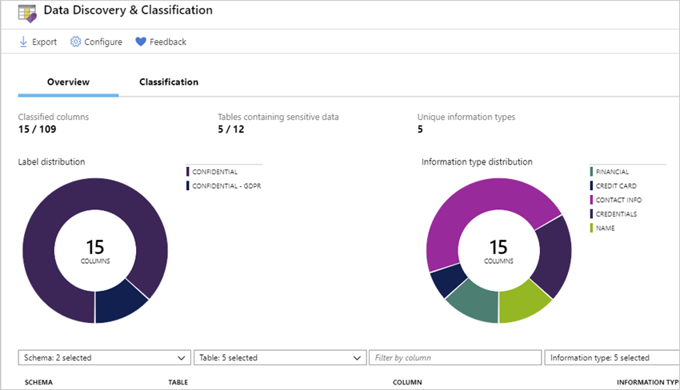
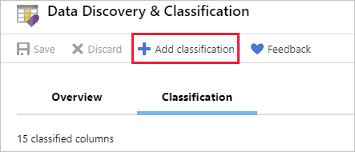
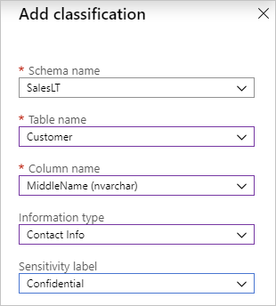

In this step, you will create your resource group and an Azure SQL Database single database containing the AdventureWorksLT sample data

1. Sign-in to the [Azure portal](https://portal.azure.com?azure-portal=true) using the same account you used to activate the Azure Sandbox. Make sure you are in the Microsoft Learn Sandbox directory.
1. Select **+ Create a resource** in the left sidebar of the Azure portal.
1. Select **Databases** and then select **SQL Database** to open the **Create SQL Database** page.

    

1. Use these values to fill out the form.

    | Setting      | Value |
    | ------------ | ----- |
    | **Database name** | **LearnDataPolicy** |
    | **Subscription** | Concierge Subscription |
    | **Resource group** |  Use the existing group <rgn>[sandbox resource group name]</rgn> |
    | **Want to use SQL elastic pool?** | **No** |

1. Under **Server**, click **Create new**, fill out the form, then click **OK**. Here's more information on how to fill out the form:

    | Setting      | Value |
    | ------------ | ----- |
    | **Server name** | A globally unique [server name](https://docs.microsoft.com/azure/architecture/best-practices/naming-conventions). |
    | **Server admin login** | A [database identifier](https://docs.microsoft.com/sql/relational-databases/databases/database-identifiers) that serves as your primary administrator login name. |
    | **Password** | Any valid password that has at least eight characters and contains characters from three of these categories: uppercase characters, lowercase characters, numbers, and non-alphanumeric characters. |
    | **Location** | Any valid location from the available list below. |

    [!include]

1. Select the **Additional settings** tab.
1. In the **Data source** section, under **Use existing data**, select **Sample**.

    :::image type="content" source="../media/M04-L01-01-create-sql-database-additional-settings.png" alt-text="Screenshot of additional configuration page.":::

1. Under **Enable Advanced Data Security**, verify **Start free trial** is selected.
1. Leave the rest of the values as default and select **Review + Create** at the bottom of the form.
1. Review the final settings and select **Create**.

It will take a few minutes to deploy the server with sample data. Once it's complete, select **Go to resource** to navigate to the Overview view of your new SQL database.

## SQL Information Protection (SQL IP)

SQL IP brings a set of advanced services and SQL capabilities, forming a new information protection paradigm in SQL aimed
at protecting the data, not just the database:

* **Discovery & recommendations** – The classification engine scans your database and identifies columns containing potentially sensitive data. It then provides you an easy way to review and apply the appropriate classification recommendations via the Azure portal.
* **Labeling** – Sensitivity classification labels can be persistently tagged on columns using new classification metadata attributes introduced into the SQL Engine. This metadata can then be utilized for advanced sensitivity-based auditing and protection scenarios.
* **Monitoring/Auditing** – Sensitivity of the query result set is calculated in real time and used for auditing access to sensitive data (currently in Azure SQL DB only).
* **Visibility** – The database classification state can be viewed in a detailed dashboard in the portal. Additionally, you can download a report (in Excel format) to be used for compliance & auditing purposes, as well as other needs.

### Classify your SQL DB

Let's classify the data in this sample Azure SQL database.

1. Under the **Security** heading in the Azure SQL Database pane, navigate to **Security Center**.
1. If Advanced Data Security isn't enabled, select the **Settings** at the top, and then **Enable** button to enable it. As noted in the instructions above, you can turn this on as part of the DB creation. This will take a minute to activate.

1. Select the **Data Discovery and Classification** on the left.

    

1. The initial state will have recommended columns - 15 in this case, but none of them will be classified yet. Select the recommendations info tip at the top of the screen to see the recommended columns.

    ‎

1. Select all the columns and then **Accept selected recommendations**.

1. Select **Save** to save the recommendations, and then switch back to the **Overview** tab.

1. Review the **Overview** tab. Notice that it includes a summary of the current classification state of the database, including a detailed list of all classified columns. You can also filter this view to only see specific schema parts, information types, and labels.

    ‎

1. To download a report in Excel format, in the top menu of the window select Export.

    

### Customizing the classification

The **Classification** tab lists the columns and how the data is classified.

As you saw earlier, the classification engine scans your database for columns containing potentially sensitive data and provides a list of recommended column classifications.

You can either take the suggested classifications as we did earlier, or manually classify columns as an alternative to or in addition to the recommendation-based classification.

1. In the top menu of the window, select **Add classification**.

    

1. In the Add classification pane, configure the five fields that display, and then select Add classification:
   * Schema name
   * Table name
   * Column name
   * Information type
   * Sensitivity label.

    

1. To complete your classification and persistently label (tag) the database columns with the new classification metadata, in the top menu of the window, select **Save**.

1. Switch back to the **Overview** tab to now see **16** columns identified.

1. Try changing some of the other classifications for identified columns - for example, setting the password data to **Highly Confidential**.

1. You can also filter the data being viewed through the filter boxes right below the graphs on the **Overview** tab.

## Monitor access to sensitive data

An important aspect of the IP paradigm is the ability to monitor access to sensitive data. [Azure SQL Database Auditing](https://docs.microsoft.com/azure/sql-database/sql-database-auditing) has been enhanced to include a new field in the audit log. The data_sensitivity_information field logs the sensitivity classifications (labels) of the actual data that was returned by the query.

Consider configuring Azure SQL Database Auditing for monitoring and auditing access to your classified sensitive data.
