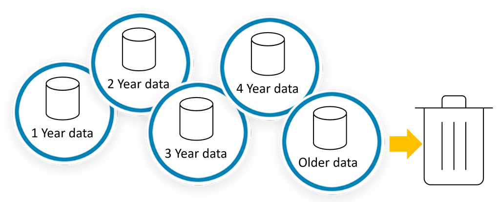

Once an organization's data has been examined and classified, the next decision to make is how long to keep the data around. Data recovery and disposal is an essential aspect of managing data assets. A _data retention policy_ defines the principles for data recovery and disposal and enforced in the same manner as data reclassification. These tasks are typically performed by the custodian and administrator roles as a collaborative task.

Failure to maintain a data retention policy could mean data loss or failure to comply with regulatory and legal discovery requirements. Most organizations that do not have a clearly defined data retention policy tend to use a default, Keep everything retention policy. However, this poses additional risks in cloud services scenarios. For example, a data retention policy for cloud service providers can be considered as "_for the duration of the subscription_," meaning as long as the service is paid for, the data is retained. Such a pay-for-retention agreement might not address corporate or regulatory retention policies.

Defining a policy for confidential data can ensure that data is stored and removed based on best practices. Also, you can create an archival policy to formalize an understanding of what data should be disposed of and when.

A data retention policy should address the required regulatory and compliance requirements and corporate legal retention requirements. Properly classified data should influence decisions made about retention duration. Data classification rules that pertain to data retention must be addressed when moving to the cloud. Data protection technologies such as encryption, rights management, and data loss prevention solutions are available in the cloud and can help mitigate disclosure risks.

## Immutable storage and data retention

Immutable storage for Azure Blob Storage enables users to store business-critical data in a write once, read many (WORM) state. This state makes the data unerasable and unmodifiable for a user-specified interval. Blobs can be created and read, but not modified or deleted, for the duration of the retention interval.

Immutable storage enables:

* **Time-based retention policy support** - Users set policies to store data for a specified interval.
* **Legal hold policy support** - When the retention interval is not known, users can set legal holds to store data immutably until the legal hold is cleared. When a legal hold is set, blobs can be created and read, but not modified or deleted. Each legal hold is associated with a user-defined alphanumeric tag that is used as an identifier string (such as a case ID).
* **Support for all blob tiers** - WORM policies are independent of the Azure Blob Storage tier and apply to all tiers: hot, cool, and archive. Users can transition data to the most cost-optimized tier for their workloads while maintaining data immutability.
* **Container-level configuration** - Users can configure time-based retention policies and legal hold tags at the container level. By using simple container-level settings, users can create and lock time-based retention policies, extend retention intervals, set and clear legal holds, and more. These policies apply to all the blobs in the container, both existing and new.
* **Audit logging support** - Each container includes an audit log, which displays up to five time-based retention commands for locked time-based retention policies. However, the log has a maximum of three logs for retention interval extensions or time-based retention. The log contains the user ID, command type, time stamps, and retention interval.  For legal holds, the log contains the user ID, command type, time stamps, and legal hold tags. 

The audit log is kept for the lifetime of the container, in accordance with the SEC 17a-4(f) regulatory guidelines. The Azure Activity Log shows a more comprehensive log of all the control plane activities. It is the user's responsibility to store those logs persistently, as might be required for regulatory or other purposes.

Immutable storage for Azure Blob storage supports two types of WORM or immutable policies: time-based retention and legal holds.

When a time-based retention policy or a legal hold is applied on a container, all existing blobs move to the immutable (write-protected and delete-protected) state. All new blobs that are uploaded to the container will also move to the immutable state.

When a time-based retention policy is applied on a container, all blobs in the container will stay in the immutable state for the duration of the effective retention period. The effective retention period for existing blobs is equal to the difference between the blob creation time and the user-specified retention interval.

For new blobs, the effective retention period is equal to the user-specified retention interval. Because users can extend the retention interval, immutable storage uses the most recent value of the user-specified retention interval to calculate the effective retention period.

For example, a user creates a time-based retention policy with a retention interval of five years. The existing blob in that container, `testblob1`, was created one year ago. The effective retention period for `testblob1` is four years. A new blob, `testblob2`, is now uploaded to the container. The retention period for this new blob is five years.

### Legal holds

When a reasonable expectation of litigation exists, organizations are required to preserve electronically stored information (ESI). This expectation often exists before the specifics of the case are known, and preservation is often broad. When you set a legal hold, all new and existing blobs stay in the immutable state until the legal hold is cleared.

A container can have both a legal hold and a time-based retention policy simultaneously. All blobs in that container stay in the immutable state until all legal holds are cleared, even if their effective retention period has expired. Conversely, a blob stays in an immutable state until the effective retention period expires, even though all legal holds have been cleared.
