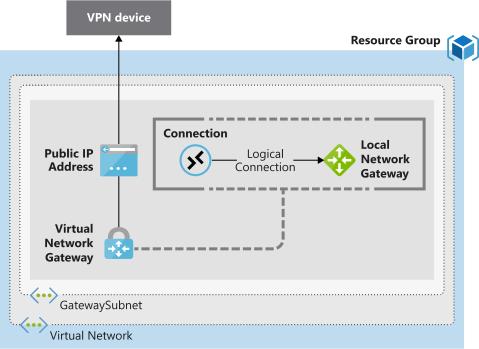
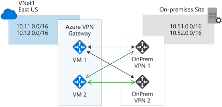

A Virtual Private Network (VPN) is a method of creating a private interconnected network. This private network uses an encrypted tunnel within another network. VPNs are typically deployed to connect two or more private networks to one another where there is no other private connectivity option available. VPNs are typically used to connect private networks across the internet, with network encryption keeping the data private.

For the healthcare provider in our scenario, VPNs can enable health professionals to share sensitive information between locations. For example, a patient may require surgery at a specialist facility, and the surgical team must be able to see details of the patient's medical history. This medical data is stored on a system in Azure.  Using a VPN to connect the facility to Azure allows the surgical team to securely access this information.

## Azure VPN Gateways

A VPN Gateway is a type of virtual network gateway. VPN Gateways are deployed in an Azure virtual networks and enable the following connectivity:

- Connect on-premises datacenters to Azure virtual networks through a **site-to-site** connection.
- Connect individual devices to Azure virtual networks through a **point-to-site** connection.
- Connect Azure virtual networks to other Azure virtual networks through a **VNet-to-VNet** connection.

All data transferred is encrypted in a private tunnel as it traverses the internet. You can only deploy one VPN gateway in each virtual network, but you can use one gateway to connect to multiple locations, including other Azure virtual networks or on-premises datacenters.

When deploying a VPN gateway, you specify the VPN type, either policy-based or route-based.

### Policy-based VPNs

You typically use policy-based VPNs on firewall devices that are used for packet filtering. These types of device interrogate every data packet against a set of criteria and then accept or drop the packet, depending on the type of filter.  When you deploy the VPN, you're adding IPsec tunnel encryption and decryption to the packet filtering and processing engine. Key features of policy-based VPNs include:

- Support for IKEv1 only.
- Uses **static routing**, where combinations of address prefixes from both networks control how traffic is encrypted and decrypted through the IPsec tunnel. The source and destination of the tunneled networks are declared in the policy and do not need to be declared in routing tables. 
- Policy-based VPNs must be used in specific scenarios that require them, such as for compatibility with legacy on-premises VPN devices.

### Route-based VPNs

You typically use route-based VPNs on router devices  where each IPsec tunnel is modeled as a network interface or VTI (virtual tunnel interface). Route based VPNs are the preferred method of connecting on-premises devices. Use a route-based VPN gateway if you need any of the following types of connectivity:

- Connections between virtual networks
- Point-to-site connections
- Multi-site connections
- Coexistence with an ExpressRoute gateway

Key features of route-based VPNs include:

- Support for IKEv2.
- Uses any-to-any (wildcard) traffic selectors.
- Uses **dynamic routing**, where routing/forwarding tables direct traffic to different IPsec tunnels. The source and destination networks are not defined, as they are in policy-based VPNs, but data packets are encrypted as they traverse interfaces based on network routing tables.

Both types use pre-shared key as the only method of authentication. Both types also rely on Internet Key Exchange (IKE) in either version 1 or version 2 and Internet Protocol Security (IPSec). IKE is used to set up a security association (an agreement of the encryption) between two endpoints. This association is then passed to the IPSec suite, which encrypts and decrypts data packets encapsulated in the VPN tunnel.

## VPN Gateway SKUs

The capabilities of your VPN Gateway are determined by the SKU  (stock-keeping unit) you deploy. The following table shows the main capabilities of each available SKU.

| SKU    | S2S/VNet-to-VNet Tunnels | Aggregate Throughput Benchmark | Border Gateway Protocol (BGP) support           |
| ------ | ------------------------ | ------------------------------ | ------------- |
| Basic  | Max. 10                  | 100 Mbps                       | Not Supported |
| VpnGw1 | Max. 30                  | 650 Mbps                       | Supported     |
| VpnGw2 | Max. 30                  | 1 Gbps                         | Supported     |
| VpnGw3 | Max. 30                  | 1 Gbps                         | Supported     |

## Deploying VPN Gateways

Before you can deploy a VPN Gateway, you'll need some Azure and on-premises resources.

### Required Azure resources

You'll need the following Azure resources before you can deploy an operational VPN Gateway.

- **Virtual network**. Deploy an Azure virtual network with enough address space for the additional subnet that you'll need for the VPN Gateway. The address space for this virtual network must not overlap with the on-premises network that you'll be connecting. Remember that you can only deploy a single VPN Gateway within a virtual network.
- **GatewaySubnet**. Deploy a subnet called `GatewaySubnet` for the VPN Gateway. Use at least a **/27** address mask to give you enough IP addresses in the subnet for future growth. You can't use this subnet for any other services.
- **Public IP Address**. Create a basic SKU dynamic public IP address. This address provides a public routable IP address as the target for your on-premises VPN device. Although this IP address is dynamic, it won't change unless you delete and recreate the VPN Gateway.
- **Local Network Gateway**. Create a Local Network Gateway to define the on-premises network's configuration-where and what the VPN Gateway will connect to. This configuration includes the on-premises VPN device's public IPv4 address and the on-premises routable networks. This information is used by the VPN Gateway to route packets through the IPSec tunnel that are destined for on-premises networks.
- **Virtual network gateway**. Create the virtual network gateway to route traffic between the virtual network and the on-premises datacenter or other virtual networks. The virtual network gateway can be either a VPN or ExpressRoute gateway but this module deals only with the VPN virtual network gateway type.
- **Connection**. Create a Connection resource to create a logical connection between the VPN Gateway and the Local Network Gateway.
  - The connection is made to the on-premises VPN device's IPv4 address as defined by the Local Network Gateway
  - The connection is made from the virtual network gateway and its associated public IP address.

   You can create multiple connections.

The following diagram shows this combination of resources and their relationships to help you better understand what is required to deploy a VPN Gateway.

### Required on-premises resources

To connect to your datacenter to a VPN Gateway, you'll need the following on-premises resources.

- A VPN device that supports Policy-based or Route-based VPN Gateways.
- A public-facing (internet routable) IPv4 address.

## High availability scenarios

There are several options to ensure you have a fault-tolerant configuration.

### Active-standby

By default, VPN gateways are deployed as two instances in an **active-standby** configuration. When planned maintenance or unplanned disruption affects the active instance, the standby instance automatically assumes responsibility for connections. During this failover, connections are interrupted, but are typically restored within a few seconds for planned maintenance, and within 90 seconds for unplanned disruptions.

### Active-active

VPN Gateways can also be deployed in an **active-active** configuration. In this configuration, you assign a unique public IP address to each instance. You then create separate tunnels from the on-premises device to each IP address. You can extend the high availability by deploying an additional VPN device on-premises.

### ExpressRoute failover

Another high availability option is to configure a VPN Gateway as a secure failover path for ExpressRoute connections. ExpressRoute circuits have resiliency built in but are not immune to physical problems affecting the cables delivering connectivity. In high availability scenarios, where there is risk associated with an outage of an ExpressRoute circuit, you can also provision a VPN Gateway. By using a second gateway, which uses the internet as an alternative method of connectivity, you help ensure that there is always a connection to the Azure virtual networks.