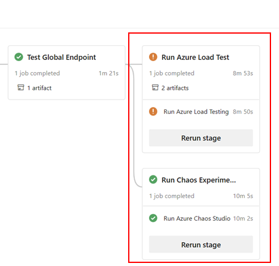

Although you can run load tests manually (with or without Azure Chaos experiments), it's recommended that you run these tests regularly and automated as part of continuous validation. To do so, embed load testing and chaos experiments into a continuous integration and continuous deployment (CI/CD) pipeline.

You can use Azure Pipelines, GitHub Actions or the CI/CD tool of your choice. In the pipeline, define the Azure Load Test and Azure Chaos Studio services as Infrastructure-as-Code (IaC) with Azure Resource Manager templates (ARM templates), Azure Bicep, or Terraform. Azure Load Testing [provides first-party tasks](/azure/load-testing/tutorial-identify-performance-regression-with-cicd) for Azure Pipelines and GitHub Actions to interact with the load testing service.

Ensure that the load test run and the chaos experiments overlap to produce meaningful results. Failed load test runs should be analyzed if the used baseline is still accurate or if it needs to be adjusted.
