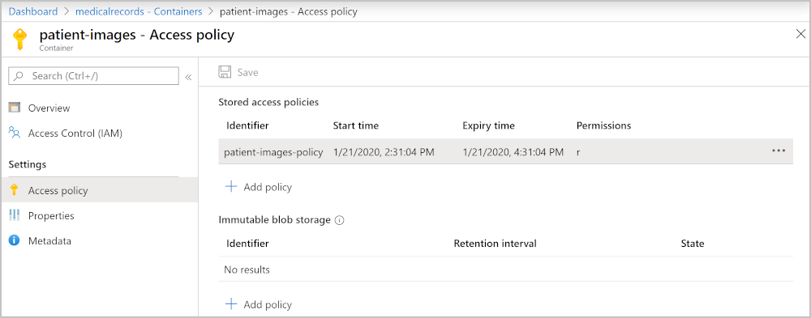
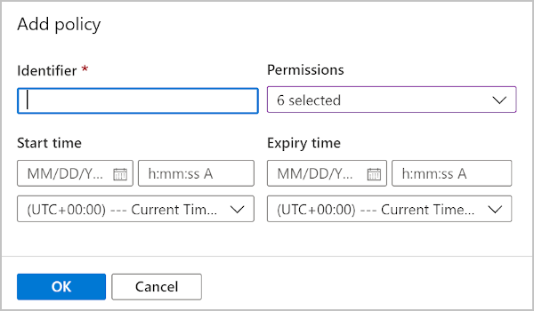

Shared access signatures are a secure way of giving access to clients without having to share your Azure credentials. With this ease of use comes a downside that anyone with the correct SAS can access the file while it's still valid. The only way you can revoke access to the storage is to regenerate the access keys. This regeneration would require you to update all apps using a shared key to use the new one. There's another option that uses SAS by associating them with a stored access policy. 

After adding SAS functionality to your app, it highlighted the inflexibility of creating a SAS for each image, with its own expiration and access controls. You'd like to update your app to use a stored access policy on the storage container. With the policy in place, you want to test you can update the expiration and affect all the created SAS tokens.

In this unit, you'll see how to use a stored access policy. You'll learn the C# Storage API commands you use to create SAS tokens associated with your new access policy. Finally, you'll test that the SAS tokens can all be changed by updating the stored access policy on the Azure portal.

## What are stored access policies?

You can create a stored access policy on four kinds of storage resources:

1. Blob containers.
1. File shares.
1. Queues.
1. Tables.

The stored access policy you create for a blob container can be used for all the blobs contained in it and the container itself. The stored access policy is created with the following properties:

- **Identifier**: the name you'll use to reference the stored access policy
- **Start time**: a DateTimeOffset for when the policy might be used from; this value can be null
- **Expiry time**: a DateTimeOffset for when the policy expires; after this time, requests to the storage will fail with 403
- **Permissions**: the list of permissions as a string that can be one or all of **acdlrw**



### Create stored access policies

You can create a shared access policy with C# code, using the Azure portal, or Azure CLI commands.

#### With C# .NET code:

```csharp
BlobSignedIdentifier identifier = new BlobSignedIdentifier
{
    Id = "stored access policy identifier",
    AccessPolicy = new BlobAccessPolicy
    {
        ExpiresOn = DateTimeOffset.UtcNow.AddHours(1),
        Permissions = "rw"
    }
};

blobContainer.SetAccessPolicy(permissions: new BlobSignedIdentifier[] { identifier });
```

#### With the portal:

On the portal, you'll go to the storage account, and then the blob storage container. On the left, select the **Access policy**. To add a new stored access policy, select the **+ Add policy**.

You can then enter all the required parameters. 



#### With Azure CLI commands:

```azurecli
az storage container policy create \
    --name stored access policy identifier \
    --container-name container name \
    --start start time UTC datetime \
    --expiry expiry time UTC datetime \
    --permissions (a)dd, (c)reate, (d)elete, (l)ist, (r)ead, or (w)rite \
    --account-key storage account key \
    --account-name storage account name \
```

### Create SAS tokens and associate them with stored access policies

You can now associate the stored access policy you've created with any new SAS tokens you need. For your company's patient diagnostic image web app, you'll update the existing code to add the above code. Then, in the method that creates the SAS token, you reference the new stored access policy.

All of your existing code needed to create the SAS token:

```csharp
BlobSasBuilder sas = new BlobSasBuilder 
{
    BlobContainerName = blob.BlobContainerName,
    BlobName = blob.Name,
    Resource = "b",
    ExpiresOn = DateTimeOffset.UtcNow.AddMinutes(1)
};
// Allow read access
sas.SetPermissions(BlobSasPermissions.Read);
```

can be replaced by referencing your new access policy.

```csharp
// Create a user SAS that only allows reading for a minute
BlobSasBuilder sas = new BlobSasBuilder
{
    Identifier = "stored access policy identifier"
};
```

There's a maximum number of stored access policies allowed on a single blob container. You can have up to five associated with them.