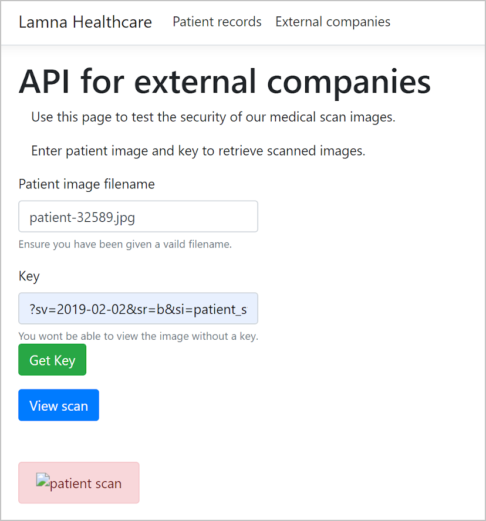

Instead of creating SAS individually, each with their own access permissions and expiry dates, you can associate them with a stored access policy. Changing the policy  affects all the SAS associated with it.

Knowing there is a better way to create and manage your companies SAS, you're going to update your new test pages to use stored access policies.

In this exercise, you'll update your web app to create SAS with stored access policies. Then you'll use Azure CLI commands to change the policies and test that the access is revoked.

## Add a method to create stored access policies

1. In the cloud shell, edit the **PatientRecordController.cs** file.

    ```bash
    code ~/sas/Controllers/PatientRecordController.cs
    ```

1. At the bottom of the class under the **GetBlobSas** method, write a method to create stored access policies.

    ```csharp
    // Use a stored access policy for the SAS
    private void CreateStoredAccessPolicy()
    {
        // Create a stored access policy for our blobs
        BlobSignedIdentifier identifier = new BlobSignedIdentifier
        {
            Id = _storedPolicyID,
            AccessPolicy = new BlobAccessPolicy
            {
                ExpiresOn = DateTimeOffset.UtcNow.AddHours(1),
                Permissions = "r"
            }
        };
    
        _container.SetAccessPolicy(permissions: new BlobSignedIdentifier[] { identifier });
    } 
    ```

1. This method makes use of a global variable for the access policy identifier. Add this at the top of the class under the declaration for the **BlobContainerClient** variable named **_container**.

    ```csharp
    private String _storedPolicyID = "patient-images-policy";
    ```

1. The stored access policy is going to be used for each SAS token that is generated, so call the new method on the classes instantiation. Add a call to is at the bottom of the method.

    ```csharp
    public PatientRecordsController(ILogger<PatientRecordsController> logger, IConfiguration iconfiguration)
    {
        _logger = logger;
        _iconfiguration = iconfiguration; 
        _container = new BlobContainerClient(
            _iconfiguration.GetValue<string>("StorageAccount:ConnectionString"),
            _iconfiguration.GetValue<string>("StorageAccount:Container")
        );
        CreateStoredAccessPolicy();
    }
    ```

1. The **GetBlobSas** can now be simplified to use the access policy. Change the method to use it.

   ```csharp
    // Build a SAS token for the given blob
    private string GetBlobSas()
    {
        // Create a user SAS that only allows reading for a minute
        BlobSasBuilder sas = new BlobSasBuilder 
        {
            Identifier = _storedPolicyID
        };
    
        // Use the shared key to access the blob
        var storageSharedKeyCredential = new StorageSharedKeyCredential(
            _iconfiguration.GetValue<string>("StorageAccount:AccountName"),
            _iconfiguration.GetValue<string>("StorageAccount:AccountKey")
        );
    
        return '?' + sas.ToSasQueryParameters(storageSharedKeyCredential).ToString();
    }
    ```

1. The code that handles the SAS token requests needs a small fix to call the updated method.

    ```csharp
    // GET PatientRecord/patient-nnnnnn/secure
    [HttpGet("{Name}/{secure}")]
    public PatientRecord Get(string name, string flag)
    {
        BlobClient blob = _container.GetBlobClient(name);
        return new PatientRecord { name=blob.Name, imageURI=blob.Uri.AbsoluteUri, sasToken=GetBlobSas() };
    }
    ```

1. Save your code changes with <kbd>CTRL</kbd>+<kbd>S</kbd> and then <kbd>CTRL</kbd>+<kbd>Q</kbd>.

### Test the new code

1. In the cloud shell, build the app.

    ```bash
    cd ~/sas/
    dotnet build
    ```

1. The port may have been closed since completing the previous exercise. Run the `curl` command to open it again.

    ```bash
    curl -X POST http://localhost:8888/openPort/8000;
    ```

1. Run the update web app. 

    ```bash
    dotnet run
    ```

1. Navigate to the web apps URL, making sure it ends in **/**.

1. On the home page, select **Get all patients**.

1. Copy an image file name, for example **patient-32589.jpg**.

1. Select the **External companies** menu link at the top of the page.

1. Paste the image filename in into the **Patient image filename** field.

1. Select **Get Key** to populate the SAS token.

1. Select **View scan** to view the image.

### Edit the stored access policy

1. Sign in to the [Azure portal](https://portal.azure.com/?azure-portal=true) with the credentials you used to create the sandbox.

1. On the portal menu, select **All resources**.

1. In the list of resources, select the **medicalrecords** storage account.

1. On the Overview page, select **Containers**. Then select **patient-images**.

1. On the left under **Settings**, select **Access policy**.

1. Notice that your web app has created a **patient-images-policy** stored access policy.

1. On the right, select the **...** menu, then select **Edit** from the popup.

1. In the Edit policy, change the **Permission** from **read** to **list**.

### Test a new SAS

1. Return to your web app, on the **External companies** page create a new SAS token by selecting **Get Key**.

1. Select **View scan**

    

The image won't be returned from Azure Storage with a 403 authentication error.