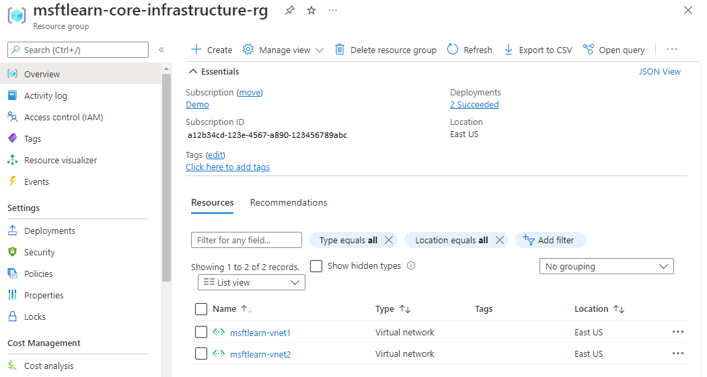
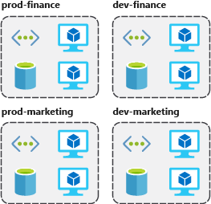

In your first week on your new job, you've looked through the existing resources in your company's Azure subscription. There are a number of resource groups that contain many different resources, but they aren't organized into a coherent structure. You've worked on Azure before, but aren't entirely sure how resource groups work and what their role is. You've guessed (correctly) that they can play a role in how you organize your resources. Let's look at what they are, and how they can be used.

[!INCLUDE [azure-free-trial-note](../../../includes/azure-free-trial-note.md)]
 
> [!VIDEO https://channel9.msdn.com/Shows/Learn-Azure/Azure-Resource-Manager/player?format=ny]

## What are resource groups?

Resource groups are a fundamental element of the Azure platform. A resource group is a logical container for resources deployed on Azure. These resources are anything you create in an Azure subscription; for example, virtual machines, Application Gateways, and CosmosDB instances. All resources must be in a resource group, and a resource can only be a member of a single resource group. Many resources can be moved between resource groups, with some services having specific limitations or requirements to move. Resource groups can't be nested. Before you can provision any resource, you need a resource group in which to place it.

### Logical grouping

Resource groups exist to help manage and organize your Azure resources. By placing resources of similar usage, type, or location into resource groups, you can provide some order and organization to resources you create in Azure. Logical grouping is the aspect that you're most interested in here, because there's a lot of disorder among your company's resources.

### Lifecycle

If you delete a resource group, all resources contained within the group are also deleted. Organizing resources by lifecycle can be useful in non-production environments, where you might try an experiment, but then dispose of it when done. Resource groups make it easy to remove a set of resources at once.

### Authorization

Resource groups are also a scope for applying role-based access control (RBAC) permissions. By applying RBAC permissions to a resource group, you can reduce administration and limit access to allow only what is needed.

## Create a resource group

You can create resource groups by using the following methods:

- Azure portal
- Azure PowerShell
- Azure CLI
- Templates
- Azure SDKs (like .NET, Java)

Let's walk through the steps you'd take to create a resource group in the Azure portal. If you'd like to follow along in your own subscription, you may.

1. Open a web browser and sign in to the [Azure portal](https://portal.azure.com/?azure-portal=true).

    > [!IMPORTANT]
    > Make sure to use your _own_ subscription. When you are in the free sandbox environment, it will not allow you to create resource groups. You can tell which subscription you are using by looking at the tenant name under your profile picture. You can switch tenants by selecting your profile picture and selecting **Switch Directory** from the options menu.

1. On the Azure portal or from the **Home** page, select **Create a resource**. The **Create a resource** pane appears.

1. In the *Search services and marketplace* search box, search for and select *Resource group*. The **Resource group** pane appears.

1. Select **Create**. The **Create a resource group** pane appears.

1. On the **Basics** tab, enter the following values for each setting.

    | Setting | Value |
    |---|---|
    | **Project details** |
    | Subscription | From the dropdown list, select the Azure subscription you'd like to use for this exercise. |
    | Resource group | Enter *msftlearn-core-infrastructure-rg*. |
    | **Resource details** |
    | Region | From the dropdown list, select a location close to you. |

    :::image type="content" source="../media/2-create-resource-group.png" alt-text="Screenshot of Azure portal showing the resource group creation with subscription, resource group, and region entered.":::

1. Select **Review + Create**, and after validation passes, select **Create** to create the resource group.

That's it, you've created a resource group that you can now use when you deploy Azure resources. Let's take a closer look at this resource group and some important things to consider.

## Explore a resource group and add a resource

1. On the Azure portal menu or from the **Home** page, under **Azure services**, select **Resource groups**.

1. From the list, select your newly created resource group. The **Resource group** pane appears.

    > [!NOTE]
    > You may also see a resource group called *NetworkWatcherRG*. You can ignore this resource group, as it's created automatically to enable Network Watcher in Azure virtual networks.

    :::image type="content" source="../media/2-rg-overview.png" alt-text="Screenshot of Azure portal showing new resource group pane with no resources in it yet." lightbox="../media/2-rg-overview.png":::

1. On the **Overview** page, you'll find the basic information about the resource group, such as its subscription, the subscription ID, any tags that are applied, and a history of the deployments to this resource group. We'll cover tags in the next unit. The deployments link takes you to a new panel with the history of all deployments to this resource group. Anytime you create a resource, it's a deployment, and you'll see the history for each resource group here.

    Using the toolbar across the top the resource group page, you can add more resources, change the columns in the list, move the resource group to another subscription, or delete it entirely.

    On the left menu, there are a number of options.

    You don't have any resources in this resource group yet, so the list at the bottom is empty. Let's create a couple of resources in the resource group.

1. In the top menu bar, select **Create**, or select **Create resources** at the bottom of the pane; either will work. The **Create a resource** pane appears.

1. In the *Search services and marketplace* search box, search for and select *Virtual network*. The **Virtual network** pane appears.

1. Select **Create**. The **Create virtual network** pane appears.

1. On the **Basics** tab, enter the following values for each setting.

    | Setting | Value |
    |---|---|
    | **Project details** |
    | Subscription | From the dropdown list, select the Azure subscription you'd like to use for this exercise. |
    | Resource group | Ensure *msftlearn-core-infrastructure-rg* appears. |
    | **Instance details** |
    | Name | Enter *msftlearn-vnet1*. |
    | Region | From the dropdown list, select a location close to you. |

1. Select **Review + create**, and after validation passes, select **Create** to add the virtual network to your resource group.

1. Repeat the virtual network creation steps again to create one more virtual network. Make sure to place the virtual network in the resource group that you created earlier, and name the virtual network *msftlearn-vnet2*.

1. Go back to your resource group; the two virtual networks you created should appear on the **Overview** pane.

    

Your resource group contains two virtual network resources, because you specified to which resource group you wanted them to belong when you created them. You could create additional resources inside this resource group, or you could create additional resource groups in the subscription into which to deploy resources.

When creating resources, you usually have the option to create a new resource group as an alternative to using an existing resource group. This may simplify the process, but as you see in your new organization, doing so can lead to resources spread across resource groups with little thought as to how to organize them.

## Use resource groups for organization

So how can you use resource groups to your advantage in your new organization? Here are some guidelines and best practices that can help with the organization.

### Consistent naming convention

You can start with using an understandable naming convention. You named your resource group **msftlearn-core-infrastructure-rg**. You've given some indication of what it's used for (**msftlearn**), the types of resources contained within (**core-infrastructure**), and the type of resource it is (**rg**). This descriptive name gives us a better idea of what it is. If you had named it **my-resource-group** or **rg1**, you have no idea on a glance of what the usage may be. In this case, you can deduce that there are probably core pieces of infrastructure contained within. If you created additional virtual networks, storage accounts, or other resources the company may consider *core infrastructure*, you could also place them here to improve the organization of your company's resources. Naming conventions can vary widely between and even within companies, but some planning can help.

### Organizing principles

You can organize resource groups in a number of ways; let's take a look at a few examples. You might put all resources that are *core infrastructure* into this resource group, but you could also organize resources strictly by resource type. For example, put all virtual networks in one resource group, all virtual machines in another resource group, and all Azure Cosmos DB instances in yet another resource group.

You could organize them by environment (prod, qa, dev). In this case, all production resources are in one resource group, all test resources are in another resource group, and so on.

You could organize them by department (marketing, finance, human resources). Marketing resources go in one resource group, finance in another resource group, and HR in a third resource group.

You could even use a combination of these strategies and organize by environment and department. Put production finance resources in one resource group, dev finance resources in another, and the same for the marketing resources.

There are a few factors that can play into the strategy you use to organize resources: authorization, resource life cycle, and billing.

#### Organize for authorization

Since resource groups are a scope of RBAC, you can organize resources by *who* needs to administer them. If your database administration team is responsible for managing all of your Azure SQL Database instances, putting them in the same resource group would simplify administration. You could give the team the proper permissions at the resource-group level to administer the databases within the resource group. Similarly, the database administration team could be denied access to the resource group with virtual networks so they don't inadvertently make changes to resources outside the scope of their responsibility.

#### Organize for lifecycle

We previously described that resource groups serve as the lifecycle for the resources within them. If you delete a resource group, you also delete all the resources in the group. Use this to your advantage, especially in areas where resources are more disposable, like non-production environments. If you deploy 10 servers for a project that you know will only last a couple of months, you might put them all in a single resource group. One resource group is easier to clean up than 10 or more resource groups.

#### Organize for billing

Lastly, placing resources in the same resource group is a way to group them for usage in billing reports. If you're trying to understand how your costs are distributed in your Azure environment, grouping them by resource group is one way to filter and sort the data to better understand where costs are allocated.

## Summary

The bottom line is that you have flexibility in how to organize resources in your resource groups. Put some thought into it so that you have a coherent approach to how you use resource groups in your Azure environment.
