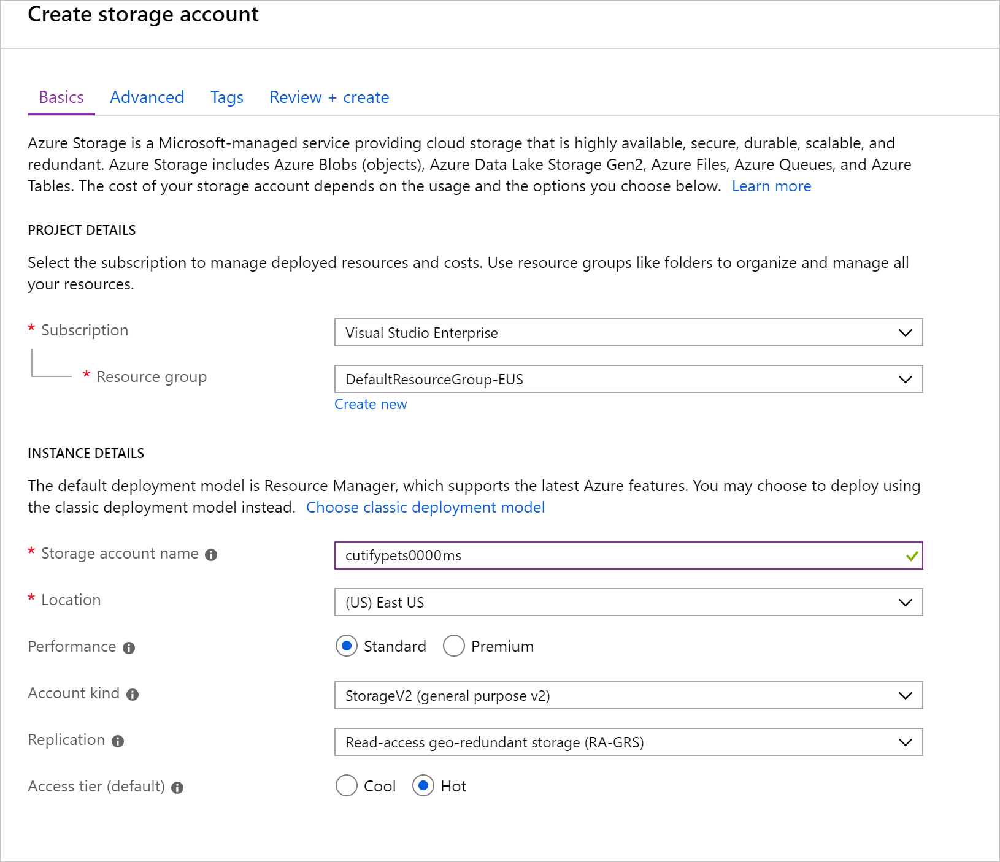
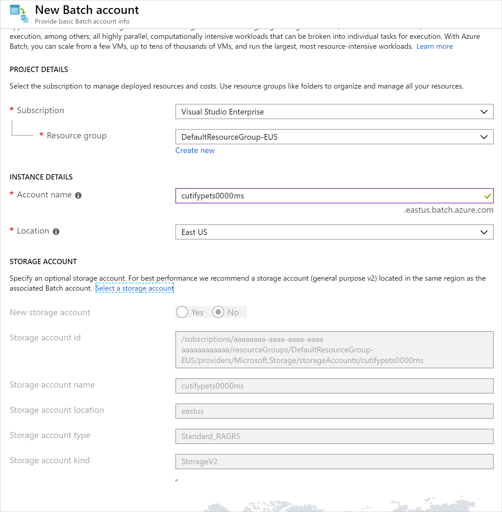

[!include]

Before you manage the Azure Batch services from a .Net application, you have to create the Azure Batch account and Storage account. You can use the Azure portal, Powershell, Azure CLI, or the Batch Management API to create these accounts.

In this unit, you'll create an Azure Batch and Azure Storage account using the Azure portal.

## Create New Storage Account

1. Navigate to the [Azure portal](https://portal.azure.com/learn.docs.microsoft.com?azure-portal=true) in your favorite browser.

1. On the Azure portal menu or from the Home page, select **Create a resource**.

1. In the **Search the Marketplace** search box type **storage**, then select **Storage account**.

1. Select an existing resource group or create a new one.

1. Select **Create** to open the **Create storage account** form, as shown in the following screenshot.

    

1. In the **Storage account name** field, enter a unique name. An example might be **cutifypets\<date\>\<your initials\>**.

    > [!NOTE]
    > Your storage account name must be globally unique, and only lowercase characters and numbers are allowed.

1. Select a location close to you from the available options.

1. Leave all the other options as their defaults and select **Review + create**, followed by **Create**.

1. Wait for the deployment to complete. We now have a storage account that we'll use in our processing to store input and output files. We'll associate this storage account with our Batch account shortly.

## Create new Batch Account

In order to create Batch workloads, we need to create an account within the Batch service.

1. In the left navigation bar, select **Create a resource**.
1. In the **Search the Marketplace** search box type **batch**, then select **Batch Service** from the list.
1. Select **Create** to open the **New Batch account** form.

    

1. Select an existing resource group, or create a new one for the resource we are adding in this module. To simplify cleanup once you have finished with this module, we recommend creating a new resource group. Note the name of the resource group you are using - it will be needed throughout these exercises. 

1. In the Account account name, enter a unique name. For example, you could enter **cutifypets\<date\>\<your initials\>**.

1. Select the link called **Select a storage account**, and in the panel that opens select the storage account your created earlier.
1. Leaving all the other options as their defaults, select **Review + create**.
1. Select **Create**.
1. Wait for the deployment to complete.
1. On the **Your deployment is complete** screen, select the link to the Batch account, as shown in the following screenshot.

    

    You now have a Batch account in which to create our jobs. 

## Create an application package containing ffmpeg

For our scenario, we've decided to enlist the help of **FFmpeg** to do our video conversion. FFmpeg is a powerful open-source multimedia framework that can, among many other things, decode, encode and transcode multimedia files. it's a great choice for making animated GIFs from our pet videos.   To use the framework, we'll add it as an application package to our Batch account. First we need to download a copy from the official FFmpeg site so we can then upload it into our Batch account.

1. Open a new tab in your browser, and navigate to https://ffmpeg.zeranoe.com/builds/win64/static/ffmpeg-3.4-win64-static.zip.

1. Save the zip file locally.

1. Back in the Batch account UI in the portal, select **Applications** under the **Features** section of the sidebar, and then select **Add** to open up the **New application** configuration form.

    

1. In **Application id** type **ffmpeg**.
1. In **Version** type **3.4**.
1. In **Application package**, select the folder icon to the right.
1. Navigate to the folder containing **ffmpeg-3.4-win64-static.zip** that you downloaded, and select **Open**.
1. Select **Submit** to upload the app to our Batch account. This step can take a few moments, so wait for it to complete. 
1. Leave the Azure portal open for the next exercise.