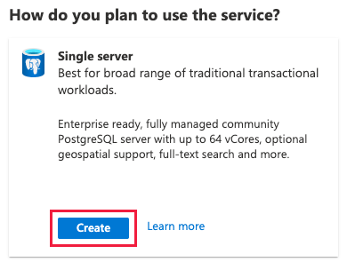

We want to have a large, high-performance database for the trial of our payment app.

In this exercise, we'll:

* Create an Azure Database for PostgreSQL instance in the Azure portal
* Change the pricing tier and back up options

The Azure Sandbox gives you a safe, sandboxed environment to use Azure resources to complete the exercises, for free.

1. Sign in to the Azure portal by using the same account that you activated the sandbox with.

    > [!div class="nextstepaction"]
    > [Azure portal](https://portal.azure.com/learn.docs.microsoft.com/?azure-portal=true)

2. Next, select **Create a resource**, **Databases**, and **Azure Database for PostgreSQL**. You can also use the **Search** functionality to find this category.

3. Select **Create** in the **Single server** box.

> The portal will display a PostgreSQL server configuration screen.

4. On the **Basics** tab, enter the following information:  

|Parameter  |Value  |
|---------|---------|
|**Subscription**     |  Leave as **Concierge subscription**.       |
|**Resource group**     | learn-xxx       |
|         **Server name** |  **payment-server-demo** |
|         **Data source** |  Leave as **none**  |
|**Location**| Leave the default, or use a region that's close to you. |
|**Version**| Leave as **10** |
|**Compute + storage**     |  Leave the default of **General Purpose**.       |
| **Admin username**| **paymentadmin** |
| **Password/Confirm Password**|  Choose a password.|

    1. Note the password down for later use.
    1. Select **Configure server** in the **Compute + storage** options.

5. Scroll to the bottom of the page
    1. Select **35 days** in the **Backup Retention Period** section.
    1. Select **Geo-Redundant** in the **Backup Redundancy Options** section.
    1. Feel free to increase compute power and storage size, if you like.
    1. Select **OK**, in the blue box at the bottom of the page.
    1. Select **Review + create**, in the blue box at the bottom of the page.

6. Select **Create**, in the blue box at the bottom of the page.

Congratulations! Your database is being deployed to Azure.
