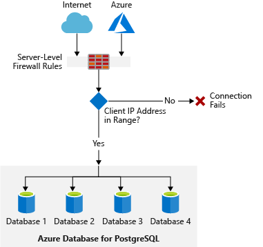
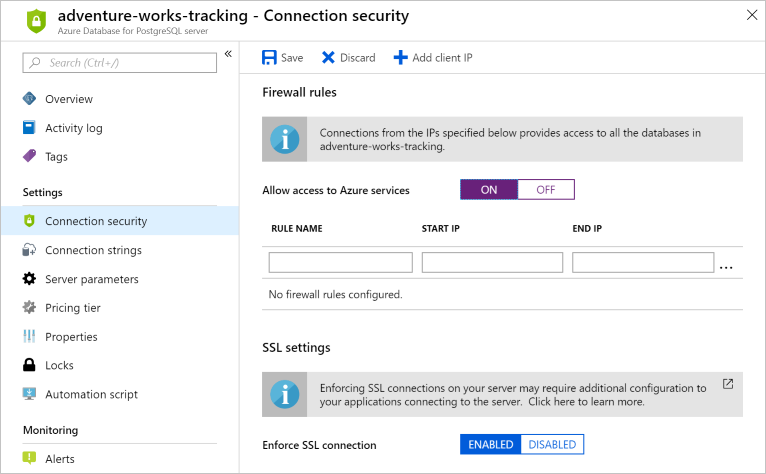

Let's assume you're using an on-premises PostgreSQL database. You're managing all security aspects and you've locked down all access to your servers using the standard PostgreSQL server-level firewall rules. Now you want to make sure that you can configure the same server-level firewall rules in Azure.

## Server security considerations and connection methods

You have a number of options to restrict access to your Azure Database for PostgreSQL server and databases. Network access can be restricted at a network, server, or database level. You can use any of the following options:

- User accounts to restrict database access
- Virtual networks to restrict network access
- Firewall rules to restrict server access

### Authentication and authorization

The Azure Database for PostgreSQL server supports native PostgreSQL authentication. You can connect and authenticate to the server with the server's admin login. You'll also create users to connect to specific databases to limit access.

### What is a virtual network?

A virtual network is a logically isolated network that's created within the Azure network. You can use a virtual network to control what Azure resources can connect to other resources.

Imagine you're running a web application that connects to a database. You'll use subnets to isolate different parts of the network. A subnet is a part of a network that's based on a range of IP addresses.

To configure these subnets, you'll create a virtual network and then subdivide the network into subnets. The web application will operate on one subnet and the database on another subnet. Each subnet will have its own rules for communicating to and from the other network. These rules give you the ability to restrict access from the database to the web application.

Creating a virtual network is beyond the scope of this module. If you need more information, please explore other learning modules related to virtual networks.

### What is a firewall?

A firewall is a service that grants server access based on the originating IP address of each request. You create firewall rules that specify ranges of IP addresses. Only clients from these granted IP addresses will be allowed to access the server. Firewall rules, generally speaking, also include specific network protocol and port information. For example, a PostgreSQL server by default listens to TCP requests on port 5432.

### Azure Database for PostgreSQL server firewall

The Azure Database for PostgreSQL server firewall prevents all access to your database server until you specify which computers have permission. The firewall configuration allows you to specify a range of IP addresses that are allowed to connect to the server. The server always uses the default PostgreSQL connection information.



### Azure Database for PostgreSQL server SSL connections

Azure Database for PostgreSQL prefers that your client applications connect to the PostgreSQL service using the Secure Sockets Layer (SSL). Enforcing SSL connections between your database server and your client applications helps protect against "man in the middle" and similar attacks by encrypting the data between the server and client. Enabling SSL requires the exchange of keys and strict authentication between client and server for the connection to work. Details about using SSL are beyond the scope of this learning module. If you need more information, please explore other learning modules related to SSL.

## Configure connection security

Let's look at the decisions and steps you make to configure an Azure Database for PostgreSQL server firewall. You'll also see how to connect to the server that you created earlier.

Sign into the [Azure portal](https://portal.azure.com/learn.docs.microsoft.com?azure-portal=true) using the same account you activated the sandbox with. Navigate to the server resource for which you'd like to create a firewall rule.

Then, you'll select the **Connection Security** option to open the connection security blade to the right.



On this screen, you have several options. You can:

- Add the IP address that you use to access the portal as a firewall entry by clicking on the **Add client IP** button.
- Allow access to Azure services. By default, all Azure services **don't** have access to the PostgreSQL server.
- Add firewall rules by entering ranges of IP addresses.
- Enforce SSL connections. This option forces your client to connect to the server using an SSL certificate.

Always remember to click on the **Save** icon above the entry fields to save the updated configuration after you've made changes.

### Allow access to Azure services

To use Azure Cloud Shell to access or configure your server, make sure to enable **Allow Access to Azure Services**. This step is going to add a firewall rule to the server configuration to allow access from Cloud Shell. This rule won't show as one of the custom rules that you add.

You also need to disable **Enforce SSL connection**. PowerShell can't connect to the server if SSL is required for client connections.

Both of these options will result in an error message that's displayed on the command line if not configured correctly.

For example, if access is not allowed to Azure services and enforce SSL connections is enabled, then you'll see something similar to this error when the firewall is blocking access:

```output
psql: FATAL: no pg_hba.conf entry for host "123.45.67.89", user "adminuser", database "postgres", SSL on FATAL:  SSL connection is required. Please specify SSL options and retry.
```

### Create a firewall rule using the portal

Let's say you want to create a firewall rule that provides access from any IP address.

> [!WARNING]
> Creating this firewall rule will allow any IP address on the Internet to attempt to connect to your server. Even though clients won't be able access the server without the username and password, enable this rule with caution and make sure you understand the security implications.

You create a new firewall rule by entering the following data in the labeled fields:

- Rule Name: `AllowAll`
- Start IP: `0.0.0.0`
- End IP: `255.255.255.255`

To remove a firewall rule, you'll click the ellipsis (...) at the end of the rule that you want to delete. Click the **Delete** button to delete the rule.

Click on the **Save** icon above the entry fields to commit the deletion of the rule.

### Create a firewall rule using the Azure CLI

You can use the Azure CLI to add firewall rules to your server with the `az postgres server firewall-rule create` command. Here's an example that creates the rule from above.

```azurecli
az postgres server firewall-rule create \
  --resource-group <rgn>[Sandbox resource group name]</rgn> \
  --server <server-name> \
  --name AllowAll \
  --start-ip-address 0.0.0.0 \
  --end-ip-address 255.255.255.255
```

You remove firewall rules from your server with the command `az postgres server firewall-rule delete`. Here's an example:

```azurecli
az postgres server firewall-rule delete \
  --name AllowAll \
  --resource-group <rgn>[Sandbox resource group name]</rgn> \
  --server-name <server-name>
```

## Connecting to your server

Like any modern database, PostgreSQL requires regular server administration to achieve best performance. You have a number of options to connect and manage your Azure Database for PostgreSQL server. We'll use `psql` to connect to the server.

### What is psql?

The command-line tool called `psql` is the PostgreSQL distributed interactive terminal for working with PostgreSQL servers and databases. `psql` works with Azure Database for PostgreSQL the same as with any other PostgreSQL implementation and is included with Azure Cloud Shell. The `psql` tool allows you to manage databases as well as execute structure queries against these databases.

Using `psql` requires a successful connection to a PostgreSQL server. There are a number of command-line parameters available for use when working with `psql`.

- `--host` - The host to which you'd like to connect.
- `--username` - The user name/ID with which to connect.
- `--dbname` - The name of the database to connect to.

> [!TIP]
> You'll typically connect to the `postgres` management database when managing your server access and database configurations.

Here is the complete command:

```bash
psql --host=<server-name>.postgres.database.azure.com
      --username=<admin-user>@<server-name>
      --dbname=<database>
```

After you're connected, you'll be presented with a command prompt and can execute commands to your server and databases.

You've now seen the steps that you take to configure Azure Database for PostgreSQL security settings. In the next unit, you'll configure Azure Database for PostgreSQL security settings. You'll also connect to the server using Cloud Shell.
