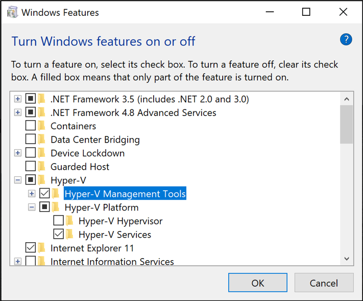
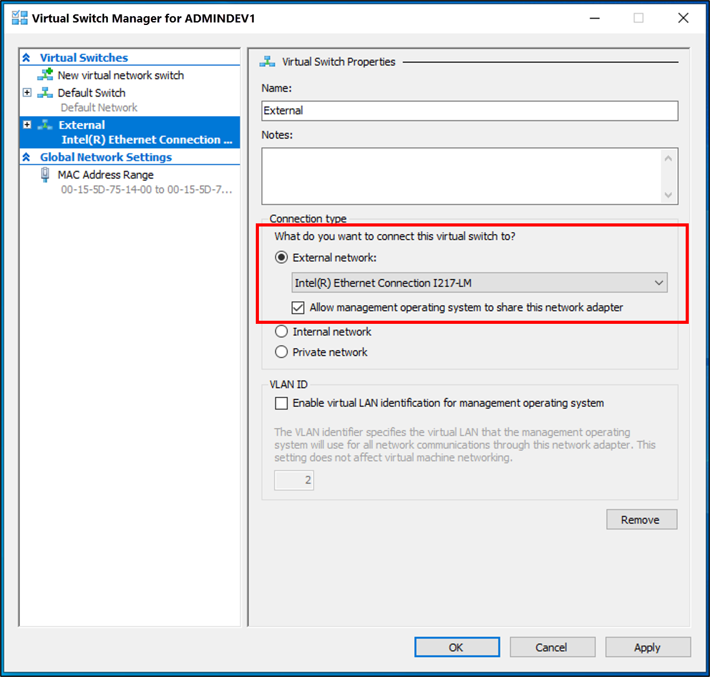
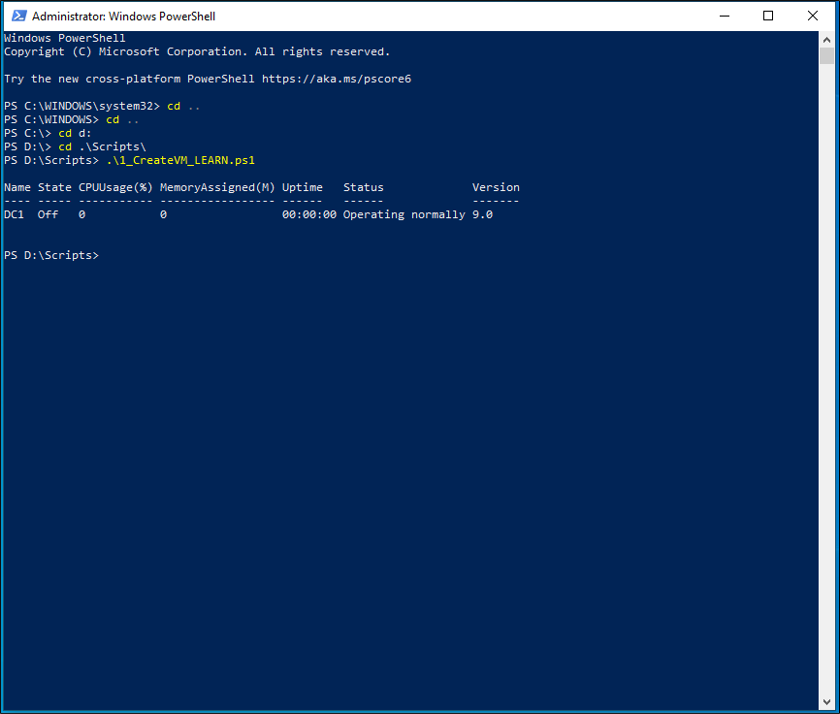
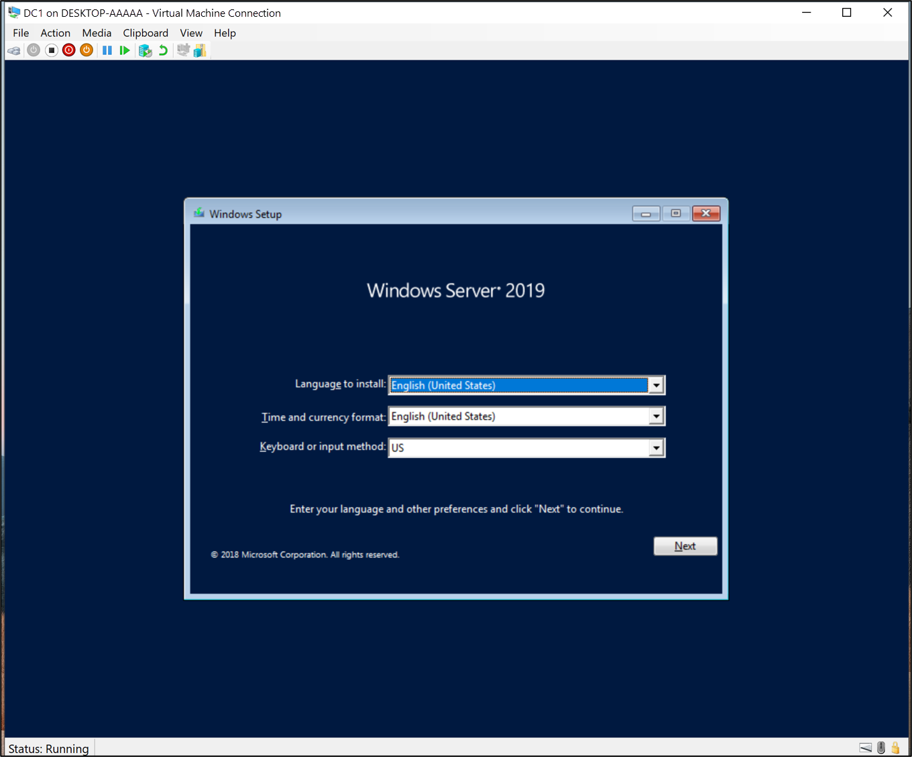

## Create and configure your virtual machine


## Install and configure Hyper-V Manager
The first thing that you'll need to do is, install Hyper-V on the host computer. If you already have Hyper-V installed, you can skip to creating the virtual machine.  To install Hyper-V, follow the steps below.

 1. Click the windows icon in the lower left and type **Turn Windows features on or off**.
 2. Click on **Turn Windows features on or off**.
 3. Expand Hyper-V and select **Hyper-V services**
 [](../media/3-exercise-2.png#lightbox)
 4. Click OK.  Click Restart.
 5. Once the computer has restarted, click the windows icon and type **Hyper-V Manager**.  Open it.
 6. In Hyper-V manager, right-click on the computer and select **Virtual Switch Manager**.
 7. Select **New virtual network switch**
 8. Select External and click **Create Virtual Switch**.
 9. Rename it **External**.
 10. Under External Network, make sure your Ethernet/wi-fi adapter is selected.
  [](../media/3-exercise-3.png#lightbox)
 11.  Click Apply.  Click Ok.
 12. If you receive a warning saying, "Pending changes may disrupt network connectivity"  click "Yes".
 13. Click Okay to close the virtual switch Manager

>[!NOTE]
> If you are having an issue creating the External network, make sure that the host machine can connect to the internet and that the **Hyper-V Exensible Virtual Switch** is not bound to your Ethernet adapter.  If so, checkout the video below for information on how to fix this issue.

## Create a virtual machine
In order to get our hybrid identity environment up and running, you'll need to create a virtual machine that will be used as the on-premises Active Directory server.   

The PowerShell script below can be used to accomplish this task.  The script contains the following variables and these can be changed to suit your environment or preferences.

Variable|Description
|-----|-----|
$VMName|The name of the virtual machine as it will appear in Hyper-V|
|$Switch|The external adapter that will allow the virtual machine to reach the internet|
$InstallMedia|Path and filename of the Windows Server 2019 build|
|$Path|The location the virtual machine will be created in|
|$VHDPath|The location of the virtual hard disk for the virtual machine|
|$VHDSize|The size in bytes of our virtual hard disk|


 Do the following tasks:

 1. Open up the PowerShell ISE as Administrator.
 2. Copy the script below in to notepad and save it as ` D:\Scripts\1_CreateVM_LEARN.ps1`

   ```powershell
    #Declare variables
    $VMName = 'DC1'
    $Switch = 'External'
    $InstallMedia = 'C:\ISO\en_windows_server_2019_updated_aug_2021_x64_dvd_a6431a28.iso'
    $Path = 'D:\VM'
    $VHDPath = 'D:\VM\DC1\DC1.vhdx'
    $VHDSize = '64424509440'

    #Create New Virtual Machine
    New-VM -Name $VMName -MemoryStartupBytes 16GB -BootDevice VHD -Path $Path -NewVHDPath $VHDPath -NewVHDSizeBytes $VHDSize  -Generation 2   

    #Set the memory to be non-dynamic
    Set-VMMemory $VMName -DynamicMemoryEnabled $false

    #Add DVD Drive to Virtual Machine
    Add-VMDvdDrive -VMName $VMName -ControllerNumber 0 -ControllerLocation 1 -Path $InstallMedia

    #Mount Installation Media
    $DVDDrive = Get-VMDvdDrive -VMName $VMName

    #Configure Virtual Machine to Boot from DVD
    Set-VMFirmware -VMName $VMName -FirstBootDevice $DVDDrive 
  ```
  3. Using a command line, navigate to ` D:\Scripts`, type `1_CreateVM_LEARN.ps1`, and hit enter.
  [](../media/3-exercise-4.png#lightbox)
  4.  Once this operation completes, you can move to finishing the operating system installation.

## Complete the operating system deployment
In order to finish building the virtual machine, you need to finish the operating system installation.

 1. Hyper-V Manager, double-click on the virtual machine
 2. Click on the Start button.
 3. You'll be prompted to ‘Press any key to boot from CD or DVD’. Go ahead and do so.
 4. On the Windows Server startup screen, select your language and click **Next**.
  [](../media/3-exercise-5.png#lightbox)
 6. Click **Install Now**.
 7. Select **Windows 2019 Standard (Desktop Experience)** and click **Next**.
 8. Check **I accept the license terms and click **Next**.
 9. Select **Custom:  Install Windows Only (Advanced)**
 10. Click **Next**
 11. When prompted, enter a password for the Administrator account.


## Check your work
At this point, you should have Hyper-V installed, a new virtual machine created and the Windows Server 2019 operating system installed on it.

To verify this exercise, we'll connect to the virtual machine.
1.  From the start button, select Hyper-V Manager
2. In the center pane, under virtual machines, right-click the virtual machine and select connect.
3. Sign-in to the new virtual machine with the password used in the Complete the operating system deployment section.


</br>

> [!VIDEO https://msit.microsoftstream.com/embed/video/8e890840-98dc-b478-1fbc-f1ecf1b0b730?autoplay=false&amp;showinfo=true]

</br>