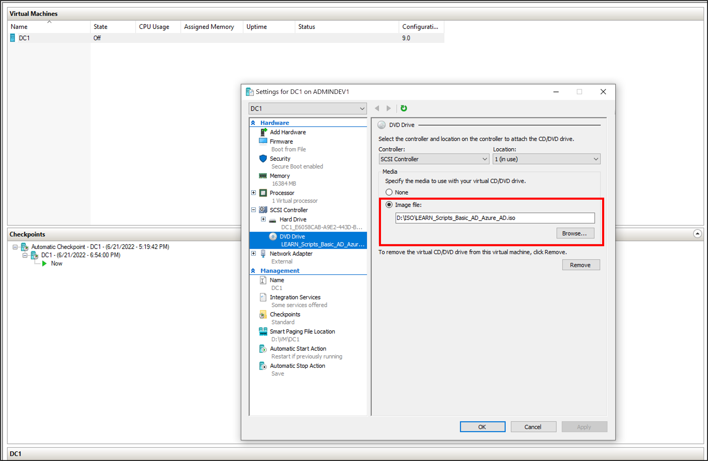
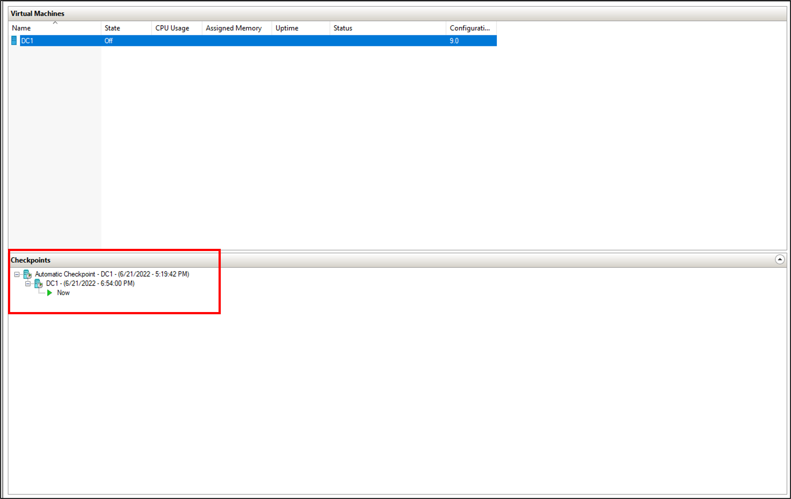

## Install Active Directory and create a test user


## Change the ISO file in Hyper-V
Now that we have the virtual machine up and the operating system installed, we want to change the ISO file that VM is using.  We're taking this action so we can run the remaining scripts from within the VM.  To change the ISO file, do the following tasks:

1. In **Hyper-V**, right click on DC1 and select **Settings**.
2. On the left, select **DVD Drive**.
3. On the right, browse for the **LEARN_Scripts_Basic_AD_Azure_AD.ISO** file that was downloaded in the prepare section.
  [](../media/4-exercise-2.png#lightbox)
4. Click **Apply** and **OK**. 

## Install Active Directory prerequisites
Now that you've a virtual machine up, you need to do a few things prior to installing Active Directory.  That is, you need to rename the virtual machine, set a static IP address and DNS information, and install the Remote Server Administration tools.   

The PowerShell script below can be used to accomplish this task.  The script contains the following variables. The variables can be changed to suit your environment or preferences.

Variable|Description
|-----|-----|
|$ipaddress|The IP address of our network card|
|$ipprefix|Defines the local subnet size, and is also known as a subnet mask|
|$ipgw|Specifies the IPv4 address of the default gateway for the host. Default gateways provide a default route for TCP/IP hosts to use when communicating with other hosts on remote networks|
|$ipdns|The first DNS server to set for the interface|
|$ipdns2|The second DNS server to set for the interface|
|$ipif|Specifies the index number of the interface|
|$featureLogPath|Sets the log file path|
|$newname|The new name of the server|
|$addsTools|The remote administration tools to install|

1. Open up the PowerShell ISE as Administrator.
2. Run the following script.

   ```powershell
    #Declare variables
    $ipaddress = "10.0.1.117" 
    $ipprefix = "24" 
    $ipgw = "10.0.1.1" 
    $ipdns = "10.0.1.117"
    $ipdns2 = "8.8.8.8" 
    $ipif = (Get-NetAdapter).ifIndex 
    $featureLogPath = "c:\poshlog\featurelog.txt" 
    $newname = "DC1"
    $addsTools = "RSAT-AD-Tools" 

    #Set static IP address
    New-NetIPAddress -IPAddress $ipaddress -PrefixLength $ipprefix -InterfaceIndex $ipif -DefaultGateway $ipgw 

    # Set the DNS servers
    Set-DnsClientServerAddress -InterfaceIndex $ipif -ServerAddresses ($ipdns, $ipdns2)

    #Rename the computer 
    Rename-Computer -NewName $newname -force 

    #Install features 
    New-Item $featureLogPath -ItemType file -Force 
    Add-WindowsFeature $addsTools 
    Get-WindowsFeature | Where installed >>$featureLogPath 

    #Restart the computer 
    Restart-Computer
    ```

## Create a Windows Server AD environment
Now that you've the VM created and it has been renamed and has a static IP address, you can go ahead and install and configure Active Directory Domain Services.  

The PowerShell script below can be used to accomplish this task.  The script contains the following variables and these can be changed to suit your environment or preferences.

Variable|Description
|-----|-----|
|$DatabasePath|Specifies the fully qualified, non-Universal Naming Convention (UNC) path to a directory on a fixed disk of the local computer that contains the domain database, for instance, C:\Databases\NTDS. The default is %SYSTEMROOT%\NTDS| 
|$DomainMode|Specifies the domain functional level of the first domain in the creation of a new forest| 
|$DomainName|Specifies the fully qualified domain name (FQDN) for the root domain in the forest|
|$DomaninNetBIOSName|Specifies the NetBIOS name for the root domain in the new forest|
|$ForestMode|Specifies the forest functional level for the new forest|
|$LogPath|Specifies the fully qualified, non-UNC path to a directory on a fixed disk of the local computer where the log file for this operation is written|
|$SysVolPath|Specifies the fully qualified, non-UNC path to a directory on a fixed disk of the local computer where the sysvol file is written| 
|$featureLogPath|Sets the feature log file path| 
|$Password|Supplies the password for the administrator account when the computer is started in Safe Mode or a variant of Safe Mode, such as Directory Services Restore Mode|  
|$SecureString|Converts $Password to a secure string|

Do the following tasks:

1. Open up the PowerShell ISE as Administrator.
2. Run the following script.

    ```powershell 
    #Declare variables
    $DatabasePath = "c:\windows\NTDS"
    $DomainMode = "WinThreshold"
    $DomainName = "contoso.com"
    $DomaninNetBIOSName = "CONTOSO"
    $ForestMode = "WinThreshold"
    $LogPath = "c:\windows\NTDS"
    $SysVolPath = "c:\windows\SYSVOL"
    $featureLogPath = "c:\poshlog\featurelog.txt" 
    $Password = "Pass1w0rd"
    $SecureString = ConvertTo-SecureString $Password -AsPlainText -Force

    #Install AD DS, DNS and GPMC 
    start-job -Name addFeature -ScriptBlock { 
    Add-WindowsFeature -Name "ad-domain-services" -IncludeAllSubFeature -IncludeManagementTools 
    Add-WindowsFeature -Name "dns" -IncludeAllSubFeature -IncludeManagementTools 
    Add-WindowsFeature -Name "gpmc" -IncludeAllSubFeature -IncludeManagementTools } 
    Wait-Job -Name addFeature 
    Get-WindowsFeature | Where installed >>$featureLogPath

    #Create New AD Forest
    Install-ADDSForest -CreateDnsDelegation:$false -DatabasePath $DatabasePath -DomainMode $DomainMode -DomainName $DomainName -SafeModeAdministratorPassword $SecureString -DomainNetbiosName $DomainNetBIOSName -ForestMode $ForestMode -InstallDns:$true -LogPath $LogPath -NoRebootOnCompletion:$false -SysvolPath $SysVolPath -Force:$true
    ```

## Create a Windows Server AD user
Now that you've our Active Directory environment, you need to a test account.  This account will be created in our on-premises AD environment and then synchronized to Azure AD.  

The PowerShell script below can be used to accomplish this task.  The script contains the following variables and these can be changed to suit your environment or preferences.

Variable|Description
|-----|-----|
|$Givenname|Specifies the user's given name|
|$Surname|Specifies the user's last name or surname|
|$Displayname|Specifies the display name of the user|
|$Name|Specifies the name of the user|
|$Password|Sets the password for the user|
|$Identity|Specifies an Active Directory user object by providing the DN of the user|
|$SecureString|Converts $Password to a secure string|

Do the following tasks:

1. Open up the PowerShell ISE as Administrator.
2. Run the following script.

    ```powershell 
     #Declare variables
    $Givenname = "Anna"
    $Surname = "Ringdal"
    $Displayname = "Anna Ringdal"
    $Name = "aringdal"
    $Password = "Pass1w0rd"
    $Identity = "CN=aringdal,CN=Users,DC=contoso,DC=com"
    $SecureString = ConvertTo-SecureString $Password -AsPlainText -Force


    #Create the user
    New-ADUser -Name $Name -GivenName $Givenname -Surname $Surname -DisplayName $Displayname -AccountPassword $SecureString

    #Set the password to never expire
    Set-ADUser -Identity $Identity -PasswordNeverExpires $true -ChangePasswordAtLogon $false -Enabled $true

## Create a checkpoint
Once you have created the user, we want to create a snapshot of the work we have done so we can roll back to this point if we need to.  To do this task, do the following tasks:

1. In Hyper-V, right-click DC1.
2. Select **Checkpoint**
3. You should now see a checkpoint created.
[](../media/4-exercise-3.png#lightbox)

## Check your work
At this point, you should have your server renamed and Active Directory installed.  You should also have a new user named Allie McCray created.

To verify this exercise, we'll connect to the virtual machine.

1. From the start button, click **Server Manager**.
2. On the left, select **Local Server**.
3. On the right, under properties, the computer name should say **DC1**.
4. Next, at the top of **Server Manager**, click **Tools** and select **Active Directory Users and Computers** (ADUC).
5. In ADUC, on the left, click **contoso**.
6. On the right, click **Users** and verify that **Anna Ringdal** is there.

</br>

> [!VIDEO https://msit.microsoftstream.com/embed/video/6aae0840-98dc-b478-91f5-f1ecf1b8ddd0?autoplay=false&amp;showinfo=true]

</br>
