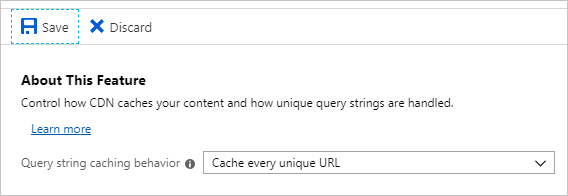

In this exercise, you'll configure CDN settings to help optimize and control the delivery of content.

### Verify the CDN delivered page

If you haven't already, verify the CDN is delivering the same content as your source URL.

1. Switch to the browser tab displaying the origin server link, and refresh the page. The page should display normally.

1. Switch to the browser tab displaying the CDN cached copy of the website, and refresh the page. Again, the page should display normally and should match the origin server page.

### Change the Origin Website Files

1. Open the [Azure portal](https://portal.azure.com/learn.docs.microsoft.com?azure-portal=true) if it isn't open already.

1. Open the CDN **endpoint**. In the middle pane, select **Overview**.

1. In another tab, open a second copy of the [Azure portal](https://portal.azure.com/learn.docs.microsoft.com?azure-portal=true).

1. On the Azure portal menu or from the **Home** page, select **Storage accounts**.

1. Select the storage account you use to host the static website. It should be the **cdnsitestorageXXXX** resource we created earlier.

1. In the **Storage account** properties pane, under **Data management**, select **Static website**.

1. In the **Static website** page, select the **$web** link.

1. In the **$web** panes, select **Overview**.

1. Check the box to select **index.html** and select **...** to open the context menu.

1. On the context menu, select **View/edit**.

1. In the **Index.html** tab, alter the page by adding text in the **H1** tag and select **Save**.

### Verify the changes

1. Switch to the browser tab displaying the origin server link, and refresh the page. The page should update immediately.

1. Switch to the browser tab displaying the CDN cached copy of the website, and refresh the page. The updated text won't appear.

1. Switch to the copy of the Azure portal showing the CDN endpoint settings, and select the **Purge** button.

1. In the **Purge** pane, select your endpoint from the drop-down, check the **Purge all** box, and select **Purge**.

1. Switch to the browser tab displaying the CDN cached copy of the website, and refresh the page. The updated text will appear after a few minutes.

The purge operation has completed successfully.

## Change Caching with Query strings

In this next section, you'll configure the cache settings and show the effects of how the different caching options work with query strings.

### Change the Caching Settings

1. Open the [Azure portal](https://portal.azure.com/learn.docs.microsoft.com?azure-portal=true) if it isn't open already.

1. Open the CDN **endpoint**. Under **Settings**, select **Caching rules**.

1. Next to **Query string caching behavior**, select **Cache every unique URL**, then select **Save**.

### Add Query Strings and Check Caching Behavior

After 10 minutes, the new settings should have updated on the CDN endpoint. Continue with the following steps:

1. Switch to the tab displaying the CDN cached copy of the website, add `/?Q=old` to the end of the URL, then press Enter. The page shouldn't change.

1. Switch to the second copy of the Azure portal, and in the **Overview** pane, select **index.html**.

1. Select **...** to open the context menu, and select **View/edit**.

1. In the **Index.html** tab, add some more text to the file and then select **Save**.

1. Switch back to the tab displaying the CDN cached copy of the website and refresh the page with the `/?Q=old` query string. The page should still not change.

1. Change the `/?Q=old` to `/?Q=new` and press Enter. The updated page appears after a short pause.

1. Switch back to the `/?Q=old` URL and notice that the older page reappears.

1. Switch back to the copy of the Azure portal that shows the CDN Endpoint settings. Select **Caching rules** under **Settings**.

1. In the Caching rules pane, in the **Query string caching behavior** drop-down, select **Bypass caching for query strings**, then select **Save**.

1. Wait for 10 minutes until the new settings have updated on the CDN endpoint.

1. Switch back to the tab displaying the CDN cached copy of the website and refresh the page using the `/?Q=old` query string. The page should update with the changed version of the page.

You've cached a copy of the origin web site and shown the caching behavior with query strings.
