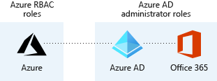

Sometimes, the built-in roles for Azure resources don't grant the precise level of access you need. Custom roles allow you to define roles that meet the specific needs of your organization. You can assign the custom roles you create to users, groups, and service principals at the scope of subscription, resource group, or resource.

In this unit, you learn about custom roles in role-based access control (RBAC) for Azure resources.

## Azure Active Directory and RBAC roles

Azure Active Directory (Azure AD) and RBAC roles are often confused when you first work with Azure. Azure AD roles provide the mechanism for managing permissions to AD resources like user accounts and passwords. RBAC provides a wealth of capabilities for managing Azure resources like virtual machines (VMs) at a granular level.



The subtle differences between how the two can be set up and managed are in the following table:

RBAC roles for Azure | Azure AD administrator roles
--- | ---
Manage access to Azure resources like VMs, storage, networks and more | Manage access to Azure Active Directory resources like user accounts and passwords 
Allows custom roles | Allows custom roles
Multiple scope levels (management group, subscription, resource group, resource) | Scope only at tenant level
Role information accessible through Azure portal, Azure CLI, Azure PowerShell, Azure Resource Manager templates, REST API | Role information accessible in Azure admin portal, Microsoft 365 admin center, Microsoft Graph, Azure AD PowerShell

For our scenario, we need a custom role to manage Azure VMs at the subscription scope. So we need to use custom roles in RBAC for Azure resources.

## Assignment and scope of custom roles

Users with the roles User Access Administrator or Owner can create or assign custom roles in RBAC for Azure resources.

Custom roles can be assigned to:

Security principal | Summary
--- | ---
**User** | An individual who has a profile in Azure Active Directory
**Group** | A set of users created in Azure Active Directory
**Service principals** | A security identity used by applications or services to access specific Azure resources
**Managed identity** | An identity in Azure Active Directory that is automatically managed by Azure

You can scope the assignment and related permissions to different levels within Azure. The different scopes are:

- Management group
- Subscription
- Resource group
- Individual resource


## Role definition and structure

A custom role definition breaks down into a collection of different permissions. Each definition details the operations that are allowed, such as read, write, and delete. The definition is formed using these structures:

```JSON
{
  "Name": "",
  "IsCustom": true,
  "Description": "",
  "Actions": [],
  "NotActions": [],
  "DataActions": [],
  "NotDataActions": [],
  "AssignableScopes": [
    "/subscriptions/{subscriptionId1}"
  ]
}
```

<!--Image taken from https://docs.microsoft.com/en-us/azure/role-based-access-control/overview - Can the '3 Role Definition' be removed please-->
The following example shows the role definition for the Contributor role. 


Any role definition is declared using the following format:

`{Company}.{ProviderName}/{resourceType}/{action}`

The parameter can be one of the following actions:

- \*
- read
- write
- action
- delete

## Define custom role to manage VMs

To help you identify what permissions to include in a role definition, use the Azure Resource Manager resource provider operations list and look at built-in roles that have permissions similar to what you need. 

### Review built-in roles

For our scenario, the Virtual Machine Contributor built-in role has more permissions than the employee needs and Virtual Machine Administrator Login doesn't have enough.

The following command returns the permissions for the build-in role Virtual Machine Contributor.

```azurecli
az role definition list --name "Virtual Machine Contributor" --output json | jq '.[] | .permissions[0].actions'
```

The following list is the permissions for the build-in role Virtual Machine Contributor.

```JSON
[
  "Microsoft.Authorization/*/read",
  "Microsoft.Compute/availabilitySets/*",
  "Microsoft.Compute/locations/*",
  "Microsoft.Compute/virtualMachines/*",
  "Microsoft.Compute/virtualMachineScaleSets/*",
  "Microsoft.DevTestLab/schedules/*",
  "Microsoft.Insights/alertRules/*",
  "Microsoft.Network/applicationGateways/backendAddressPools/join/action",
  "Microsoft.Network/loadBalancers/backendAddressPools/join/action",
  "Microsoft.Network/loadBalancers/inboundNatPools/join/action",
  "Microsoft.Network/loadBalancers/inboundNatRules/join/action",
  "Microsoft.Network/loadBalancers/probes/join/action",
  "Microsoft.Network/loadBalancers/read",
  "Microsoft.Network/locations/*",
  "Microsoft.Network/networkInterfaces/*",
  "Microsoft.Network/networkSecurityGroups/join/action",
  "Microsoft.Network/networkSecurityGroups/read",
  "Microsoft.Network/publicIPAddresses/join/action",
  "Microsoft.Network/publicIPAddresses/read",
  "Microsoft.Network/virtualNetworks/read",
  "Microsoft.Network/virtualNetworks/subnets/join/action",
  "Microsoft.RecoveryServices/locations/*",
  "Microsoft.RecoveryServices/Vaults/backupFabrics/backupProtectionIntent/write",
  "Microsoft.RecoveryServices/Vaults/backupFabrics/protectionContainers/protectedItems/*/read",
  "Microsoft.RecoveryServices/Vaults/backupFabrics/protectionContainers/protectedItems/read",
  "Microsoft.RecoveryServices/Vaults/backupFabrics/protectionContainers/protectedItems/write",
  "Microsoft.RecoveryServices/Vaults/backupPolicies/read",
  "Microsoft.RecoveryServices/Vaults/backupPolicies/write",
  "Microsoft.RecoveryServices/Vaults/read",
  "Microsoft.RecoveryServices/Vaults/usages/read",
  "Microsoft.RecoveryServices/Vaults/write",
  "Microsoft.ResourceHealth/availabilityStatuses/read",
  "Microsoft.Resources/deployments/*",
  "Microsoft.Resources/subscriptions/resourceGroups/read",
  "Microsoft.SqlVirtualMachine/*",
  "Microsoft.Storage/storageAccounts/listKeys/action",
  "Microsoft.Storage/storageAccounts/read",
  "Microsoft.Support/*"
]
```

For our scenario, we want a custom role that can be used for monitoring and restarting virtual machines for a specific subscription. So we want to include the following actions scoped at the subscription level:

- Read access to the compute, network, and storage resources
- Ability to start and restart virtual machines
- Access to the resource groups in the subscription
- Access to monitoring resources

There are some operations in the Virtual Machine Contributor role definition we can use like `"Microsoft.Insights/alertRules/*"` for monitoring. But restart and some others aren't listed as actions in that role definition.

### Find resource provider operations

We can find the VM restart action in the Azure Resource Manager resource provider operations list or by running the following command to return operations for VMs:

  ```PowerShell
 Get-AzProviderOperation */virtualMachines/*
 ```

The following operation for restart is returned in the list.

```PowerShell
Operation         : Microsoft.Compute/virtualMachines/restart/action
OperationName     : Restart Virtual Machine
ProviderNamespace : Microsoft Compute
ResourceName      : Virtual Machines
Description       : Restarts the virtual machine
IsDataAction      : False
```

The `Get-AzProviderOperation` is useful to get the most current list of resource provider operations. You can also find a published list of resource providers and operations in the Azure Resource Manager content on Docs. 

### Create VM Operator role definition

Let's assume we've picked out what we need by looking at the related build-in role definitions and the resource provider operations list. We end up with the following role definition for our custom role. We'll use this role definition for our custom role.

```JSON
   {
   "Name": "Virtual Machine Operator",
   "Id": "88888888-8888-8888-8888-888888888888",
   "IsCustom": true,
   "Description": "Can monitor and restart virtual machines.",
   "Actions": [
     "Microsoft.Storage/*/read",
     "Microsoft.Network/*/read",
     "Microsoft.Compute/*/read",
     "Microsoft.Compute/virtualMachines/start/action",
     "Microsoft.Compute/virtualMachines/restart/action",
     "Microsoft.Authorization/*/read",
     "Microsoft.ResourceHealth/availabilityStatuses/read",
     "Microsoft.Resources/subscriptions/resourceGroups/read",
     "Microsoft.Insights/alertRules/*",
     "Microsoft.Support/*"
   ],
   "NotActions": [],
   "DataActions": [],
   "NotDataActions": [],
   "AssignableScopes": [
      "/subscriptions/{subscriptionId1}" 
   ]
   }
    ```