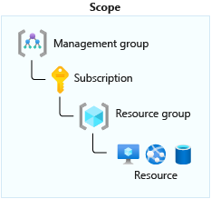

## What are custom roles

Sometimes, the roles that are built into Azure don't grant the precise level of access that you need. Referring to the scenario, you will create a custom role by using Azure CLI commands to allocate the correct role to the new employee providing exactly the right permission to enable him to fulfill his role

### Active Directory and RBAC

These role types are often confused when first working with Azure. Active Directory roles provide the mechanism for managing permissions to AD resources only. RBAC provides a whole wealth of capabilities for managing every resource in azure at a granular level

<!--Image taken from https://docs.microsoft.com/en-us/azure/role-based-access-control/rbac-and-directory-admin-roles#differences-between-azure-rbac-roles-and-azure-ad-administrator-roles -->


The subtle differences between how the two can be setup and managed are listed below:

Azure RBAC roles | Azure AD administrator roles
--- | ---
Manage access to Azure resources | Manage access to Azure Active Directory resources
Allows custom roles | Allows custom roles
Multiple scope levels (management group, subscription, resource group, resource) | Scope only at tenant level
Role information accessible through Azure portal, Azure CLI, Azure PowerShell, Azure Resource Manager templates, REST API | Role information can be accessed in Azure admin portal, Microsoft 365 admin center, Microsoft Graph, AzureAD PowerShell.

### Assigning custom roles

In order to add or remove custom roles you must have role permissions such as
`Microsoft.Authorization/roleAssignments/write and Microsoft.Authorization/roleAssignments/delete`, which are allocated to User access administrators and owners. Custom roles can be assigned to

Security Principal | Summary
--- | ---
**User** | An individual who has a profile in Azure Active Directory.
**Group** | A set of users created in Azure Active Directory
**Service Principles** | A security identity used by applications or services to access specific Azure resources
**Managed identity** | An identity in Azure Active Directory that is automatically managed by Azure

This assignment and related permissions can be scoped to different levels within azure. In the example, the new employee could be assigned a custom role at the subscription level (assuming the Virtual Machines are contained within your subscription). The different scopes are:

- Management Group
- Subscription
- Resource Group
- Individual resource

<!--Image taken from https://docs.microsoft.com/en-us/azure/role-based-access-control/overview Can the '3 Scope' be removed please-->


## Role Definition and structure

Breaking down a custom role definition, it is a collection of different permissions. Each definition within this, details the operations which are allowed, such as read, write and delete. The definition is formed using these structures:

```JSON
{
  "Name": "",
  "IsCustom": true,
  "Description": "",
  "Actions": [],
  "NotActions": [],
  "DataActions": [],
  "NotDataActions": [],
  "AssignableScopes": [
    "/subscriptions/{subscriptionId1}"
  ]
}
```

<!--Image taken from https://docs.microsoft.com/en-us/azure/role-based-access-control/overview - Can the '3 Role Definition' be removed please-->


Any role definition can be declared using the following format:

`{Company}.{ProviderName}/{resourceType}/{action}`

The action parameter can be one of the following:

- \*
- read
- write
- action
- delete

With our example scenario in mind here is an example of a custom role for managing Virtual Machines. You will see there are a wide variety of actions that can be applied. Learning the actions available will help you better implement RBAC solutions.

```JSON
{
  "Name": "Virtual Machine Operator",
  "Id": "88888888-8888-8888-8888-888888888888",
  "IsCustom": true,
  "Description": "Can monitor and restart virtual machines.",
  "Actions": [
    "Microsoft.Storage/*/read",
    "Microsoft.Network/*/read",
    "Microsoft.Compute/*/read",
    "Microsoft.Compute/virtualMachines/start/action",
    "Microsoft.Compute/virtualMachines/restart/action",
    "Microsoft.Authorization/*/read",
    "Microsoft.ResourceHealth/availabilityStatuses/read",
    "Microsoft.Resources/subscriptions/resourceGroups/read",
    "Microsoft.Insights/alertRules/*",
    "Microsoft.Insights/diagnosticSettings/*",
    "Microsoft.Support/*"
  ],
  "NotActions": [],
  "DataActions": [],
  "NotDataActions": [],
  "AssignableScopes": [
    "/subscriptions/{subscriptionId1}",
    "/subscriptions/{subscriptionId2}",
    "/subscriptions/{subscriptionId3}"
  ]
}
```
