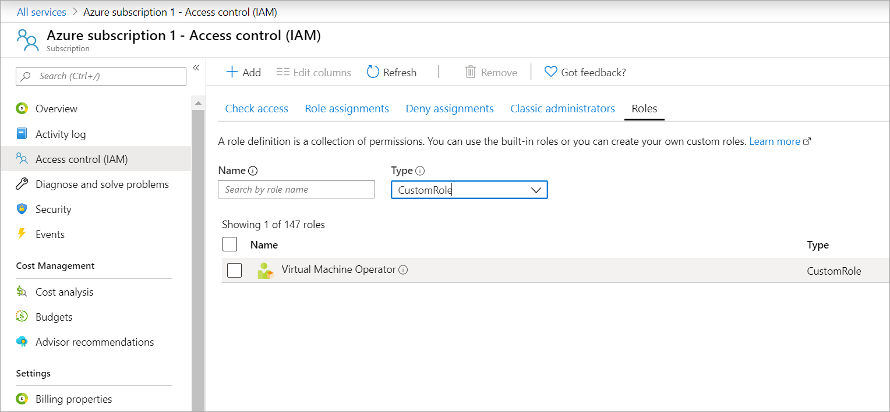

## View and manage a custom role

Refferring to the scenario, you are the owner of the subscription and wish to manage the roles that have been created and assigned. This will enable you to control the governance of your subscription.

[!include[](../../../includes/azure-sandbox-activate.md)]

### View custom roles within the portal

1. Sign into the [Azure portal](https://portal.azure.com/learn.docs.microsoft.com?azure-portal=true) using the same account you activated the sandbox with.

1. In the search bar, type **Subscription** and select the subscription option.
1. Select the subscription from the list
1. Select **Access Control** from the left menu

1. Click **Roles** and select **custom roles** type

1. This shows all the custom roles in your organization

### Update a custom role

Custom roles can easily be updated through the Azure CLI
1. Type **Code** into the cloud shell
1. Paste the definition below into the editor, click 'Save' from the three dot menu using a filename of  **VM-Support-Role-New.json**

    ```JSON
         {   
            "name": "Virtual Machine Support",
            "description": "Lets you manage virtual machines",
            "IsCustom": true,
          "Actions": [
           "Microsoft.Authorization/*/read",
                  "Microsoft.Compute/availabilitySets/*",
                  "Microsoft.Compute/locations/*",
                  "Microsoft.Compute/virtualMachines/*",
                  "Microsoft.Compute/virtualMachineScaleSets/*",
                  "Microsoft.DevTestLab/schedules/*",
                  "Microsoft.Insights/alertRules/*",
                  "Microsoft.Network/applicationGateways/backendAddressPools/join/action",
                  "Microsoft.Network/loadBalancers/backendAddressPools/join/action",
                  "Microsoft.Network/loadBalancers/inboundNatPools/join/action",
                  "Microsoft.Network/loadBalancers/inboundNatRules/join/action",
                  "Microsoft.Network/loadBalancers/probes/join/action",
                  "Microsoft.Network/loadBalancers/read",
                  "Microsoft.Network/locations/*",
                  "Microsoft.Network/networkInterfaces/*",
                  "Microsoft.Network/networkSecurityGroups/join/action",
                  "Microsoft.Network/networkSecurityGroups/read",
                  "Microsoft.Network/publicIPAddresses/join/action",
                  "Microsoft.Network/publicIPAddresses/read",
                  "Microsoft.Network/virtualNetworks/read",
                  "Microsoft.Network/virtualNetworks/subnets/join/action",
                  "Microsoft.RecoveryServices/locations/*",
                  "Microsoft.RecoveryServices/Vaults/backupFabrics/backupProtectionIntent/write",
                  "Microsoft.RecoveryServices/Vaults/backupFabrics/protectionContainers/protectedItems/*/read",
                  "Microsoft.RecoveryServices/Vaults/backupFabrics/protectionContainers/protectedItems/read",
                  "Microsoft.RecoveryServices/Vaults/backupFabrics/protectionContainers/protectedItems/write",
                  "Microsoft.RecoveryServices/Vaults/backupPolicies/read",
                  "Microsoft.RecoveryServices/Vaults/backupPolicies/write",
                  "Microsoft.RecoveryServices/Vaults/read",
                  "Microsoft.RecoveryServices/Vaults/usages/read",
                  "Microsoft.RecoveryServices/Vaults/write",
                  "Microsoft.ResourceHealth/availabilityStatuses/read",
                  "Microsoft.Resources/deployments/*",
                  "Microsoft.Resources/subscriptions/resourceGroups/read",
                  "Microsoft.SqlVirtualMachine/*",
                  "Microsoft.Storage/storageAccounts/listKeys/action",
                  "Microsoft.Storage/storageAccounts/read",
                  "Microsoft.Support/*",
                  "Microsoft.Compute/virtualMachines/start/action",
                  "Microsoft.Compute/virtualMachines/restart/action"
          ],
          "NotActions": [],
          "DataActions": [],
          "NotDataActions": [],
         "assignableScopes": [
              "/subscriptions/{subscriptionId}"
            ]
          }
        ```

1. Finally, you can use this file to update the role you created in section 2, by typing the following into the cloud shell

        ```Azure CLI
            az role definition update --role-definition VM-Support-Role-New.json
        ```

### Delete a custom role

Deleting custom roles is also a simple task with the Azure CLI

1. Type the following into your cloud shell, this will delete the role

        ```Azure CLI
            az role definition delete --name "Virtual Machine Support"
        ```

1. Now list the roles to check if it has been removed

        ```Azure CLI
        az role definition list --custom-role-only true
        ```