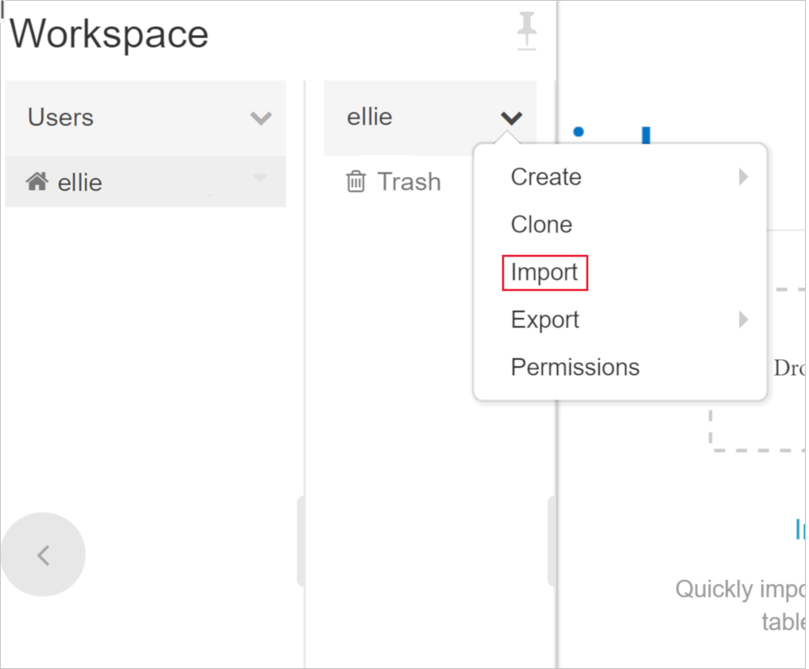

Now switch to your Databricks workspace to practice some hands-on exercises on visualizing data using Databricks. We'll use a sample dataset to perform simple query and data analysis. Then, we'll use some built-in functions to visualize data. Finally, we'll use Power BI and Matplotlib to see how we can integrate these tools for better visualization of our data. 

> [!NOTE]
> To complete the following procedures you must already have deployed your Azure Databricks workspace in your Azure portal.

## Clone the Databricks archive

1. From the Azure portal, navigate to your Azure Databricks workspace and select **Launch Workspace**.
1. Within the Workspace, using the command bar on the left, select **Workspace**, **Users**, and select your username (the entry with house icon).
1. In the blade that appears, select the downwards pointing chevron next to your name, and select **Import**.



1. On the Import Notebooks dialog, select URL and paste in the following URL:
   ```html
   https://github.com/MicrosoftDocs/mslearn-create-data-visualizations-using-azure-databricks-and-power-bi/blob/master/DBC/07-Visualization.dbc?raw=true
   ```
1. Select **Import**.
1. A folder named after the archive should appear. Select that folder.
1. The folder will contain one or more notebooks that you'll use in completing this lab.

To complete the exercise, continue working within your Azure Databricks workspace and open the new `07-Visualization` folder. Within the folder, you'll find `Python`, `Scala`, and `Spark` subfolders. Choose which of these languages you prefer to use, open the corresponding folder and then the `01-Querying-Files` notebook. Follow the instructions within the notebook, until you've completed the entire notebook. 

> Note: You'll find corresponding notebooks within the `Solutions` subfolder. These contain completed cells for exercises that ask you to complete one or more challenges. Refer to these if you get stuck or simply want to see the solution.

## Complete the following notebooks

1. **01-Querying-Files** - This notebook contains some basic visualization using built-in functions and DataFrames .
1. **02-Exploratory-Data-Analysis** - In this notebook you perform basic exploratory analysis on a sample dataset to prepare it for some advanced visualization in next notebooks.
1. **03-Power-BI** - In this notebook you connect your Databricks cluster to Power BI and create visualization using Power BI tools.
1. **04-Matplotlib** - In this notebook you use Matplotlib to create custom visualization for your data.

After you've completed the notebooks, return to this screen and continue to the next step.