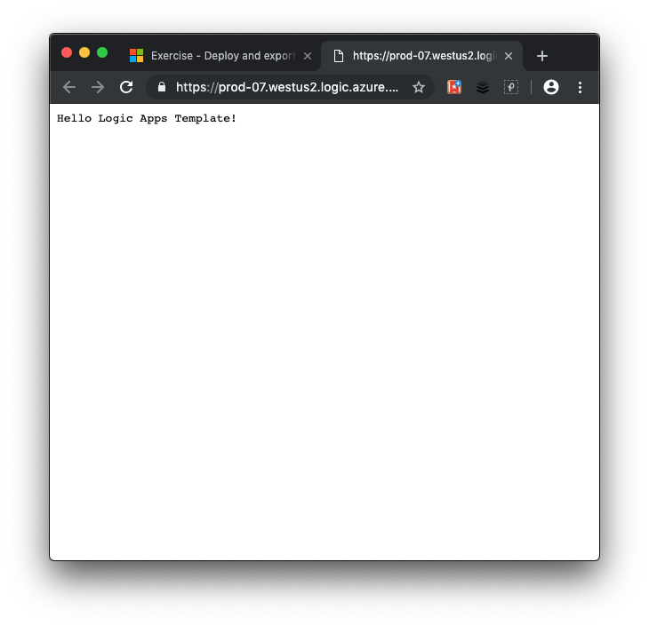

In this unit, we'll deploy a workflow in Azure Logic Apps using an Azure Resource Manager template. 

### Creating resources in Azure

Usually, we'd first create a resource group to hold all the items that we need to create. A resource group helps us administer all the virtual machines (VMs), disks, network interfaces, and other elements that make up our solution as a unit.

We can create a resource group with the Azure CLI command `az group create`. This command takes a `--name` to provide a unique resource group name in our subscription. The command also takes a `--location` to provide the default Azure region for the resources.

However, we're using the free Azure sandbox environment, so you don't need to create a resource group. Instead, you can use the previously created resource group **<rgn>[sandbox resource group name]</rgn>** in this exercise.

### Download and examine a basic Resource Manager template

1. From Cloud Shell, run the following curl command to download the template from GitHub.

    ```azurecli
    curl https://raw.githubusercontent.com/MicrosoftDocs/mslearn-logic-apps-and-arm-templates/master/basic-template/template.json > basic-template.json
    ```

1. To view our template, open it in the built-in editor.

    ```azurecli
    code basic-template.json
    ```

    The logic app workflow definition described in **template.json** is shown in the following listing.

    [!code-json[](../code/basic-template/template.json)]

    As you can see from the preceding JSON definition, and as the template name suggests, this logic app workflow is basic. Let's look at the main components of this app.

    In the following snippet, we see that the app is called `HelloLogicAppsTemplate`. This name is hardcoded in the template. The location in which the app runs is also hardcoded to `westus2`.

    [!code-json[](../code/basic-template/template.json?range=10-11)]

    Scrolling down to the **triggers** section, we see that the workflow is triggered with an HTTP GET request. The trigger is named `manual`. 

    [!code-json[](../code/basic-template/template.json?range=18-27)]

    Further on down in the **actions** section, we learn that this workflow contains one step or action. This action responds to the request with the message `Hello Azure Logic Apps Template!`.

    [!code-json[](../code/basic-template/template.json?range=28-38)]

    The Resource Manager template's **outputs** section has a single output called `logicAppUrl`. This output variable lists the URL for the deployed logic app resource. This URL makes testing the app easier. The output uses `listCallbackURL` to create the URL, but the workflow name and trigger name are both hardcoded here.

    [!code-json[](../code/basic-template/template.json?range=45-50)]

    Let's now deploy this logic app and test it.

### Validate and deploy the template

To deploy our logic app resource, we'll use the `az deployment group create` command because we're deploying to a resource group. When deploying using this command, you can choose to deploy a remote template by specifying its location with the `--template-uri` parameter. In our case, we want to deploy the template we have locally, so we'll set the `--template-file` parameter.

1. From the Cloud Shell, run `az deployment group validate` to validate the template.

    ```azurecli
    az deployment group validate \
    --resource-group <rgn>[sandbox resource group name]</rgn> \
    --template-file basic-template.json
    ```

    The `--template-file` argument points to the local template. The template's filename is **basic-template.json**.

    You see a large JSON block as output, which tells you that the template passed validation.

    Azure Resource Manager fills in the template parameters, and checks whether the template would successfully run in your subscription.

    If validation failed, you would see a detailed description of the failure in the output.

1. Run the following `az deployment group create` command in the Cloud Shell to deploy the logic app resource defined by our basic template to our sandbox resource group.

    ```azurecli
    az deployment group create \
    --name MyDeployment \
    --resource-group <rgn>[sandbox resource group name]</rgn> \
    --template-file basic-template.json
    ```

    This command resembles the previous command, but also includes the `--name` argument to give your deployment a name.

    This command takes two to three minutes to complete. When the deployment completes, you see another large JSON block as output that describes the deployment. You see `provisioningState` in the JSON result with the value `Succeeded`.

### Verify deployment

1. Run `az deployment group show` to verify the deployment.

    ```azurecli
    az deployment group show \
    --name MyDeployment \
    --resource-group <rgn>[sandbox resource group name]</rgn> 
    ```

    You see the same JSON block that you previously saw. You can run this command later if you ever need these details about the deployment. The output is structured as JSON to make it easier to feed into other tools you might use to track your deployments and cloud usage.

1. To see the app in action, find the **logicAppUrl** value in the JSON result. Select the URL, or copy and paste it into a new browser window. The page displays the *Hello Azure Logic Apps Template!* message as shown in the following screenshot.

   

Congratulations! You've successfully deployed a logic app workflow using an Azure Resource Manager template.

As we noted in this exercise, the basic template has many hardcoded values. These values make the template less flexible than we'd like. We can improve the situation by using parameters.
